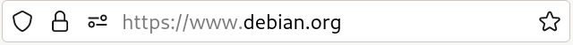
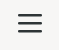
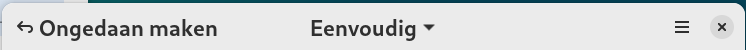

---
title: Begrippenlijst voor Linux beginners cursus
author: |
    | Steven Speek 
    |  \tt{slspeek@gmail.com}
date: \today{}
...
Actiemenu

: Menu in de bestandsbeheerder te activeren met ```F10``` of de drie puntjes boven elkaar in de adresbalk.

{width=300px}

Activiteiten modus

:   Toestand van het GNOME desktop systeem om van programma te wisselen, van desktop te wisselen of om een programma te starten. U komt in deze modus met ```SUPER```. U verlaat hem met ```SUPER``` of ```ESC```. Zie [GNOME docs](https://help.gnome.org/users/gnome-help/stable/shell-introduction.html.nl#activities).

Activiteiten knop

: Linksboven in de bovenbalk vindt u de activiteiten knop die u 
naar activiteiten modus brengt en van daar weer terug naar normale modus.


Adresbalk

: Invulveld in de bestandsbeheerder {height=25px} dat aangeeft in welke map u zich bevindt. In Firefox {height=25px} geeft het aan naar welke website u kijkt. U kunt hier ook zelf in typen om naar een map, die u wilt zien, te gaan in de bestandsbeheerder. Of een webadres, wat u wilt bekijken, in Firefox.

Applicatie

: Zie toepassing

Applicatie modus

: Onderdeel van de activiteiten modus waarin alle geïnstalleerde programma's worden getoond.
U komt in deze modus door ```SUPER+A``` in te drukken.

Besturingssysteem

:	Verzameling programma’s die de hardware aanstuurt en zorgt dat toepassingen kunnen draaien.

Bovenbalk

:	Onderdeel van de GNOME desktop. De zwarte balk aan de bovenzijde van het scherm met links de activiteiten knop, in het midden de tijdsaanduiding en rechts het systeemmenu.

{width=90%}

Context menu

: Een contextmenu, ook wel een rechtermuisknopmenu genoemd, is een pop-upmenu dat verschijnt wanneer je met de rechtermuisknop op een object, zoals een bestand, map, tekst of grafisch element, klikt in een grafische gebruikersinterface, een webbrowser, of een toepassing. Het contextmenu biedt gebruikers snel toegang tot verschillende acties en opties die relevant zijn voor het geselecteerde object, afhankelijk van de context van de klik.

In een contextmenu kun je vaak de volgende soorten opties vinden:

1. **Basisbewerkingen:** Dit omvat opties zoals kopiëren, knippen, plakken, verwijderen en hernoemen van bestanden en mappen.

2. **Openen:** Hiermee kun je een geselecteerd object openen met de standaardtoepassing of met een specifieke toepassing naar keuze.

3. **Eigenschappen:** Hiermee kun je de eigenschappen van een object bekijken, zoals bestandsgrootte, aanmaakdatum, en machtigingen.

4. **Koppelingen:** In webbrowsers kun je links openen in een nieuw tabblad, in een nieuw venster, of ze kopiëren naar het klembord.

U opent het context menu van een item met ```MENU``` (menu toets) of ```SHIFT+F10``` of door rechts te klikken op het item.

Dash

:	Onderdeel van de GNOME desktop. Alleen zichtbaar in activiteiten en applicatie modus. Hier staan je favoriete programma’s en je vindt hier de geopende programma’s.


Desktop manager

:	Systeemprogramma dat het bureaublad beheert en andere programma’s kan openen en sluiten. Tevens regelt het de plaatsing van vensters.

Display manager

:	Graphisch inlogscherm. Als een geldige gebruikersnaam en wachtwoord wordt ingevoerd wordt daarna een bureaublad getoond.

Filesystem Hierarchy Standard

:  Afspraak die op UNIX vastlegt wat in welke map dient te staan. Bijvoorbeeld:

1. Thuismappen in ```/home```

1. Thuismap van de beheerder root in ```/root```

1. Toepassingen in  ```/usr/bin``` en ```/bin```

1. Tijdelijke bestanden in ```/tmp```

1. Instellingen op systeemniveau (voor alle gebruikers) in ```/etc```

Zie verder de [online-documentatie](https://tldp.org/LDP/Linux-Filesystem-Hierarchy/html/index.html).

Focus

: Eén GUI-element (knop, lijst, invoerveld) of venster kan de focus hebben. Dit betekent dat invoer van het toetsenbord naar dat element of venster wordt gestuurd. U wisselt focus tussen toepassingen met ```ALT+TAB```. Tussen vensters op één scherm met ```ALT+ESC```. En tussen verschillende vensters van dezelfde toepassing met ```ALT+BACKTICK```. 

GNOME

:   Standaard desktop manager in Debian. Zie [GNOME docs](https://help.gnome.org/users/gnome-help/stable/index.html.nl).

GUI

:	Graphical user interface.

Hamburgermenu

: Het hamburgermenu  geeft in een toepassing toegang tot de menu's van een toepassing en bevindt zich meestal rechtsbovenin het venster.

Linux Documentation Project

:   Documentatie (voor gevorderden) over je dingen op Linux voor elkaar krijgt, de zogeheten *Howtos*. Website [tldp.org](https://tldp.org) (afkorting van __The Linux Documentation Project__).

Menu toets

: Toets op het toetsenbord die tussen de rechter super (windows) toets en de rechter control toets ligt. De toets activeert het context menu.


Notificatie venster

:   Venster met systeem notificaties, kalender en weer. Openen en sluiten met ```SUPER+V```. Actieve notificatie focus geven met ```SUPER+N```.

{width=400px}

Open source software

:	Software met de broncode erbij. In tegenstelling tot gesloten software kan en mag een programmeur zien wat de software doet.

Pad 

:   Aanduiding van bestands of map locatie in termen van bovenliggende mappen. Absolute paden beginnen met een ```/``` en relatieve paden niet. Voorbeelden:

- ```Documenten/Geschiedenis``` is de map waar je komt door vanuit de huidige map de map ```Documenten``` in te gaan en dan de map ```Geschiedenis``` in te gaan. Merk op dat dit een relatief pad is omdat het niet met ```/``` begint.

- ```/usr/bin``` is een absoluut pad waar je komt door vanuit ```/``` de map ```usr``` in te gaan en dan de map ```bin``` in te gaan.

- ```/home/tux/Documenten``` is het absolute pad van de ```Documenten``` map in de thuismap van gebruiker ```tux```.

Programma

:  zie toepassing.

Super toets

:   De toets met het Windows logo. Op het toetsenbord ligt hij tussen de control en alt toets in. Ook wel de Windows-toets genoemd.

{width=300px}

Systeemmenu

:   Menu aan de rechterzijde van de bovenbalk in GNOME. Zie [GNOME docs](https://help.gnome.org/users/gnome-help/stable/shell-introduction.html.nl#systemmenu).

{width=50%}

{width=100px}

Thuismap

:   De gebruikers map. Hier worden documenten en afbeeldingen opgeslagen. De gebruiker van wie de thuismap is kan hier zelf mappen aanmaken. Bijvoorbeeld ```/home/tux```. Zie [online-documentatie](https://nl.wikipedia.org/wiki/Homedirectory).

Titelbalk

: De balk aan de bovenkant van een venster, met rechts het  om het venster te sluiten.



Toepassing

:    Een stuk software dat een bepaalde functionaliteit biedt. Bijvoorbeeld:

1. Met Firefox {width=40px} kunt u websurfen

1. Met LibreOffice Writer {width=40px} kunt u documenten maken

1. Met Bestanden {width=40px} kunt u uw bestanden beheren

1. Met Software {width=40px} kunt u toepassingen installeren of verwijderen

Werkblad

:     Een virtueel bureaublad, u kunt er meerdere van aanmaken. Het dient om geopende toepassingen te groeperen. Zie [GNOME documentatie](https://help.gnome.org/users/gnome-help/stable/shell-workspaces.html.nl).

{height=200px}

Zoekvak

:   Onderdeel van de activiteiten modus. Het heeft automatisch de focus (aandacht) van het toetsenbord. Hiermee kunt u snel programma's openen, documenten zoeken of instellingen vinden.


