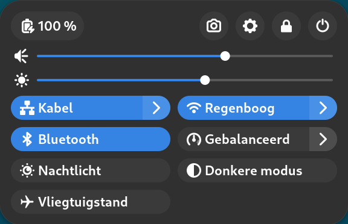

---
title: Begrippenlijst Linux beginners cursus
author: Steven Speek
date: \today{}
...

Activiteiten modus

:   Toestand van het GNOME desktop systeem om van programma te wisselen, van desktop te wisselen of om een programma te starten. U komt in deze modus met ```SUPER```. U verlaat hem met ```SUPER``` of ```ESC```.

Activiteiten knop

: Linksboven in de bovenbalk vindt u de activiteiten knop die u 
naar activiteiten modus brengt en van daar weer terug naar normale modus.


Applicatie

: Zie toepassing

Applicatie modus

: Onderdeel van de activiteiten modus waarin alle geïnstalleerde programma's worden getoond.
U komt in deze modus door ```SUPER+A``` in te drukken.

Besturingssysteem

:	Verzameling programma’s die de hardware aanstuurt en zorgt dat toepassingen kunnen draaien.

Bovenbalk

:	Onderdeel van de GNOME desktop. De zwarte balk aan de bovenzijde van het scherm met links activiteiten, in het midden de tijdsaanduiding en met systeemmenu rechts.


Dash

:	Onderdeel van de GNOME desktop. Hier staan je favoriete programma’s en je vindt hier de geopende programma’s.


Desktop manager

:	Systeemprogramma dat het bureaublad beheert en andere programma’s kan openen en sluiten. Tevens regelt het de plaatsing van vensters.

Display manager

:	Graphisch inlogscherm. Als een geldige gebruikersnaam en wachtwoord wordt ingevoerd wordt daarna een bureaublad getoond.

GUI

:	Graphical user interface.

Open software

:	Software met de broncode erbij. In tegenstelling tot gesloten software kan en mag een programmeur zien wat de software doet.

Programma

: zie toepassing

Super	

:    De toets op het toetsenbord tussen de control en alt toets in.

{width=300px}

Systeemmenu

: Menu aan de rechterzijde van de bovenbalk in GNOME.

 {width=50%}

Toepassing

: Een stuk software dat een bepaalde functionaliteit biedt. Bijvoorbeeld:

1. Met Firefox {width=40px} kunt u websurfen

1. Met LibreOffice Writer {width=40px} kunt u documenten maken

1. Met Bestanden {width=40px} kunt u uw bestanden beheren

1. Met Software {width=40px} kunt u toepassingen installeren of verwijderen


Zoekvak

: Onderdeel van de activiteiten modus. Het heeft automatisch de focus (aandacht) van het toetsenbord. Hiermee kunt u snel programma's openen, documenten zoeken of instellingen vinden.

