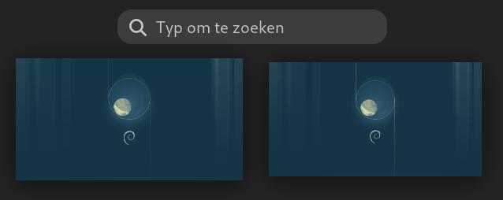

---
title: Begrippenlijst voor Linux beginners cursus
author: |
    | Steven Speek 
    |  \tt{slspeek@gmail.com}
date: \today{}
...

Activiteiten modus

:   Toestand van het GNOME desktop systeem om van programma te wisselen, van desktop te wisselen of om een programma te starten. U komt in deze modus met ```SUPER```. U verlaat hem met ```SUPER``` of ```ESC```. Zie [GNOME docs](https://help.gnome.org/users/gnome-help/stable/shell-introduction.html.nl#activities).

Activiteiten knop

: Linksboven in de bovenbalk vindt u de activiteiten knop die u 
naar activiteiten modus brengt en van daar weer terug naar normale modus.


Applicatie

: Zie toepassing

Applicatie modus

: Onderdeel van de activiteiten modus waarin alle geïnstalleerde programma's worden getoond.
U komt in deze modus door ```SUPER+A``` in te drukken.

Besturingssysteem

:	Verzameling programma’s die de hardware aanstuurt en zorgt dat toepassingen kunnen draaien.

Bovenbalk

:	Onderdeel van de GNOME desktop. De zwarte balk aan de bovenzijde van het scherm met links activiteiten, in het midden de tijdsaanduiding en met systeemmenu rechts.


Dash

:	Onderdeel van de GNOME desktop. Hier staan je favoriete programma’s en je vindt hier de geopende programma’s.


Desktop manager

:	Systeemprogramma dat het bureaublad beheert en andere programma’s kan openen en sluiten. Tevens regelt het de plaatsing van vensters.

Display manager

:	Graphisch inlogscherm. Als een geldige gebruikersnaam en wachtwoord wordt ingevoerd wordt daarna een bureaublad getoond.

Filesystem Hierarchy Standard

:  Afspraak die op UNIX vastlegt wat in welke map dient te staan. Bijvoorbeeld:

1. Thuismappen in ```/home```

1. Thuismap van de beheerder root in ```/root```

1. Toepassingen in  ```/usr/bin``` en ```/bin```

1. Tijdelijke bestanden in ```/tmp```

1. Instellingen op systeemniveau (voor alle gebruikers) in ```/etc```

Zie verder de [online-documentatie](https://tldp.org/LDP/Linux-Filesystem-Hierarchy/html/index.html).

GNOME

:   Standaard desktop manager onder debian. Zie [GNOME docs](https://help.gnome.org/users/gnome-help/stable/index.html.nl)

GUI

:	Graphical user interface.

Linux Documentation Project

:   Documentatie (voor gevorderden) over je dingen op Linux voor elkaar krijgt, de zogeheten *Howtos*. Website [tldp.org](https://tldp.org) (afkorting van __The Linux Documentation Project__).

Notificatie venster

:   Venster met systeem notificaties, kalender en weer. Openen en sluiten met ```SUPER+V```. Actieve notificatie focus geven met ```SUPER+N```.

{width=400px}

Open software

:	Software met de broncode erbij. In tegenstelling tot gesloten software kan en mag een programmeur zien wat de software doet.

Programma

:  zie toepassing.

Super

:   De toets met het Windows logo. Op het toetsenbord ligt hij tussen de control en alt toets in. Ook wel de Windows-toets genoemd.

{width=300px}

Systeemmenu

:   Menu aan de rechterzijde van de bovenbalk in GNOME. Zie [GNOME docs](https://help.gnome.org/users/gnome-help/stable/shell-introduction.html.nl#systemmenu).

{width=50%}

{width=100px}

Thuismap

:   De gebruikers directorie. Hier worden documenten en afbeeldingen opgeslagen. De gebruiker van wie de thuismap is kan hier zelf mappen aanmaken. Bijvoorbeeld ```/home/tux```. Zie [online-documentatie](https://nl.wikipedia.org/wiki/Homedirectory).

Toepassing

:    Een stuk software dat een bepaalde functionaliteit biedt. Bijvoorbeeld:

1. Met Firefox {width=40px} kunt u websurfen

1. Met LibreOffice Writer {width=40px} kunt u documenten maken

1. Met Bestanden {width=40px} kunt u uw bestanden beheren

1. Met Software {width=40px} kunt u toepassingen installeren of verwijderen

Werkblad

:     Een virtueel bureaublad, u kunt er meerdere van aanmaken. Het dient om geopende toepassingen te groeperen. Zie [GNOME documentatie](https://help.gnome.org/users/gnome-help/stable/shell-workspaces.html.nl).

{height=200px}

Zoekvak

:   Onderdeel van de activiteiten modus. Het heeft automatisch de focus (aandacht) van het toetsenbord. Hiermee kunt u snel programma's openen, documenten zoeken of instellingen vinden.


