---
title: Oefeningen voor de Linux beginners cursus
author: |
    | Steven Speek 
    |  \tt{slspeek@gmail.com}
date: \today{}
...

# Notatie
Het lettertype ```Courier``` wordt gebruikt om iets op te schrijven dat u op het toetsenbord kunt typen.
Uitzondering hierop zijn de volgende speciale toetsen:
```SPATIEBALK```, ```CTRL```, ```ALT```, ```SUPER```, ```MENU```, ```TAB```, ```HOME```, ```END```, ```ESC```, ```DELETE```, ```PageDown```, ```PageUp```, ```PrintScreen```, ```F1```, ```F2``` ... en ```ENTER```, hier dient u betreffende toets in te drukken in plaats van het woord in te typen.


# Rondleiding GNOME
1.  Aanmelden en afmelden

    a.  Meld u aan met het account (gebruikersnaam=```tux```, wachtwoord=```tux```)

    a.  Afmelden 

        i. Klik op 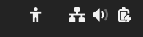{height=20px} 

        i. Klik op {height=20px}

        i. Klik op "Afmelden ..."

        i. Bevestig in de popup

        i. Log opnieuw aan

1.  Schermbeveiliging activeren

    a.  Activeer de schermbeveiliging met ```SUPER+L```

    a.  Maak de computer weer los door het wachtwoord van gebruiker Tux in te voeren: ```tux```

1.  Hulp openen en sluiten 1

    a.  Open hulp met ```SUPER+F1```
    
    a.  Sluit Hulp met ```ALT+F4```

1.  Hulp openen en sluiten 2

    a.  Open hulp met ```SUPER+6```

    a.  Sluit Hulp met kruisje rechtsboven

1.  Hulp openen en sluiten 3

    a.  Open Hulp met ```SUPER```, type ```hulp``` en druk ```ENTER```

    a.  Sluit de hulp met ```CTRL+W```

1.  Hulp openen en sluiten 4 (moeilijk)

    a.  Open de hulp door op ```SUPER``` te drukken, en dan op het reddingsboei
        symbool op de dash te klikken

    a.  Gebruik ```CTRL-S``` en zoek op 'sneltoetsen', ga naar 'Sneltoetsen
        > instellen'

        i.  Ga naar beneden naar 'Vooraf gedefinieerde sneltoetsen'

        i.  Klap 'Systeem' open en zoek de sneltoets voor
            'Toepassingenmenu openen'.

        i.  Gebruik deze toets. Sluit de hulp dan met ```ENTER``` of
             ```SPATIEBALK```.

1. Ga activiteiten modus in en verlaat haar onverrichter zake weer (zes keer)

    a. Met het toetsenbord ```SUPER```
        
        i. Verlaten met ```ESC``` of ```SUPER```

        i. Verlaten via de knop 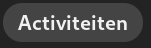{height=20px}

    a. Met de muis {height=20px}

        i. Verlaten met ```ESC```
        
        i. Verlaten via ```SUPER```

        i. Verlaten via de knop {height=20px}

1. Open de samenvatting van deze cursus:
    
    a. Druk ```SUPER``` in

    a. Type ```samenv``` en ```ENTER```

    a. Druk ```CTRL+W``` om haar weer te sluiten

1. Ga applicatie modus in en verlaat haar onverrichter zake weer (zes keer)
    
    a. Ga binnen via ```SUPER+A```

        i. Verlaten via ```SUPER```

        i. Verlaten via ```ESC ESC```

        i. Verlaten via {height=20px}

    a. Ga met behulp de muis binnen via {height=20px} en 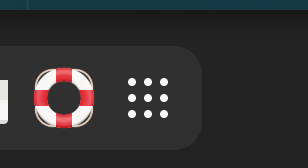{height=20px}

        i. Verlaten via ```SUPER```

        i. Verlaten via ```ESC ESC```

        i. Verlaten via {height=20px}

1. Ga applicatie modus binnen op een wijze naar keuze en
    
    a. Sleep firefox {width=40px} naar het eerste (linker) werkblad

    a. Sleep kaarten {width=40px} naar het tweede (rechter) werkblad

    a. Ga naar gewone modus op een wijze naar keuze

    a. Sluit beide toepassingen

        i. ```ALT+F4``` om firefox te sluiten

        i. ```SUPER+PageDown``` om naar tweede werkblad te gaan

        i. ```ALT+F4``` om kaarten te sluiten

1. Open en sluit het notificatie venster

    a. Open met een klik op 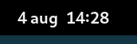{height=20px}

        i. Sluit met een klik op {height=20px}
    
    a. Open met ```SUPER+V```

        i. Sluit met ```ESC```

        i. Sluit met ```SUPER+V```

1. Open het systeemmenu en sluit haar onverrichter zake weer

    a. Open met klik op {height=20px}

        i. Sluit met klik op {height=20px}

    a. Open met klik op {height=20px}

        i. Sluit met ```ESC```

1. Netwerk uitschakelen en opnieuw inschakelen

    a. Start {width=40px} en ga naar ```tldp.org```.

    a. Open het systeemmenu

    a. Klik {height=20px}, knop wordt grijs

    a. Sluit systeemmenu

    a. Start {width=40px} en ga naar ```debian.org```, dit zal niet gaan
    
    a. Klik 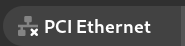{height=20px}, knop krijgt weer kleur

    a. Sluit systeemmenu

    a. Ga naar {width=40px} en herlaad de pagina met ```F5```

1. Afmelden op twee manieren

    a. Met muis
        
        i. Klik op {height=20px} 

        i. Klik op {height=20px}

        i. Klik op "Afmelden ..."

        i. Annuleer in de popup

    a. Met toetsenbord

        i. ```SUPER afme ENTER```

        i. Annuleer in de popup door ```SPATIEBALK``` of ```ESC```

1. Uitschakelen op drie manieren

    a. Met ```ALT+CTRL+DELETE```

        i. Annuleer in de popup met ```ESC```

    a. Met muis

        i. Klik op {height=20px} 

        i. Klik op {height=20px}

        i. Klik op "Uitschakelen ..."

        i. Annuleer in de popup met ```ESC```

    a. Met toetsenbord

        i. ```SUPER uits ENTER```

        i. Annuleer in de popup door ```SPATIEBALK``` of ```ESC```


1. Herstarten op twee manieren

    a. Met muis

        i. Klik op {height=20px} 

        i. Klik op {height=20px}

        i. Klik op "Herstarten ..."

        i. Annuleer in de popup met ```ESC```

    a. Met toetsenbord

        i. ```SUPER hersta ENTER```

        i. Annuleer in de popup door ```SPATIEBALK``` of ```ESC```


# Toepassingen openen en afsluiten

1.  Sneltoetsen toevoegen. Open sneltoetsen in de Instellingen door:

    a. ```SUPER snelt ENTER```

    a. Klik op "Sneltoetsen weergeven en aanpassen"
        
    a. Ken onder de afdeling "Starters" ```SUPER+E``` aan "Persoonlijke map"

    a. Ken onder de afdeling "Starters" ```SUPER+C``` aan "Rekenmachine starten"

    a. Ken onder de afdeling "Starters" ```SUPER+I``` aan Instellingen

1.  Aangepaste sneltoetsen toevoegen. Open sneltoetsen in de Instellingen.

    a. Open de afdeling "Aangepaste sneltoets" (onderaan).

    a.  ```SUPER+SHIFT+I``` toekennen aan "Afstellingen"

        i. Klik op de + onderaan

        i. Vul onder "Naam" ```Afstellingen``` in

        i. Vul onder "Opdracht" ```gnome-tweaks``` in

        i. Klik op "Sneltoets instellen" en druk ```SUPER+SHIFT+I```

    a.  Ken ```ALT+CTRL+T``` toe aan de opdracht ```gnome-terminal``` onder de naam ```Terminal```.

1.  Sneltoetsen opzoeken. Open de sneltoetsen instellingen zoals in beschreven in de eerste oefening *(Hint: Afdeling "Vensters")*.
    
    a. Wat is de toets voor maximaliseren

    a. Wat is de toets voor herstellen

1.  Sneltoetsen opzoeken. Open de sneltoetsen instellingen zoals in beschreven in de eerste oefening.
Gebruik nu het vergrootglas bovenaan het venster om te zoeken.
    
    a. Wat is de toets voor "Toepassingenmenu openen"

    a. Wat is de toets voor "Afmelden"

1.  Open en sluit terminal 1

    a.  Open met ```ALT+CTRL+T```

    a.  Sluit met ```CTRL+D``` (betekent end of file in UNIX)

1.  Open en sluit terminal 2

    a.  Open ```SUPER```, ```ter```, ```ENTER```

    a.  Sluit met ```CTRL+D```

1. Open en sluit terminal 3

    a. Ga in applicatie modus met ```SUPER+A```

    b. Klik op het terminal venster icon 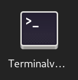{width=50px}

    c. Sluit het venster met de muis door op het kruisje rechtsboven te klikken

1. Open en sluit terminal 4

    a. Ga in applicatie modus met de muis:

        i. Klik op {height=20px}

        i. Klik op de 3x3 puntjes op de dash {width=100px}
    
    a. Sleep het {width=50px} naar het eerste werkblad

    a. Klik op {height=20px} om applicatie modus te verlaten

    a. Klik op een willekeurige plek van het terminalvenster 

    a. Sluit het terminalvenster door ```ALT+F4``` in te drukken

1. Open met ```ALT+CTRL+T``` een terminalvenster

    a. Gebruik het toepassingmenu om een extra terminalvenster te openen

        i. ```SUPER+F10```

        i. ```ENTER``` op "Nieuw venster"
    
    a. Sluit het tweede terminalvenster af via het toepassingsmenu

        i. ```SUPER+F10```

        i. Gebruik de pijltjes toetsen om naar "Afsluiten" te komen

        i. Druk ```SPATIEBALK```
    
    a. Herhaal dit voor het eerste terminalvenster

1. Open en sluit twee firefox vensters

    a. Druk ```SUPER+1``` om firefox te openen

    a. Maak een nieuw venster aan via het toepassingsmenu

        i. ```SUPER+F10```

        i. ```ENTER``` op "Nieuw venster"
    
    a. Sluit beide vensters met het toepassingsmenu
        
        i. ```SUPER+F10```

        i. Gebruik de pijltjes toetsen om naar "Afsluiten" te komen

        i. Druk ```SPATIEBALK```

1. Open en sluit twee LibreOffice writer vensters met het bestandsmenu

    a. Druk ```SUPER+3```

    a. Druk ```F10``` om de menubalk voor Writer te activeren

    a. Druk ```↓```

    a. Druk ```→```

    a. Druk ```SPATIEBALK```

    a. Druk ```F10``` om de menubalk voor Writer te activeren

    a. Druk ```↑``` om snel bij "Afsluiten" te komen

    a. Druk ```SPATIEBALK```

1. Open twee LibreOffice writer vensters en sluit ze één voor één

    a. Druk ```SUPER+3```

    a. Druk ```CTRL+N``` om via de sneltoets voor een nieuw venster van LibreOffice een tweede venster te openen

    a. Druk ```CTRL+W``` om het tweede venster te sluiten

    a. Druk ```CTRL+W``` om het eerste venster te sluiten

    a. Druk ```CTRL+Q``` om LibreOffice af te sluiten

1. Open twee LibreOffice writer vensters en sluit ze één voor één

    a. Druk ```SUPER+3```

    a. Druk ```CTRL+N``` om via de sneltoets voor een nieuw venster van LibreOffice een tweede venster te openen

    a. Klik op het kruisje rechtsboven van het tweede venster

    a. Klik op het kruisje rechtsboven van het eerste venster

1. Open en sluit een LibreOffice calc venster

    a. Druk ```SUPER spread ENTER```

    a. Sluit met ```ALT+F4```

1. Open en sluit een eenvoudige (platte) tekst editor

    a. Druk ```SUPER tekst ENTER```

    a. Sluit met ```ALT+F4```

1. Open een rekenmachine en reken 6 keer 7 uit

    a. Druk ```SUPER+C```

    a. Druk ```6*7 ENTER```

    a. Sluit met ```ALT+F4```

1. Reken 2 + 4 x 10 uit via het zoekvak

    a. Druk ```SUPER 2+4*10```

    a. Druk ```SUPER``` om in normale modus terug te keren

1. Open een tekst editor via applicatie modus

    a. Ga met de muis naar applicatie modus (twee stappen)

    a. Klik rechts op > om naar de tweede pagina te komen

    a. Klik op 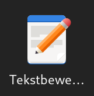{width=50px}

    a. Open een tweede venster met ```CTRL+N```

    a. Sluit tweede venster met ```ALT+F4```

    a. Sluit eerste venster met ```ALT+F4```

1. Open een tekst editor via applicatie modus

    a. Druk ```SUPER+A```

    a. Druk ```PageDown``` om op de tweede pagina te komen

    a. Sleep {width=50px} naar het eerste werkblad

    a. Druk tweemaal ```ESC``` om in normale modus te komen

    a. Sluit het venster met ```ALT+F4```

1. Open en sluit twee firefox vensters met de muis

    a. Ga activiteiten modus in door op {height=20px} te klikken

    a. Klik op {width=40px} op de dash

    a. Ga opnieuw activiteiten modus in door op {height=20px} te klikken

    a. Klik met ```CTRL``` ingedrukt op {width=40px} op de dash

    a. Verlaat activiteiten modus door op {height=20px} te klikken

    a. Klik de beide vensters dicht door op het kruisje rechtsboven te klikken 

        i. Noem twee manieren waarop dit sluiten van beide vensters in één keer had gekunt (er zijn drie manieren)

1. Som manieren waarop een toepassing, waaraan een sneltoets is toegekend, maar niet op de dash staat, kan worden gestart (vier manieren)

1. Som manieren waarop een toepassing, waaraan een sneltoets is toegekend en op de dash staat, kan worden gestart (vijf manieren)

1. Op welke wijzen kan een extra venster worden geopend van toepassingen (die extra vensters toestaan)? (vier manieren)

1. Wat is de toetscombinatie waarmee een venster wordt gesloten?

1. Wat is een gangbare toetscombinatie waarmee een toepassing wordt afgesloten?

1. Waarom is een goed idee om toepassingen die u veel gebruikt aan de dash toe te voegen? (twee redenen)

# Belangrijke toepassingen

## Firefox

1. Start Firefox met ```SUPER+1```.

    - Ga naar de URL: ```github.com/slspeek/linux-beginners-cursus```.

    - Scroll omlaag en ga via de link naar de presentatie van de cursus.

    - Sluit de browser af met ```CTRL+Q```

1. Start Firefox.

    - Ga naar ```debian.org```. 

    - Open een extra tabblad met ```CTRL+T```, merk op dat u gelijk het webadres kunt intypen. Ga naar ```tldp.org```.

    - Ga naar het eerste tabblad door ```CTRL+TAB``` in te drukken.

    - Sluit ```debian.org```, met ```CTRL+W```.

    - Sluit de browser af door het laatste tabblad te sluiten

1. Start Firefox met ```SUPER+1```.

    - Ga naar de URL: ```github.com/slspeek/linux-beginners-cursus```

    - Scroll naar "Onderdelen"

    - Op de Samenvatting en Oefeningen op een apart tabblad (en blijf op de eerste pagina)

    - Gebruik ```CTRL+TAB``` om de twee nieuwe pagina's te bekijken

    - Sluit de browser af met ```CTRL+Q```
    
1. Start Firefox met ```SUPER+1```.

    - Ga naar de URL: ```slspeek.github.io/linux-beginners-cursus/#14```

    - Klik rechts in de animatie om het context menu te openen en kies "Afbeelding openen in nieuw tabblad"

    - Bekijk grotere animatie

    - Sluit de browser af met ```CTRL+Q```

1. Start Firefox met ```SUPER+1```.

    - Ga naar de URL: ```github.com/slspeek/linux-beginners-cursus```

    - Maak een bladwijzer met ```CTRL+D```

    - Sluit de browser af met ```CTRL+Q```

1. Start Firefox met ```SUPER+1```.

    - Ga met behulp van de bladwijzer naar de URL: ```github.com/slspeek/linux-beginners-cursus```

        - Maak bladwijzerbalk zichtbaar met ```CTRL+SHIFT+B``` als deze verborgen is
    
    - Scroll naar beneden naar de README naar "Onderdelen"

    - Klik op de link "Presentatie"
    
    - Maak een bladwijzer door op {width=30px} aan de rechterzijde te klikken

    - Sluit de browser af met ```CTRL+Q```

1. Start Firefox met ```SUPER+1```.

    - Ga met behulp van de bladwijzer naar de "Presentatie" van de cursus

    - Ga naar de tweede pagina

    - Klik met op "Samenvatting"

    - Maak een bladwijzer door {width=30px} naar de bladwijzerbalk te slepen

    - Sluit de browser af met ```CTRL+Q```

1. Start Firefox met ```SUPER+1```.

    - Open het context menu (rechtsklikken) van de bladwijzerbalk en kies "Map toevoegen ..." en maak een map "cursus" aan

    - Sleep de drie bladwijzers over de cursus naar deze map

    - En order ze zo dat het resultaat er zo uitziet:
    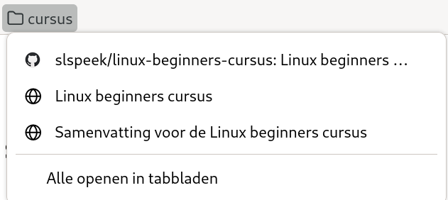{height=100px}

    - Sluit de browser af met ```CTRL+Q```

1. Start Firefox met ```SUPER+1```.

    - Ga met behulp van de bladwijzer naar de "Presentatie" van de cursus

    - Ga naar de tweede pagina

    - Klik met ```CTRL``` ingedrukt op "Oefeningen" en "Begrippenlijst"

    - Breng met behulp van ```CTRL+TAB``` de tabbladen 1 voor 1 naar voren en sleep {width=30px} naar de map "cursus" op de bladwijzerbalk

1. Start Firefox met ```SUPER+1```

    - Ga naar ```kernel.org```

    - Maak een bladwijzer met ```CTRL+D```

    - Ga naar "Bladwijzers beheren" met ```CTRL+SHIFT+O```

    - Verwijder de bladwijzer naar ```kernel.org```

    - Sluit de browser af met ```CTRL+Q```

1. Noem drie manieren waarop je een bladwijzer in Firefox kunt maken (er zijn er vier).

1. Noem drie manieren waarop je een bladwijzer in Firefox kunt verwijderen.

1. Start Firefox met ```SUPER+1```

    - Ga naar 'Add-ons en thema's' met ```CTRL+SHIFT+A``` of via het hamburger menu rechtbovenin.

    - Selecteer aan de linkerzijde van de pagina 'Extensies'

    - Type in het zoekvak ```Adblocker for Youtube``` en installeer deze extensie

    - Sluit de browser af met ```CTRL+Q```

1. Start Firefox met ```SUPER+1```.

    - Ga naar de URL: ```slspeek.github.io/linux-beginners-cursus/samenvatting.html```.

    - Scroll omlaag naar "Internet browser: Firefox" en dan naar "Essentiële extensies installeren", klik op de link van "I don't care about cookies"

    - Klik op de knop "Toevoegen aan Firefox"

    - Ga na met ```CTRL+SHIFT+A``` (Add-ons) of de extensie is geïnstalleerd

    - Sluit de browser af met ```CTRL+Q```

1. Start Firefox met ```SUPER+1```

    - Ga via het hamburgermenu rechtsboven naar 'Hulp' en dan naar 'Hulp verkrijgen'

    - Type ```navigatiegeschiedenis```

    - Wat betekent geschiedenis in Firefox?

    - Sluit de browser af met ```CTRL+Q```

## Bestanden

1. Waar staat de thuismap van tux?

1. Wat is het map scheidingsteken op Linux?

1. Onder welke map is een aangekoppelde USB-stick terug te vinden?

1. Waarvoor hebt u een bestandsbeheerder nodig (noem vier redenen)? 

1. Noem drie manieren waarop u de bestandsbeheerder kunt openen.

1. Wisselen tussen raster- en lijstweergave.

    - Open bestandsbeheerder met ```SUPER+E```

    - Wissel naar  lijstweergave met ```CTRL+1```

    - Wissel naar rasterweergave met ```CTRL+2```

    - Welke weergave geeft meer informatie?

    - Sluit de bestandsbeheerder met ```CTRL+W```

1. Wisselen tussen raster- en lijstweergave.

    - Open bestandsbeheerder met ```SUPER+E```

    - Wissel naar de andere weergave met 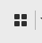{width=20px} of 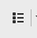{width=20px}

    - Keer terug naar eerste weergave

    - Sluit de bestandsbeheerder met ```CTRL+W```

1. Verborgen bestanden tonen

    - Open bestandsbeheerder met ```SUPER+E```

    - Toon de verborgen bestanden met behulp van het menu met de drie puntjes boven elkaar rechts in de adresbalk
    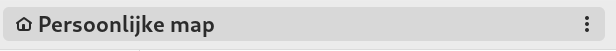{height=20px} 

    - Wat voor soort namen hebben de verborgen bestanden? Ziet u een patroon? (Wissel eventueel meerdere malen met ```CTRL+H```)

    - Sluit de bestandsbeheerder met ```CTRL+W```

1. De map ```Documenten``` ingaan.
    
    - Open bestandsbeheerder met ```SUPER+E```

    - Dubbel klik de map ```Documenten```. De adresbalk ziet er nu zo uit: 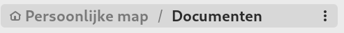{height=20px}

    - Ga nu weer omhoog door op "Persoonlijke map" in {height=20px} te klikken. De adresbalk ziet er dan weer zo {height=20px} uit.

    - Ga opnieuw de map ```Documenten``` in.

    - Ga terug omhoog met behulp van ```ALT+↑```

    - Sluit de bestandsbeheerder met ```ALT+F4```

1. De map ```Afbeeldingen``` ingaan.

    - Herhaal de zes stappen van de vorige opgave met de map ```Afbeeldingen```

1. Map ```werkstuk-protohistorie``` in de map ```Documenten``` aanmaken.

    - Open bestandsbeheerder met ```SUPER+E```

    - Ga naar de map ```Documenten``` 

    - Maak met behulp van het menu met de drie puntjes boven elkaar rechts in de adresbalk
    {height=20px} een nieuwe map genaamd ```werkstuk-protohistorie``` aan.

    - Met welke sneltoets had dit ook gekunt (open eventueel opnieuw het drie puntjes boven elkaar menu voor het antwoord)?

    - Sluit de bestandsbeheerder met ```ALT+F4```

1. Welke twee manieren hebt u geleerd om mappen aan te maken?

1. Mappen ```bronstijd``` en ```ijzertijd``` in ```werkstuk-protohistorie``` aanmaken.

    - Open bestandsbeheerder met ```SUPER+E```

    - Navigeer via de map ```Documenten``` naar de map ```werkstuk-protohistorie```.

    - Maak met behulp van de sneltoets ```CTRL+SHIFT+N``` een map ```bronstijd``` aan.

    - Maak met behulp van het drie puntjes menu een map ```ijzertijd``` aan.

    - Sluit de bestandsbeheerder met ```ALT+F4```

1. Bloemen sorteren.

    - Open bestandsbeheerder met ```SUPER+E```

    - Ga naar de map ```bloemen``` in ```Afbeeldingen```

    - Maak mappen ```composietenfamilie```, ```anjerfamilie``` en ```ooievaarsbekfamilie``` aan.

    - Sleep de afbeeldingen van de bloemen naar de juiste map (als u langer dan een halve seconde boven een map hangt met een plaatje voor u het loslaat navigeert u naar de map, gebruik ```ALT+↑``` om weer terug te keren naar ```bloemen```)

        - Akkerdistel, Harig knopkruid, Gewone melkdistel naar ```composietenfamilie```

        - Robertskruid en Beemdooievaarsbek naar ```ooievaarsbekfamilie```

        - De rest naar ```anjerfamilie```
    
    - Sluit de bestandsbeheerder met ```ALT+F4```

1. Een kopie maken van de ```Documenten``` map.

    - Open bestandsbeheerder met ```SUPER+E```

    - Open het context menu van de map ```Documenten``` en kies "Kopiëren"

    - Klik rechts op een open plek in de "Persoonlijke map" en kies "Plakken"

    - Hoe heeft de bestandsbeheerder de kopie genoemd?

    - Sluit de bestandsbeheerder met ```ALT+F4```

1. Een schermafdruk verplaatsen

    - Open bestandsbeheerder met ```SUPER+E```

    - Navigeer naar ```Afbeeldingen/Schermafdrukken```

    - Maak een schermafdruk met ```ALT+PrintScreen```

    - Knip deze afbeelding via haar context menu

    - Navigeer naar ```Documenten``` 

    - Plak de schermafdruk via het context menu

    - Ga terug naar ```Afbeeldingen/Schermafdrukken```

    - Staat de schermafdruk hier nog?

    - Navigeer terug naar ```Documenten``` 

    - Gooi de schermafdruk in de prullenbak door haar te selecteren en ```DELETE``` te drukken

    - Sluit de bestandsbeheerder met ```ALT+F4```

1. Map ```Video's``` in de prullenbak gooien en terughalen

    - Open bestandsbeheerder met ```SUPER+E```

    - Klik rechts op ```Video's``` en kies "In Prullenbak gooien"

    - Klik in het linkerpaneel op "Prullenbak"

    - Hier ziet u ```Video's``` staan

    - Klik rechts op ```Video's``` en kies "Uit Prullenbak terughalen"

    - Merk op dat ```Video's``` niet meer in de "Prullenbak" zit

    - Navigeer naar "Persoonlijke map" door op het linkerpaneel op "Persoonlijke map" te klikken

    - U ziet dat de map ```Video's``` er weer staat

    - Sluit de bestandsbeheerder met ```ALT+F4```

1. Een map in de prullenbak gooien en er weer uit terughalen.

    - Open bestandsbeheerder met ```SUPER+E```

    - Maak een map ```oefening-prullenbak``` aan

    - Klik rechts op ```oefening-prullenbak``` en kies "In Prullenbak gooien"

    - Merk op dat ```oefening-prullenbak``` niet meer in de "Persoonlijke map" is te zien. Het is weg.

    - Klik in het linkerpaneel op "Prullenbak"

    - Hier ziet u ```oefening-prullenbak``` staan

    - Klik rechts op ```oefening-prullenbak``` en kies "Uit Prullenbak terughalen"

    - Merk op dat ```oefening-prullenbak``` niet meer in de "Prullenbak" zit

    - Navigeer naar "Persoonlijke map" door op het linkerpaneel op "Persoonlijke map" te klikken

    - U ziet dat de map ```oefening-prullenbak``` er weer staat

    - Selecteer ```oefening-prullenbak``` en druk op ```DELETE```
    
    - Sluit de bestandsbeheerder met ```ALT+F4```

1. Prullenbak legen

    - Open bestandsbeheerder met ```SUPER+E```

    - Klik in het linkerpaneel op "Prullenbak"

    - Hier ziet u alleen ```oefening-prullenbak``` staan

    - Kies uit het actiemenu (```F10```) "Prullenbak legen"

    - Sluit de bestandsbeheerder met ```ALT+F4```

1. Bladwijzer van een map maken van één uw projecten

    - Open bestandsbeheerder met ```SUPER+E```

    - Maak in ```Documenten``` een map ```werkstuk-protohistorie``` aan.

    - Sleep deze juist aangemaakte map naar het linkerpaneel boven het "Nieuwe bladwijzer"
    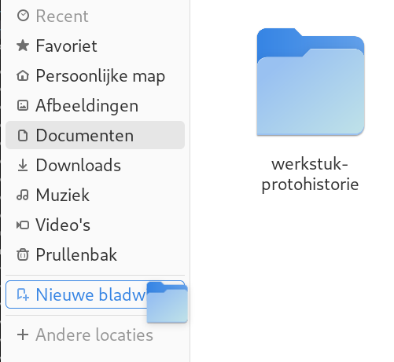{height=150px}

    - Sluit de bestandsbeheerder met ```ALT+F4```

1. Twee bladwijzers maken

    - Open bestandsbeheerder met ```SUPER+E```

    - ga met behulp van uw bladwijzer naar de eerder aangemaakt map ```werkstuk-protohistorie```

    - navigeer in de map ```bronstijd```

    - maak een bladwijzer aan met ```CTRL+D```

    - navigeer in de map ```ijzertijd```

    - maak een bladwijzer aan met behulp van het menu met de drie puntjes boven elkaar rechts in de adresbalk
    {height=20px}

    - Sluit de bestandsbeheerder met ```ALT+F4```

1. Op welke drie manieren kunt u een bladwijzer aanmaken in de bestandsbeheerder?

1. Verwijder de bladwijzers naar de mappen ```ijzertijd``` en ```bronstijd```.

    - Open bestandsbeheerder met ```SUPER+E```

    - Verwijder de bladwijzers naar de mappen ```ijzertijd``` en ```bronstijd``` door in het linkerpaneel rechts te klikken op de bladwijzers
    en uit het menu "Verwijderen uit bladwijzers" te kiezen.

    - Overtuig uzelf ervan dat in de map ```werkstuk-protohistorie``` de mappen ```ijzertijd``` en ```bronstijd``` nog bestaan.
    
    - Sluit de bestandsbeheerder met ```ALT+F4```

1. Gebruik eigenschappen in bestandsbeheerder

    - Open bestandsbeheerder met ```SUPER+E```

    - Navigeer naar ```Afbeeldingen```

    - Hoe groot is de map ```bloemen```.
        
        -  Selecteer ```bloemen```

        -  Open het context menu en kies "Eigenschappen"

    - Sluit de bestandsbeheerder met ```ALT+F4```

1. Hoe groot in pixels is het plaatje ```blaassilene.jpg``` (anjerfamilie)?

    - Gebruik "Eigenschappen" van het bestand

1. Werkstukje maken over protohistorie.

    - Zoek met Firefox op Wikipedia naar protohistorie

        - Gebruik ```CTRL+K``` en ```CTRL+↑```, ```CTRL+↓```

    - Print de pagina [```https://nl.wikipedia.org/wiki/Protohistorie```](https://nl.wikipedia.org/wiki/Protohistorie) naar pdf en sla deze op in de map ```werkstuk-protohistorie``` gebruikmakend van de bladwijzer.

    - Sluit Firefox

    - Open opnieuw bestandsbeheerder met ```SUPER+E```

    - Zoek met ```CTRL+F``` naar het woord ```schrift```, het document ```Protohistorie - Wikipedia.pdf``` uit de map ```werkstuk-protohistorie```
        moet zich onder de zoekresultaten moeten bevinden.

1. Maak een archief ```bloemen.zip``` in de map ```Afbeeldingen``` van de map ```bloemen```.

    - Open bestandsbeheerder met ```SUPER+E```

    - Navigeer naar ```Afbeeldingen```

    - Klik rechts op de map ```bloemen``` en kies "Inpakken ..."

    - Accepteer de naam ```bloemen```, door op "Maken" te klikken

    - Sluit de bestandsbeheerder met ```ALT+F4```

1. Archief ```bloemen.zip``` inzien.

    - Open bestandsbeheerder met ```SUPER+E```

    - Navigeer naar ```Afbeeldingen```

    - Dubbelklik op ```bloemen.zip```

    - In achiefbeheer kunt u het archief bezien, dubbelklik op ```bloemen``` om de familie mappen te zien, dubbelklik verder op bijvoorbeeld ```anjerfamilie``` om de anjers te zien.

    - Sluit archiefbeheer met ```ALT+F4```

    - Sluit de bestandsbeheerder met ```ALT+F4```

1. Archief uitpakken in nieuwe map

    - Open bestandsbeheerder met ```SUPER+E```

    - Maak map ```plaatjes``` aan. In welke map wordt ```plaatjes``` aangemaakt?

    - Navigeer naar ```Afbeeldingen``` en kopieer ```bloemen.zip``` door er rechts op te klikken en "Kopieren" te kiezen

    - Navigeer naar de eerder gemaakte ```plaatjes``` map. De druk ```CTRL+V``` om een kopie van het ```bloemen.zip``` archief hier te plaatsen.

    - Klik rechts op ```bloemen.zip``` en kies "Uitpakken". Er is nu een map ```bloemen``` in ```plaatjes``` gemaakt. Overtuig u ervan dat dit precies de families bevat die u gemaakt had.

    - Gooi ```bloemen.zip``` en map ```bloemen``` uit ```plaatjes``` in de prullenbak. Door rechts te klikken en "In de prullenbak gooien" te kiezen.

    - Sluit de bestandsbeheerder met ```ALT+F4```

1. Archief uitpakken naar

    - Open bestandsbeheerder met ```SUPER+E```

    - Navigeer naar ```Afbeeldingen```
    
    - Klik rechts op ```bloemen.zip``` en kies "Uitpakken naar". Kies als map ```plaatjes``` in "Persoonlijke map".

    - Navigeer naar de ```plaatjes``` map. Overtuig u ervan dat de map ```bloemen``` de families bevat die u gemaakt had.

    - Gooi vanuit "Persoonlijke map" ```plaatjes``` in de prullenbak.
    
    - Sluit de bestandsbeheerder met ```ALT+F4```

1. De hulp functie gebruiken om op bestandsgrootte te sorteren

    - Open bestandsbeheerder met ```SUPER+E```

    - Ga naar pictogram weergave

    - Open de hulp functie ```F1```

    - Zoek met ```CTRL+S``` naar ```sorteren```, en ga naar "Bestanden en mappen sorteren"

    - Volg de instructies om op bestandsgrootte te sorteren in pictogramweergave

    - Verander van weergave naar lijstweergave

    - Volg de instructies om weer naar alphabetische oplopend sortering terug te keren

    - Sluit de hulp
    
    - Sluit de bestandsbeheerder met ```ALT+F4```


1. Open en sluit het sneltoetsen overzicht in de bestandsbeheerder

    - Open bestandsbeheerder met ```SUPER+E```

    - Gebruik ```CTRL+?``` om het sneltoetsen venster te openen

    - Gebruikt ```PageDown``` om tweemaal verder te bladeren

    - Sluit het met ```ESC```
    
    - Sluit de bestandsbeheerder met ```ALT+F4```

1. Met welke sneltoets kunt u een map of bestand hernoemen?

1. Met welke sneltoets kunt u in één keer naar uw persoonlijke map terugkeren?

1. Met welke sneltoets kunt terug gaan naar de lokatie waar u was? En met welke weer vooruit  (*Hint: dit heet "Ga terug" en "Ga verder"*)?
Probeer dit uitvoerig uit. U opent de bestandsbeheerder en gaat naar ```Documenten``` en dan naar ```Afbeeldingen/Schermafdrukken``` en probeert de gevonden sneltoetsen uit.

#  Werkbladen en vensters

1. Wisselen tussen twee toepassingen op één werkblad

    - Open Firefox met ```SUPER+1```

    - Open bestandsbeheer ```SUPER+4```

    - Wissel terug naar Firefox met ```ALT+TAB```

        - Hoe had u dit anders kunnen doen met een sneltoets?
    
    - Wissel nu weer naar de bestandsbeheerder met ```ALT+TAB```

    - Sluit beide toepassingen met ```ALT+F4```

        - Sluit de bestandsbeheerder met ```ALT+F4```

        - Sluit Firefox met ```ALT+F4```

1. Wisselen tussen vier toepassingen op één werkblad

    - Open Firefox met ```SUPER+1```

    - Open bestandsbeheer ```SUPER+4```

    - Open LibreOffice writer ```SUPER+3```

    - Open Hulp met ```SUPER+6```

    - Wissel nu de focus naar Firefox terug door ```ALT+[TAB TAB TAB]``` (u houdt ```ALT``` ingedrukt en drukt driemaal op ```TAB``` )

    - Wissel nu de focus naar Hulp door ```ALT+TAB```

    - Wissel focus naar Writer met ```ALT+[TAB TAB]```

    - Zie wat er gebeurt met het popup venster met icons van de geopende toepassingen als u ```ALT+[TAB TAB TAB TAB]``` doet (als alles goed is houdt Writer de focus)

    - Sluit alle toepassingen door viermaal ```ALT+F4``` te geven

1. Wisselen tussen vier toepassingen op één werkblad

    - Open Firefox met ```SUPER+1```

    - Open bestandsbeheer ```SUPER+4```

    - Open LibreOffice writer ```SUPER+3```

    - Open Hulp met ```SUPER+6```

    - Wissel naar via activiteiten modus naar Firefox

        - ```SUPER```

        - klik op Firefox

    - Wissel naar via activiteiten modus naar bestandsbeheer

        - ```SUPER```

        - U gebruikt de pijltjes om bestandsbeheer te selecteren en u drukt dan ```ENTER```

    - Wissel naar via activiteiten modus naar Hulp

        - ```SUPER```

        - U gebruikt de pijltjes om Hulp te selecteren en u drukt dan ```ENTER```

    - Sluit alle toepassingen door viermaal ```ALT+F4``` te geven

1. Wisselen tussen twee toepassingen op twee werkbladen

    - Open Firefox met ```SUPER+1```

    - Ga via activiteiten naar het werkblad rechts van het huidige werkblad

        - ```SUPER```, ```PageDown```, ```SUPER```
    
    - Open bestandsbeheer ```SUPER+E```

    - Wissel terug naar Firefox met ```ALT+TAB```

        - Hoe had u dit anders kunnen doen met een sneltoets?
    
    - Wissel nu weer naar de bestandsbeheerder met ```ALT+TAB```

    - Sluit beide toepassingen met ```ALT+F4```

        - Sluit de bestandsbeheerder met ```ALT+F4```

        - Wissel met ```SUPER+1``` naar Firefox

        - Sluit deze met ```ALT+F4```

1. Wisselen tussen twee vensters van dezelfde toepassing

    - Open Firefox met ```SUPER+1```

    - Open LibreOffice writer ```SUPER+3```

    - Open een extra writer venster met ```CTRL+N```

    - Merk op dat u met ```ALT+TAB``` combinaties niet bij het "Geen titel 1" venster van writer kunt terugkomen

    - Geef met ```ALT+TAB``` writer de focus

    - Geef met ```ALT+` ``` het "Geen titel 1" venster van writer de focus

    - Geef met ```ALT+` ``` het "Geen titel 2" venster van writer de focus

    - Sluit alle vensters door driemaal ```ALT+F4``` te geven

1. Snel wisselen tussen de vensters van één werkblad

    - Open Firefox met ```SUPER+1```

    - Open LibreOffice writer ```SUPER+3```

    - Open een extra writer venster met ```CTRL+N```

    - Ga naar het werkblad rechts van dit werkblad via activiteiten: ```SUPER```, ```PageDown```, ```SUPER```

    - Open Hulp ```SUPER+6```

    - Open Software ```SUPER+5```

    - Wissel nu terug naar Hulp met ```ALT+ESC```

    - Wissel terug naar Software met ```ALT+ESC```

    - Ga terug naar het eerste werkblad met ```SUPER```, ```PageUp```, ```SUPER```

    - Wissel met ```ALT+ESC``` naar het "Geen titel 1" venster van writer

    - Wissel met ```ALT+[ESC ESC]``` naar Firefox

    - Geef driemaal ```ALT+F4``` om de drie vensters op het eerste werkblad te sluiten

    - Geef ```ALT+TAB``` om Software de focus te geven

    - Geef tweemaal ```ALT+F4``` om Software en Hulp te sluiten

1. Venster meenemen naar ander werkblad

    - Open Firefox met ```SUPER+1```

    - Open LibreOffice writer ```SUPER+3```

    - Open een extra writer venster met ```CTRL+N```

    - Ga met "Geen titel 2" naar het werkblad rechts van deze door ```SUPER+SHIFT+PageDown``` te geven

    - Ga terug naar het eerste werkblad met ```SUPER```, ```PageUp```, ```SUPER```

    - Welke venters staan hier?

    - Ga weer terug naar het tweede werkblad met ```SUPER```, ```PageDown```, ```SUPER```

    - Welke venster staat hier?

    - Sluit al deze vensters met ```ALT+F4``` zonder de muis te gebruiken (*Hint*: ```SUPER```, ```PageUp```, ```SUPER``` )
    
1. Venster verplaatsen naar ander werkblad via venstermenu

    - Open Firefox met ```SUPER+1```

    - Open LibreOffice writer ```SUPER+3```

    - Open een extra writer venster met ```CTRL+N```

    - Open het venstermenu van het "Geen titel 2" venster met ```ALT+SPATIEBALK```

    - Ga met de pijltjes naar "Naar werkblad rechts" en druk ```SPATIEBALK```

    - Ga naar het tweede werkblad met ```SUPER+PageDown```

    - Welk venster staat daar?

    - Ga terug naar het eerste werkblad met ```SUPER```, ```PageUp```, ```SUPER```

    - Welke venters staan hier?

    - Sluit al deze vensters met ```ALT+F4``` zonder de muis te gebruiken (*Hint*: ```SUPER```, ```PageDown```, ```SUPER``` )

1. In activiteiten modus focus wisselen tussen elementen

    - Ga activiteiten modus in met ```SUPER```

    - Druk ```ALT+CTRL+[TAB*]``` (```[TAB*]``` betekent hier 1 of meer keer ```TAB```)

        - Houdt met de rechterhand ```CTRL``` ingedrukt

        - Met de linkerhand ```ALT+[TAB*]```

    - Noem de verschillende componenten op (vijf stuks) waar de focus naar toe kan

    - Probeer al deze vijf componenten uit (met pijltjes toetsen en spatiebalk of enter)

1. Omschrijf in uw eigen woorden wat een werkblad in GNOME is.

1. Waarvoor kunt u werkbladen gebruiken?

1. Noem twee manieren om tussen werkbladen te wisselen (er zijn er drie)?

1. Welke twee manieren kent u om een venster naar een ander werkblad te verplaatsen (terwijl u op het huidige werkblad blijft)?

1. Hoe wisselt u van werkblad terwijl u het venster dat de focus heeft meeneemt?


# Toepassingen installeren

1. Welke toepassing moet u starten om updates uit te voeren?

1.  Standaard applicatie wijzigen

    a.  Web naar Chromium

1. Terminal als opstart toepassing toevoegen

    a. zet terminal als opstart toepassing

    a. meld u af en weer aan en overtuig uzelf ervan dat de terminal toepassing is gestart

    a. verwijder terminal als opstart toepassing

#  Vensters, werkbladen en bureaubladen

1. Pas achtergrond aan:

    i. Klik rechts op leeg stuk bureaublad

    i. Kies 'Achtergrond aanpassen ...'

1. Schermbeveiliging uitschakelen

    i. open 'Scherm' in instellingen (```SUPER```, ```schermin``` ```ENTER```)

    i. schakel schermbeveiliging uit
    
# Online accounts

1. Voeg een online account toe

1. Inspecteer de kalender

    a. voeg een afspraak toe

    a. controleer op een ander medium (telefoon) dat de afspraak is gemaakt

    a. verwijder deze afspraak weer

1. Bekijk je drive

    a. maak een bestand aan in drive

    a. controleer op een ander medium dat het bestand is aangemaakt

    a. verwijder het bestand weer

1. Verwijder je online account

# Gebruikersbeheer

1. Gebruiker toevoegen (```Linus```)

1. Wachtwoord veranderen (```linus```)

1. Plaatje veranderen (```Linus```)

1. Gebruiker wisselen (Van ```tux``` naar ```linus```)

1. Log uit van ```linus```

# Speciale tekens

1.  Euroteken invoeren

    a. via speciale tekens toepassing

    a.  ```Ctrl-Shift-U 20ac SPATIEBALK```

1. é (e accent) invoeren

    a. via speciale tekens toepassing
    
    a. ```CTRL-SHIFT-U 00e9 SPATIEBALK```
