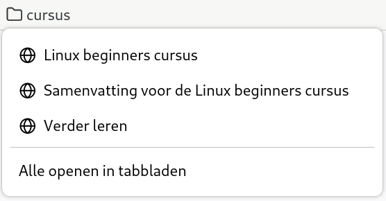
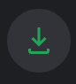

---
title: Oefeningen voor de Linux beginners cursus
author: |
    | Steven Speek 
    |  \tt{slspeek@gmail.com}
date: \today{}
...
# Notatie
Het lettertype ```Courier``` wordt gebruikt om iets op te schrijven dat u op het toetsenbord kunt typen.
Uitzondering hierop zijn de volgende speciale toetsen:
```SPATIEBALK```, ```CTRL```, ```ALT```, ```SUPER```, ```MENU```, ```TAB```, ```HOME```, ```END```, ```ESC```, ```DELETE```, ```PageDown```, ```PageUp```, ```PrintScreen```, ```F1```, ```F2``` ... en ```ENTER```, hier dient u betreffende toets in te drukken in plaats van het woord in te typen.

# Inleiding

1. Op welke familie van besturingssystemen is Linux gebaseerd?

1. Noem twee sleutelfiguren in het onstaan van Linux.

1. Onder welke licensie is de Linux kernel gepubliceerd?

1. Noem drie voordelen van vrije software.

1. Uit welke twee onderdelen bestaat een Linux distributie grofweg gezegd?

# Rondleiding GNOME
1.  Aanmelden en afmelden

    a.  Meld u aan met het account (gebruikersnaam=```tux```, wachtwoord=```tux```)

    a.  Afmelden 

        i. Klik op {height=20px} 

        i. Klik op {height=20px}

        i. Klik op "Afmelden ..."

        i. Bevestig in de popup

        i. Log opnieuw aan

1.  Schermbeveiliging activeren

    a.  Activeer de schermbeveiliging met ```SUPER+L```

    a.  Maak de computer weer los door het wachtwoord van gebruiker Tux in te voeren: ```tux```

1.  Hulp openen en sluiten 1

    a.  Open hulp met ```SUPER+F1```
    
    a.  Sluit Hulp met ```ALT+F4```

1.  Hulp openen en sluiten 2

    a.  Open hulp met ```SUPER+6```

    a.  Sluit Hulp met kruisje rechtsboven

1.  Hulp openen en sluiten 3

    a.  Open Hulp met ```SUPER```, type ```hulp``` en druk ```ENTER```

    a.  Sluit de hulp met ```CTRL+W```

1.  Hulp openen en sluiten 4 (moeilijk)

    a.  Open de hulp door op ```SUPER``` te drukken, en dan op het reddingsboei
        symbool op de dash te klikken

    a.  Gebruik ```CTRL+S``` en zoek op 'sneltoetsen', ga naar 'Sneltoetsen
        > instellen'

        i.  Ga naar beneden naar 'Vooraf gedefinieerde sneltoetsen'

        i.  Klap 'Systeem' open en zoek de sneltoets voor
            'Toepassingenmenu openen'.

        i.  Gebruik deze toets. Sluit de hulp dan met ```ENTER``` of
             ```SPATIEBALK```.

1. Ga activiteiten modus in en verlaat haar onverrichter zake weer (zes keer)

    a. Ga activiteiten modus in met het toetsenbord ```SUPER``` (driemaal)
        
        i. Verlaat activiteiten modus met ```ESC```
        
        i. Verlaat activiteiten modus met ```SUPER```

        i. Verlaat activiteiten modus via de knop {height=20px}

    a. Ga activiteiten modus in met de muis {height=20px} (driemaal)

        i. Verlaat activiteiten modus met ```ESC```
        
        i. Verlaat activiteiten modus met ```SUPER```

        i. Verlaat activiteiten modus met de knop {height=20px}

1. Open de samenvatting van deze cursus:
    
    a. Druk ```SUPER``` in (en laat hem weer los)

    a. Type ```samenv``` gevolgd door ```ENTER```

    a. Druk ```CTRL+W``` om haar weer te sluiten

1. Ga applicatie modus in en verlaat haar onverrichter zake weer (zes keer)
    
    a. Ga applicatie modus binnen via ```SUPER+A```

        i. Ga terug naar normale modus met ```SUPER```

        i. Ga terug naar normale modus met ```ESC ESC```

        i. Ga terug naar normale modus met {height=20px}

    a. Ga met behulp de muis applicatie modus binnen door te klikken op {height=20px} en daarna op {height=20px}

        i. Ga terug naar normale modus met ```SUPER```

        i. Ga terug naar normale modus met ```ESC ESC```

        i. Ga terug naar normale modus met {height=20px}

1. Ga applicatie modus binnen op een wijze naar keuze en
    
    a. Sleep firefox {width=40px} naar het eerste (linker) werkblad

    a. Sleep kaarten {width=40px} naar het tweede (rechter) werkblad

    a. Ga naar gewone modus op een wijze naar keuze

    a. Sluit beide toepassingen

        i. Ga naar het eerste (linker) werkblad met ```SUPER+PageUp```

        i. ```ALT+F4``` om firefox te sluiten

        i. ```SUPER+PageDown``` om naar tweede werkblad te gaan

        i. ```ALT+F4``` om kaarten te sluiten

1. Open en sluit het notificatie venster

    a. Open met een klik op {height=20px}

        i. Sluit met een klik op {height=20px}
    
    a. Open met ```SUPER+V```

        i. Sluit met ```ESC```

        i. Sluit met ```SUPER+V```

1. Open het systeemmenu en sluit haar onverrichter zake weer

    a. Open met klik op {height=20px}

        i. Sluit met klik op {height=20px}

    a. Open met klik op {height=20px}

        i. Sluit met klik ergens buiten het menu

    a. Open met klik op {height=20px}

        i. Sluit met ```ESC```

1. Netwerk uitschakelen en opnieuw inschakelen

    a. Start {width=40px} en ga naar ```tldp.org```.

    a. Open het systeemmenu

    a. Klik {height=20px}, knop wordt grijs

    a. Sluit het systeemmenu

    a. Start {width=40px} en ga naar ```debian.org```, dit zal niet gaan

    a. Open het systeemmenu
    
    a. Klik {height=20px}, knop krijgt weer kleur

    a. Sluit systeemmenu

    a. Ga naar {width=40px} en herlaad de pagina met ```F5```

    a. Sluit Firefox met ```ALT+F4```
    
1. Afmelden op twee manieren

    a. Met muis
        
        i. Klik op {height=20px} 

        i. Klik op {height=20px}

        i. Klik op "Afmelden ..."

        i. Annuleer in de popup

    a. Met toetsenbord

        i. ```SUPER afme ENTER```

        i. Annuleer in de popup door ```SPATIEBALK``` of ```ESC```

1. Uitschakelen op drie manieren

    a. Met ```ALT+CTRL+DELETE```

        i. Annuleer in de popup met ```ESC```

    a. Met muis

        i. Klik op {height=20px} 

        i. Klik op {height=20px}

        i. Klik op "Uitschakelen ..."

        i. Annuleer in de popup met ```ESC```

    a. Met toetsenbord

        i. ```SUPER uits ENTER```

        i. Annuleer in de popup door ```SPATIEBALK``` of ```ESC```


1. Herstarten op twee manieren

    a. Met muis

        i. Klik op {height=20px} 

        i. Klik op {height=20px}

        i. Klik op "Herstarten ..."

        i. Annuleer in de popup met ```ESC```

    a. Met toetsenbord

        i. ```SUPER hersta ENTER```

        i. Annuleer in de popup door ```SPATIEBALK``` of ```ESC```


# Toepassingen starten en afsluiten

1.  Sneltoetsen toevoegen. Open sneltoetsen in de Instellingen door:

    a. ```SUPER snelt ENTER```

    a. Klik op "Sneltoetsen bekijken en aanpassen"
        
    a. Ken onder de afdeling "Starters" ```SUPER+E``` aan "Persoonlijke map"

    a. Ken onder de afdeling "Starters" ```SUPER+C``` aan "Rekenmachine starten"

    a. Ken onder de afdeling "Starters" ```SUPER+I``` aan Instellingen

1.  Aangepaste sneltoetsen toevoegen. Open sneltoetsen in de Instellingen.

    a. Open de afdeling "Aangepaste sneltoets" (onderaan).

    a.  ```SUPER+SHIFT+I``` toekennen aan "Afstellingen"

        i. Klik op de + onderaan

        i. Vul onder "Naam" ```Afstellingen``` in

        i. Vul onder "Opdracht" ```gnome-tweaks``` in

        i. Klik op "Sneltoets instellen" en druk ```SUPER+SHIFT+I```

    a.  Ken ```ALT+CTRL+T``` toe aan de opdracht ```gnome-terminal``` onder de naam ```Terminal```.

1.  Sneltoetsen opzoeken. Open de sneltoetsen instellingen zoals in beschreven in de eerste oefening *(Hint: Afdeling "Vensters")*.
    
    a. Wat is de toets voor "Venster maximaliseren"?

    a. Wat is de toets voor "Venster herstellen"?

1.  Sneltoetsen opzoeken. Open de sneltoetsen instellingen zoals in beschreven in de eerste oefening.
Gebruik nu het vergrootglas bovenaan het venster om te zoeken.
    
    a. Wat is de toets voor "Toepassingenmenu openen"? Type ```toepassingenmenu``` in het tekstvak naast het vergrootglas  en kijk in de zoekresultaten voor het antwoord

    a. Wat is de toets voor "Afmelden"?  Type ```afmelden``` in het tekstvak naast het vergrootglas  en kijk in de zoekresultaten voor het antwoord

1.  Open en sluit terminal 1

    a.  Open met ```ALT+CTRL+T```

    a.  Sluit met ```CTRL+D``` (betekent end of file in UNIX)

1.  Open en sluit terminal 2

    a.  Open ```SUPER```, ```ter```, ```ENTER```

    a.  Sluit met ```CTRL+D```

1. Open en sluit terminal 3

    a. Ga in applicatie modus met ```SUPER+A```

    b. Klik op het terminal venster icon {width=50px}

    c. Sluit het venster met de muis door op het kruisje rechtsboven te klikken

1. Open en sluit terminal 4

    a. Ga in applicatie modus met de muis:

        i. Klik op {height=20px}

        i. Klik op de 3x3 puntjes op de dash {width=100px}
    
    a. Sleep het {width=50px} naar het eerste werkblad

    a. Klik op {height=20px} om applicatie modus te verlaten

    a. Klik op een willekeurige plek van het terminalvenster 

    a. Sluit het terminalvenster door ```ALT+F4``` in te drukken

1. Open met ```ALT+CTRL+T``` een terminalvenster

    a. Gebruik het toepassingmenu om een extra terminalvenster te openen

        i. ```SUPER+F10```

        i. ```ENTER``` op "Nieuw venster"
    
    a. Sluit het tweede terminalvenster af via het toepassingsmenu

        i. ```SUPER+F10```

        i. Gebruik de pijltjes toetsen om naar "Afsluiten" te komen

        i. Druk ```SPATIEBALK```
    
    a. Herhaal dit voor het eerste terminalvenster

1. Open en sluit twee Firefox vensters

    a. Druk ```SUPER+1``` om Firefox te openen

    a. Maak een nieuw venster aan via het toepassingsmenu

        i. ```SUPER+F10```

        i. ```ENTER``` op "Nieuw venster"
    
    a. Sluit beide vensters met het toepassingsmenu
        
        i. ```SUPER+F10```

        i. Gebruik de pijltjes toetsen om naar "Afsluiten" te komen

        i. Druk ```SPATIEBALK```

1. Open en sluit twee LibreOffice writer vensters met het bestandsmenu

    a. Druk ```SUPER+3```

    a. Druk ```F10``` om de menubalk voor Writer te activeren

    a. Druk ```↓```

    a. Druk ```→```

    a. Druk ```SPATIEBALK```

    a. Druk ```F10``` om de menubalk voor Writer te activeren

    a. Druk ```↑``` om snel bij "Afsluiten" te komen

    a. Druk ```SPATIEBALK```

1. Open twee LibreOffice writer vensters en sluit ze één voor één

    a. Druk ```SUPER+3```

    a. Druk ```CTRL+N``` om via de sneltoets voor een nieuw venster van LibreOffice een tweede venster te openen

    a. Druk ```CTRL+W``` om het tweede venster te sluiten

    a. Druk ```CTRL+W``` om het eerste venster te sluiten

    a. Druk ```CTRL+Q``` om LibreOffice af te sluiten

1. Open twee LibreOffice writer vensters en sluit ze één voor één

    a. Druk ```SUPER+3```

    a. Druk ```CTRL+N``` om via de sneltoets voor een nieuw venster van LibreOffice een tweede venster te openen

    a. Klik op het kruisje rechtsboven van het tweede venster

    a. Klik op het kruisje rechtsboven van het eerste venster

1. Open en sluit een LibreOffice calc venster

    a. Druk ```SUPER spread ENTER```

    a. Sluit met ```ALT+F4```

1. Open en sluit een eenvoudige (platte) tekst editor

    a. Druk ```SUPER tekst ENTER```

    a. Sluit met ```ALT+F4```

1. Open een rekenmachine en reken 6 keer 7 uit

    a. Druk ```SUPER+C```

    a. Druk ```6*7 ENTER```

    a. Sluit met ```ALT+F4```

1. Reken 2 + 4 x 10 uit via het zoekvak

    a. Druk ```SUPER 2+4*10```

    a. Druk ```SUPER``` om in normale modus terug te keren

1. Open een tekst editor via applicatie modus

    a. Ga met de muis naar applicatie modus (twee stappen)

    a. Klik rechts op > om naar de tweede pagina te komen

    a. Klik op {width=50px}

    a. Open een tweede venster met ```CTRL+N```

    a. Sluit tweede venster met ```ALT+F4```

    a. Sluit eerste venster met ```ALT+F4```

1. Open een tekst editor via applicatie modus

    a. Druk ```SUPER+A```

    a. Druk ```PageDown``` om op de tweede pagina te komen

    a. Sleep {width=50px} naar het eerste werkblad

    a. Druk tweemaal ```ESC``` om in normale modus te komen

    a. Sluit het venster met ```ALT+F4```

1. Open en sluit twee Firefox vensters met de muis

    a. Ga activiteiten modus in door op {height=20px} te klikken

    a. Klik op {width=40px} op de dash

    a. Ga opnieuw activiteiten modus in door op {height=20px} te klikken

    a. Klik met ```CTRL``` ingedrukt op {width=40px} op de dash

    a. Verlaat activiteiten modus door op {height=20px} te klikken

    a. Klik de beide vensters dicht door op het kruisje rechtsboven te klikken 

        i. Noem twee manieren waarop dit sluiten van beide vensters in één keer had gekunt (er zijn drie manieren)

1. Som manieren op waarop een toepassing, waaraan een sneltoets is toegekend, maar niet op de dash staat, kan worden gestart (vier manieren)

1. Som manieren op waarop een toepassing, waaraan een sneltoets is toegekend en op de dash staat, kan worden gestart (vijf manieren)

1. Op welke wijzen kan een extra venster worden geopend van toepassingen (die extra vensters toestaan)? (vier manieren)

1. Wat is de toetscombinatie waarmee een venster wordt gesloten?

1. Wat is een gangbare toetscombinatie waarmee een toepassing wordt afgesloten?

1. Waarom is een goed idee om toepassingen die u veel gebruikt aan de dash toe te voegen? (twee redenen)

# Belangrijke toepassingen

## Firefox

1. Start Firefox met ```SUPER+1```.

    - Ga naar de URL: [```slspeek.github.io/linux-beginners-cursus```](https://slspeek.github.io/linux-beginners-cursus).

    - Scroll naar het kopje "Lesmateriaal"

    - Klik op de koppeling van de Webversie (tweede kolom) van "Presentaties"
    
    - Blader door enkele presentaties heen, nu weet u waar u het lesmateriaal online kunt vinden

    - Sluit de browser af met ```CTRL+Q```

1. Start Firefox met ```SUPER+1```.

    - Ga naar [```debian.org```](http://debian.org). 

    - Open een extra tabblad met ```CTRL+T```, merk op dat u gelijk het webadres kunt intypen. Ga naar ```tldp.org```.

    - Ga terug naar het eerste tabblad door ```CTRL+TAB``` in te drukken.

    - Sluit ```debian.org```, met ```CTRL+W```.

    - Sluit de browser af door het laatste tabblad te sluiten (```CTRL+W```)

1. Start Firefox met ```SUPER+1```.

    - Ga naar de URL: [```slspeek.github.io/linux-beginners-cursus```](https://slspeek.github.io/linux-beginners-cursus)

    - Scroll naar het kopje "Lesmateriaal"

    - Open de Webversie van de Samenvatting en de Oefeningen op een apart tabblad (en blijf op de eerste pagina), door ```CTRL``` in gedrukt te houden terwijl u op de koppelingen van de Webversie  (tweede kolom) van de Samenvatting en de Oefeningen klikt

    - Gebruik ```CTRL+TAB``` om de twee nieuwe pagina's te bekijken

    - Sluit de browser af met ```CTRL+Q```
    
1. Start Firefox met ```SUPER+1```.

    - Zet
    [```slspeek.github.io/linux-beginners-cursus/toepassingen-starten-en-afsluiten.html#4```](https://slspeek.github.io/linux-beginners-cursus/toepassingen-starten-en-afsluiten.html#4)
    in de adresbalk

    - Klik rechts in de animatie om het context menu te openen en kies "Afbeelding openen in nieuw tabblad"

    - Bekijk de grotere animatie

    - Sluit de browser af met ```CTRL+Q```

1. Start Firefox met ```SUPER+1```.

    - Ga naar de URL: [```slspeek.github.io/linux-beginners-cursus```](https://slspeek.github.io/linux-beginners-cursus)

    - Maak een bladwijzer met ```CTRL+D```

    - Sluit de browser af met ```CTRL+Q```

1. Start Firefox met ```SUPER+1```.

    - Ga met behulp van de bladwijzer naar de URL: [```slspeek.github.io/linux-beginners-cursus```](https://slspeek.github.io/linux-beginners-cursus) ("Linux beginners cursus")
        
    - Scroll naar het kopje "Lesmateriaal"

    - Klik op de koppeling van de Webversie van "Verder leren" (tweede kolom)
    
    - Maak een bladwijzer door op {width=30px} aan de rechterzijde te klikken

    - Sluit de browser af met ```CTRL+Q```

1. Start Firefox met ```SUPER+1```.

    - Ga met behulp van de bladwijzer naar de URL [```slspeek.github.io/linux-beginners-cursus```](https://slspeek.github.io/linux-beginners-cursus) ("Linux beginners cursus")

    - Klik op de Webversie van "Samenvatting" onder het kopje "Lesmateriaal"

    - Maak bladwijzerbalk zichtbaar met ```CTRL+SHIFT+B``` als deze verborgen is

    - Maak een bladwijzer door {width=30px} naar de bladwijzerbalk te slepen

    - Sluit de browser af met ```CTRL+Q```

1. Start Firefox met ```SUPER+1```.

    - Als de bladwijzerbalk niet zichtbaar is maakt u hem zichtbaar met ```SHIFT+CTRL+B```

    - Open het context menu (rechtsklikken) van de bladwijzerbalk en kies "Map toevoegen ..." en maak een map "cursus" aan

    - Sleep de drie bladwijzers over de cursus naar deze map ("Linux beginners cursus", "Verder leren" en "Samenvatting voor de Linux beginners cursus")

    - En orden ze zodanig dat het resultaat er zo uitziet:
    {height=100px}

    - Sluit de browser af met ```CTRL+Q```

1. Start Firefox met ```SUPER+1```.

    - Ga met behulp van de bladwijzer naar de URL [```slspeek.github.io/linux-beginners-cursus```](https://slspeek.github.io/linux-beginners-cursus) ("Linux beginners cursus")

    - Ga naar het kopje "Lesmateriaal"

    - Klik met ```CTRL``` ingedrukt op de Webversies van "Oefeningen" en "Begrippenlijst"

    - Als de bladwijzerbalk niet zichtbaar is maakt u hem zichtbaar met ```SHIFT+CTRL+B```

    - Breng met behulp van ```CTRL+TAB``` de tabbladen 1 voor 1 naar voren en sleep {width=30px} naar de map "cursus" op de bladwijzerbalk

    - Sluit de browser af met ```CTRL+Q```

1. Start Firefox met ```SUPER+1```

    - Ga naar [```kernel.org```](https://kernel.org)

    - Maak een bladwijzer met ```CTRL+D```

    - Ga naar "Bladwijzers beheren" met ```CTRL+SHIFT+O```. Er opent een popup venster met de titel "Bibliotheek".

    - Selecteer in het linkerpaneel "Bladwijzerbalk"

    - Verwijder de bladwijzer naar ```kernel.org```, door rechts te klikken op de ```kernel.org``` bladwijzer en "Bladwijzer verwijderen" te kiezen

    - Sluit het "Bibliotheek" venster met ```CTRL+W```

    - Sluit de browser af met ```CTRL+Q```

1. Noem drie manieren waarop je een bladwijzer in Firefox kunt maken (er zijn er vier).

1. Noem drie manieren waarop je een bladwijzer in Firefox kunt verwijderen.

1. Start Firefox met ```SUPER+1```

    - Ga naar 'Add-ons en thema's' met ```CTRL+SHIFT+A``` of via het hamburger menu {height=20px} rechtbovenin.

    - Selecteer aan de linkerzijde van de pagina 'Extensies'

    - Type in het zoekvak met label "Meer add-ons zoeken" ```Adblocker Ultimate``` en installeer deze extensie:

        - Kies het bovenste zoekresultaat

        - Klik op de blauwe knop met opschrift "Toevoegen aan Firefox"

        - Klik in popup die rechtbovenin verschijnt op "Toevoegen"

        - Klik in de volgende popup die rechtbovenin verschijnt op "Oké"

    - Sluit de browser af met ```CTRL+Q```

1. Start Firefox met ```SUPER+1```.

    - Ga naar de URL: [```slspeek.github.io/linux-beginners-cursus/samenvatting.html#firefox```](https://slspeek.github.io/linux-beginners-cursus/samenvatting.html#firefox).

    - Scroll omlaag naar "Extensies installeren", klik op de koppeling van "I don't care about cookies"

    - Klik op de knop "Toevoegen aan Firefox"

    - Ga na met ```CTRL+SHIFT+A``` (Add-ons) of de extensie is geïnstalleerd

    - Sluit de browser af met ```CTRL+Q```

1. Start Firefox met ```SUPER+1```

    - Ga via het hamburgermenu rechtsboven {height=20px} naar 'Hulp' en dan naar 'Hulp verkrijgen'

    - Type ```navigatiegeschiedenis``` in het zoekvak midden op de pagina

    - Wat betekent geschiedenis in Firefox?

    - Sluit de browser af met ```CTRL+Q```

## Bestanden

1. Wat is het pad van de thuismap van gebruiker tux?

1. Wat is het map scheidingsteken op Linux?

1. Onder welke map is een aangekoppelde USB-stick terug te vinden?

1. Waarvoor hebt u een bestandsbeheerder nodig (noem vier redenen)? 

1. Noem drie manieren waarop u de bestandsbeheerder kunt openen.

1. Een plaatje openen

    - Open bestandsbeheerder met ```SUPER+E```

    - Klik in het linker paneel op "Afbeeldingen"

    - Dubbelklik in het grote paneel op de map "bloemen"

    - Dubbelklik in het grote paneel op "akkerdistel.jpeg"

    - Sluit "Afbeeldingsweergave" met ```ALT+F4```
    
    - Sluit de bestandbeheerder met ```ALT+F4```

1. De samenvatting openen 

    - Open bestandsbeheerder met ```SUPER+E```

    - Klik in het linker paneel op "Downloads"

    - Dubbelklik in het grote paneel op "samenvatting.pdf"

    - Sluit "Documentweergave" met ```ALT+F4```
    
    - Sluit de bestandbeheerder met ```ALT+F4```

1. Wisselen tussen raster- en lijstweergave.

    - Open bestandsbeheerder met ```SUPER+E```

    - Wissel naar  lijstweergave met ```CTRL+1```

    - Wissel naar rasterweergave met ```CTRL+2```

    - Welke weergave geeft meer informatie?

    - Sluit de bestandsbeheerder met ```CTRL+W```

1. Wisselen tussen raster- en lijstweergave.

    - Open bestandsbeheerder met ```SUPER+E```

    - Wissel naar de andere weergave met één van de knoppen rechtsbovenin: {width=20px} of {width=20px}

    - Keer terug naar eerste weergave

    - Sluit de bestandsbeheerder met ```CTRL+W```

1. Verborgen bestanden tonen

    - Open bestandsbeheerder met ```SUPER+E```

    - Toon de verborgen bestanden met behulp van het hamburgermenu {height=20px}, het menuitem heet "Verborgen bestanden tonen"
    
    - Wat voor soort namen hebben de verborgen bestanden? Ziet u een patroon? (Wissel eventueel meerdere malen met ```CTRL+H```)

    - Sluit de bestandsbeheerder met ```CTRL+W```

1. De map ```Documenten``` ingaan.
    
    - Open bestandsbeheerder met ```SUPER+E```

    - Dubbel klik de map ```Documenten```. De adresbalk ziet er nu zo uit: {height=20px}

    - Ga nu weer omhoog door op "Persoonlijke map" in {height=20px} te klikken. De adresbalk ziet er dan weer zo {height=20px} uit.

    - Ga opnieuw de map ```Documenten``` in.

    - Ga terug omhoog met behulp van ```ALT+↑```

    - Sluit de bestandsbeheerder met ```ALT+F4```

1. De map ```Afbeeldingen``` ingaan.

    - Herhaal de zes stappen van de vorige opgave met de map ```Afbeeldingen```

1. Map ```werkstuk-protohistorie``` in de map ```Documenten``` aanmaken.

    - Open bestandsbeheerder met ```SUPER+E```

    - Ga naar de map ```Documenten``` 

    - Maak met behulp van het menu met de drie puntjes boven elkaar rechts in de adresbalk
    {height=20px} een nieuwe map genaamd ```werkstuk-protohistorie``` aan.

    - Met welke sneltoets had dit ook gekunt (open eventueel opnieuw het drie puntjes boven elkaar menu voor het antwoord)?

    - Sluit de bestandsbeheerder met ```ALT+F4```

1. Welke twee manieren hebt u geleerd om mappen aan te maken?

1. Mappen ```bronstijd``` en ```ijzertijd``` in ```werkstuk-protohistorie``` aanmaken.

    - Open bestandsbeheerder met ```SUPER+E```

    - Navigeer via de map ```Documenten``` naar de map ```werkstuk-protohistorie```.

    - Maak met behulp van de sneltoets ```CTRL+SHIFT+N``` een map ```bronstijd``` aan.

    - Maak met behulp van het drie puntjes menu een map ```ijzertijd``` aan.

    - Sluit de bestandsbeheerder met ```ALT+F4```

1. Bloemen sorteren.

    - Open bestandsbeheerder met ```SUPER+E```

    - Ga naar de map ```bloemen``` in ```Afbeeldingen```

    - Maak mappen ```composietenfamilie```, ```anjerfamilie``` en ```ooievaarsbekfamilie``` aan.

    - Sleep de afbeeldingen van de bloemen naar de juiste map (als u langer dan een halve seconde boven een map hangt met een plaatje voor u het loslaat navigeert u naar de map, gebruik ```ALT+↑``` om weer terug te keren naar ```bloemen```)

        - Akkerdistel, Harig knopkruid, Gewone melkdistel naar ```composietenfamilie```

        - Robertskruid en Beemdooievaarsbek naar ```ooievaarsbekfamilie```

        - De rest naar ```anjerfamilie```
    
    - Sluit de bestandsbeheerder met ```ALT+F4```

1. Een kopie maken van de ```Documenten``` map.

    - Open bestandsbeheerder met ```SUPER+E```

    - Open het context menu van de map ```Documenten``` en kies "Kopiëren"

    - Klik rechts op een open plek in de "Persoonlijke map" en kies "Plakken"

    - Hoe heeft de bestandsbeheerder de kopie genoemd?

    - Sluit de bestandsbeheerder met ```ALT+F4```

1. Een schermafdruk verplaatsen

    - Open bestandsbeheerder met ```SUPER+E```

    - Maak een schermafdruk met ```ALT+PrintScreen```

    - Navigeer naar ```Afbeeldingen/Schermafdrukken```

    - Knip deze afbeelding via haar context menu

    - Navigeer naar ```Documenten``` 

    - Plak de schermafdruk via het context menu

    - Ga terug naar ```Afbeeldingen/Schermafdrukken```

    - Staat de schermafdruk hier nog?

    - Navigeer terug naar ```Documenten``` 

    - Gooi de schermafdruk in de prullenbak door haar te selecteren en ```DELETE``` te drukken

    - Sluit de bestandsbeheerder met ```ALT+F4```

1. Map ```Video's``` in de prullenbak gooien en terughalen

    - Open bestandsbeheerder met ```SUPER+E```

    - Klik rechts op ```Video's``` en kies "In Prullenbak gooien"

    - Klik in het linkerpaneel op "Prullenbak"

    - Hier ziet u ```Video's``` staan

    - Klik rechts op ```Video's``` en kies "Uit Prullenbak terughalen"

    - Merk op dat ```Video's``` niet meer in de "Prullenbak" zit

    - Navigeer naar "Persoonlijke map" door op het linkerpaneel op "Persoonlijke map" te klikken

    - U ziet dat de map ```Video's``` er weer staat

    - Sluit de bestandsbeheerder met ```ALT+F4```

1. Een map in de prullenbak gooien en er weer uit terughalen.

    - Open bestandsbeheerder met ```SUPER+E```

    - Maak een map ```oefening-prullenbak``` aan

    - Klik rechts op ```oefening-prullenbak``` en kies "In Prullenbak gooien"

    - Merk op dat ```oefening-prullenbak``` niet meer in de "Persoonlijke map" is te zien. Het is weg.

    - Klik in het linkerpaneel op "Prullenbak"

    - Hier ziet u ```oefening-prullenbak``` staan

    - Klik rechts op ```oefening-prullenbak``` en kies "Uit Prullenbak terughalen"

    - Merk op dat ```oefening-prullenbak``` niet meer in de "Prullenbak" zit

    - Navigeer naar "Persoonlijke map" door op het linkerpaneel op "Persoonlijke map" te klikken

    - U ziet dat de map ```oefening-prullenbak``` er weer staat

    - Selecteer ```oefening-prullenbak``` en druk op ```DELETE```
    
    - Sluit de bestandsbeheerder met ```ALT+F4```

1. Prullenbak legen

    - Open bestandsbeheerder met ```SUPER+E```

    - Klik in het linkerpaneel op "Prullenbak"

    - Hier ziet u alleen ```oefening-prullenbak``` staan

    - Kies uit het actiemenu (```F10```) "Prullenbak legen"

    - Sluit de bestandsbeheerder met ```ALT+F4```

1. Gebruik eigenschappen in bestandsbeheerder

    - Open bestandsbeheerder met ```SUPER+E```

    - Navigeer naar ```Afbeeldingen```

    - Hoe groot is de map ```bloemen```.
        
        -  Selecteer ```bloemen```

        -  Open het context menu en kies "Eigenschappen"

    - Sluit de bestandsbeheerder met ```ALT+F4```

1. Hoe groot in pixels is het plaatje ```blaassilene.jpg``` (```Afbeeldingen/bloemen/anjerfamilie```)?

    - Gebruik "Eigenschappen" van het bestand

    - Klik onderaan de "Eigenschappen" popup op "Afbeeldingseigenschappen"

1. Bladwijzer van een map maken van één uw projecten

    - Open bestandsbeheerder met ```SUPER+E```

    - Ga ```Documenten``` in.

    - Sleep ```werkstuk-protohistorie``` naar het linkerpaneel boven het "Nieuwe bladwijzer"
    {height=150px}

    - Sluit de bestandsbeheerder met ```ALT+F4```

1. Twee bladwijzers maken

    - Open bestandsbeheerder met ```SUPER+E```

    - ga met behulp van uw bladwijzer naar de eerder aangemaakt map ```werkstuk-protohistorie```

    - navigeer in de map ```bronstijd```

    - maak een bladwijzer aan met ```CTRL+D```

    - navigeer in de map ```ijzertijd```

    - maak een bladwijzer aan met behulp van het menu met de drie puntjes boven elkaar rechts in de adresbalk
    {height=20px}

    - Sluit de bestandsbeheerder met ```ALT+F4```

1. Op welke drie manieren kunt u een bladwijzer aanmaken in de bestandsbeheerder?

1. Verwijder de bladwijzers naar de mappen ```ijzertijd``` en ```bronstijd```.

    - Open bestandsbeheerder met ```SUPER+E```

    - Verwijder de bladwijzers naar de mappen ```ijzertijd``` en ```bronstijd``` door in het linkerpaneel rechts te klikken op de bladwijzers
    en uit het menu "Verwijderen uit bladwijzers" te kiezen.

    - Overtuig uzelf ervan dat in de map ```werkstuk-protohistorie``` de mappen ```ijzertijd``` en ```bronstijd``` nog bestaan.
    
    - Sluit de bestandsbeheerder met ```ALT+F4```

1. Werkstukje maken over protohistorie.

    - Zoek met Firefox op Wikipedia naar protohistorie

        - Gebruik ```CTRL+K``` en ```CTRL+↑```, ```CTRL+↓```

    - Druk de pagina [```https://nl.wikipedia.org/wiki/Protohistorie```](https://nl.wikipedia.org/wiki/Protohistorie) af naar pdf en sla deze op in de map ```werkstuk-protohistorie``` gebruikmakend van de bladwijzer.

        - Kies uit het hamburgermenu  "Afdrukken..." 

        - Zet het "Uitvoerapparaat" in het rechterpaneel op "Opslaan als PDF" en druk op "Opslaan"

        - Kies in het linkerpaneel van het bestandsvenster de bladwijzer ```werkstuk-protohistorie```

        - Klik op de blauwe knop "Opslaan" rechtsbovenin

    - Sluit Firefox

    - Open opnieuw bestandsbeheerder met ```SUPER+E```

    - Zoek met ```CTRL+F``` naar het woord ```periode```, het document ```Protohistorie - Wikipedia.pdf``` uit de map ```werkstuk-protohistorie```
        moet zich onder de zoekresultaten moeten bevinden.

1. Maak een archief ```bloemen.zip``` in de map ```Afbeeldingen``` van de map ```bloemen```.

    - Open bestandsbeheerder met ```SUPER+E```

    - Navigeer naar ```Afbeeldingen```

    - Klik rechts op de map ```bloemen``` en kies "Inpakken ..."

    - Accepteer de naam ```bloemen```, door op "Maken" te klikken

    - Sluit de bestandsbeheerder met ```ALT+F4```

1. Archief ```bloemen.zip``` inzien.

    - Open bestandsbeheerder met ```SUPER+E```

    - Navigeer naar ```Afbeeldingen```

    - Dubbelklik op ```bloemen.zip```

    - In achiefbeheer kunt u het archief bezien, dubbelklik op ```bloemen``` om de familie mappen te zien, dubbelklik verder op bijvoorbeeld ```anjerfamilie``` om de anjers te zien.

    - Sluit archiefbeheer met ```ALT+F4```

    - Sluit de bestandsbeheerder met ```ALT+F4```

1. Archief uitpakken in nieuwe map

    - Open bestandsbeheerder met ```SUPER+E```

    - Maak map ```plaatjes``` aan. In welke map wordt ```plaatjes``` aangemaakt?

    - Navigeer naar ```Afbeeldingen``` en kopieer ```bloemen.zip``` door er rechts op te klikken en "Kopieren" te kiezen

    - Navigeer naar de eerder gemaakte ```plaatjes``` map. De druk ```CTRL+V``` om een kopie van het ```bloemen.zip``` archief hier te plaatsen.

    - Klik rechts op ```bloemen.zip``` en kies "Uitpakken". Er is nu een map ```bloemen``` in ```plaatjes``` gemaakt. Overtuig u ervan dat dit precies de families bevat die u gemaakt had.

    - Gooi ```bloemen.zip``` en map ```bloemen``` uit ```plaatjes``` in de prullenbak. Door er rechts op te klikken en "In de prullenbak gooien" te kiezen.

    - Sluit de bestandsbeheerder met ```ALT+F4```

1. Archief uitpakken naar

    - Open bestandsbeheerder met ```SUPER+E```

    - Navigeer naar ```Afbeeldingen```
    
    - Klik rechts op ```bloemen.zip``` en kies "Uitpakken naar". Kies als map ```plaatjes``` in "Persoonlijke map".

    - Navigeer naar de ```plaatjes``` map. Overtuig u ervan dat de map ```bloemen``` de families bevat die u gemaakt had.

    - Gooi vanuit "Persoonlijke map" ```plaatjes``` in de prullenbak.
    
    - Sluit de bestandsbeheerder met ```ALT+F4```

1. De hulp functie gebruiken om op bestandsgrootte te sorteren

    - Open bestandsbeheerder met ```SUPER+E```

    - Ga naar raster weergave

    - Open de hulp functie ```F1```

    - Zoek met ```CTRL+S``` naar ```sorteren```, en ga naar "Bestanden en mappen sorteren"

    - Volg de instructies om op bestandsgrootte te sorteren in pictogramweergave

    - Verander van weergave naar lijstweergave

    - Volg de instructies om weer naar alphabetische oplopend sortering terug te keren

    - Sluit de hulp
    
    - Sluit de bestandsbeheerder met ```ALT+F4```


1. Open en sluit het sneltoetsen overzicht in de bestandsbeheerder

    - Open bestandsbeheerder met ```SUPER+E```

    - Gebruik ```SHIFT+CTRL+?``` om het sneltoetsen venster te openen

    - Gebruikt ```PageDown``` om tweemaal verder te bladeren

    - Sluit het met ```ESC```
    
    - Sluit de bestandsbeheerder met ```ALT+F4```

1. Met welke sneltoets kunt u een map of bestand hernoemen?

1. Met welke sneltoets kunt u in één keer naar uw persoonlijke map terugkeren?

1. Met welke sneltoets kunt terug gaan naar de lokatie waar u was? En met welke weer vooruit  (*Hint: dit heet "Ga terug" en "Ga verder"*)?
Probeer dit uitvoerig uit. U opent de bestandsbeheerder en gaat naar ```Documenten``` en dan naar ```Afbeeldingen/Schermafdrukken``` en probeert de gevonden sneltoetsen uit.

#  Vensters en werkbladen

1. Wisselen tussen twee toepassingen op één werkblad

    - Open Firefox met ```SUPER+1```

    - Open bestandsbeheer ```SUPER+4```

    - Wissel terug naar Firefox met ```ALT+TAB```

        - Met welke andere sneltoets had dit ook gekunt?
    
    - Wissel nu weer naar de bestandsbeheerder met ```ALT+TAB```

    - Sluit beide toepassingen met ```ALT+F4```

        - Sluit de bestandsbeheerder met ```ALT+F4```

        - Sluit Firefox met ```ALT+F4```

1. Wisselen tussen vier toepassingen op één werkblad

    - Open Firefox met ```SUPER+1```

    - Open bestandsbeheer ```SUPER+4```

    - Open LibreOffice writer ```SUPER+3```

    - Open Hulp met ```SUPER+6```

    - Wissel nu de focus naar Firefox terug door ```ALT+[TAB TAB TAB]``` (u houdt ```ALT``` ingedrukt en drukt driemaal op ```TAB``` )

    - Wissel nu de focus naar Hulp door ```ALT+TAB```

    - Wissel focus naar Writer met ```ALT+[TAB TAB]```

    - Zie wat er gebeurt met het popup venster met icons van de geopende toepassingen als u ```ALT+[TAB TAB TAB TAB]``` doet (als alles goed is houdt Writer de focus)

    - Sluit alle toepassingen door viermaal ```ALT+F4``` te geven

1. Wisselen tussen vier toepassingen op één werkblad

    - Open Firefox met ```SUPER+1```

    - Open bestandsbeheer ```SUPER+4```

    - Open LibreOffice writer ```SUPER+3```

    - Open Hulp met ```SUPER+6```

    - Wissel naar via activiteiten modus naar Firefox

        - ```SUPER```

        - klik op Firefox

    - Wissel naar via activiteiten modus naar bestandsbeheer

        - ```SUPER```

        - U gebruikt de pijltjes om bestandsbeheer te selecteren en u drukt dan ```ENTER```

    - Wissel naar via activiteiten modus naar Hulp

        - ```SUPER```

        - U gebruikt de pijltjes om Hulp te selecteren en u drukt dan ```ENTER```

    - Sluit alle toepassingen door viermaal ```ALT+F4``` te geven

1. Wisselen tussen twee toepassingen op twee werkbladen

    - Open Firefox met ```SUPER+1```

    - Ga via activiteiten naar het werkblad rechts van het huidige werkblad

        - ```SUPER PageDown SUPER```
    
    - Open bestandsbeheer ```SUPER+E```

    - Wissel terug naar Firefox met ```ALT+TAB```

        - Hoe had u dit anders kunnen doen met een sneltoets?
    
    - Wissel nu weer naar de bestandsbeheerder met ```ALT+TAB```

    - Sluit beide toepassingen met ```ALT+F4```

        - Sluit de bestandsbeheerder met ```ALT+F4```

        - Wissel met ```SUPER+1``` naar Firefox

        - Sluit deze met ```ALT+F4```

1. Wisselen tussen twee vensters van dezelfde toepassing

    - Open Firefox met ```SUPER+1```

    - Open LibreOffice writer ```SUPER+3```

    - Open een extra writer venster met ```CTRL+N```

    - Merk op dat u met ```ALT+TAB``` combinaties niet bij het "Geen titel 1" venster van writer kunt terugkomen

    - Geef met ```ALT+TAB``` writer de focus

    - Geef met ```ALT+` ``` het "Geen titel 1" venster van writer de focus

    - Geef met ```ALT+` ``` het "Geen titel 2" venster van writer de focus

    - Sluit alle vensters door driemaal ```ALT+F4``` te geven

1. Snel wisselen tussen de vensters van één werkblad

    - Open Firefox met ```SUPER+1```

    - Open LibreOffice writer ```SUPER+3```

    - Open een extra writer venster met ```CTRL+N```

    - Ga naar het werkblad rechts van dit werkblad via activiteiten: ```SUPER PageDown SUPER```

    - Open Hulp ```SUPER+6```

    - Open Software ```SUPER+5```

    - Wissel nu terug naar Hulp met ```ALT+ESC```

    - Wissel terug naar Software met ```ALT+ESC```

    - Ga terug naar het eerste werkblad met ```SUPER PageUp SUPER```

    - Wissel met ```ALT+ESC``` naar het "Geen titel 1" venster van writer

    - Wissel met ```ALT+[ESC ESC]``` naar Firefox

    - Geef driemaal ```ALT+F4``` om de drie vensters op het eerste werkblad te sluiten

    - Geef ```ALT+TAB``` om Software de focus te geven

    - Geef tweemaal ```ALT+F4``` om Software en Hulp te sluiten

1. Venster meenemen naar ander werkblad

    - Open Firefox met ```SUPER+1```

    - Open LibreOffice writer ```SUPER+3```

    - Open een extra writer venster met ```CTRL+N```

    - Ga met "Geen titel 2" naar het werkblad rechts van deze door ```SUPER+SHIFT+PageDown``` te geven

    - Ga terug naar het eerste werkblad met ```SUPER PageUp SUPER```

    - Welke venters staan hier?

    - Ga weer terug naar het tweede werkblad met ```SUPER PageDown SUPER```

    - Welke venster staat hier?

    - Sluit al deze vensters met ```ALT+F4``` zonder de muis te gebruiken (*Hint*: ```SUPER PageUp SUPER``` )
    
1. Venster verplaatsen naar ander werkblad via venstermenu

    - Open Firefox met ```SUPER+1```

    - Open LibreOffice writer ```SUPER+3```

    - Open een extra writer venster met ```CTRL+N```

    - Open het venstermenu van het "Geen titel 2" venster met ```ALT+SPATIEBALK```

    - Ga met de pijltjes naar "Naar werkblad rechts" en druk ```SPATIEBALK```

    - Ga naar het tweede werkblad met ```SUPER+PageDown```

    - Welk venster staat daar?

    - Ga terug naar het eerste werkblad met ```SUPER```, ```PageUp```, ```SUPER```

    - Welke venters staan hier?

    - Sluit al deze vensters met ```ALT+F4``` zonder de muis te gebruiken (*Hint*: ```SUPER PageDown SUPER``` )

1. In activiteiten modus focus wisselen tussen elementen

    - Ga activiteiten modus in met ```SUPER```

    - Druk ```ALT+CTRL+[TAB*]``` (```[TAB*]``` betekent hier 1 of meer keer ```TAB```)

        - Houdt met de rechterhand ```CTRL``` ingedrukt

        - Met de linkerhand ```ALT+[TAB*]```

    - Noem de verschillende componenten op (vijf stuks) waar de focus naar toe kan

    - Probeer al deze vijf componenten uit (met pijltjes toetsen en spatiebalk of enter)

1. Omschrijf in uw eigen woorden wat een werkblad in GNOME is.

1. Waarvoor kunt u werkbladen gebruiken?

1. Noem twee manieren om tussen werkbladen te wisselen (er zijn er drie)?

1. Welke twee manieren kent u om een venster naar een ander werkblad te verplaatsen (terwijl u op het huidige werkblad blijft)?

1. Hoe wisselt u van werkblad terwijl u het venster dat de focus heeft meeneemt?

1. Op twee manieren openen van het venstermenu van LibreOffice writer

    - Open de bestandsbeheerder met ```SUPER+3``` 

    - Klik rechts in titelbalk om het venstermenu te openen

    - Klik ergens naast het menu om het te sluiten

    - Open het venstermenu met ```ALT+SPATIEBALK```

    - Sluit het venster door op "Sluiten" in dit menu te klikken

1. Op twee manieren openen van het venstermenu van de bestandsbeheerder

    - Open de bestandsbeheerder met ```SUPER+E``` 

    - Klik rechts op een vrij stukje in titelbalk om het venstermenu te openen

    - Klik ergens naast het menu om het te sluiten

    - Open het venstermenu met ```ALT+SPATIEBALK```

    - Sluit het venster door op "Sluiten" in dit menu te klikken

1. Op twee manieren openen van het venstermenu van Firefox

    - Open de bestandsbeheerder met ```SUPER+1``` 

    - Klik rechts op een vrij stukje in titelbalk. Merk op dat een ander menu gerelateerd aan de tabbladen wordt getoond. Klik nogmaals rechts om het venstermenu te openen.

    - Klik ergens naast het menu om het te sluiten

    - Open het venstermenu met ```ALT+SPATIEBALK```

    - Sluit het venster door op "Sluiten" in dit menu te klikken

1. Wat is de meest betrouwbare en eenduidige wijze om het verstermenu te openen?

1. Maximaliseren en herstellen van LibreOffice writer

    - Open LibreOffice writer met ```SUPER+3``` 

    - Maximaliseer het venster met ```SUPER+↑``` 

    - Herstel het venster met ```SUPER+↓``` 

    - Maximaliseer het venster nu door op de titelbalk dubbel te klikken

    - Herstel het venster door op de titelbalk dubbel te klikken

    - Maximaliseer het venster door de titelbalk tot boven de bovenbalk te slepen (Merk op dat het hele scherm blauw wordt om aan te geven dat u op het punt staat het venster te maximaliseren).

    - Herstel het venster door de titelbalk naar beneden te slepen

    - Maximaliseer het venster nu via het venstermenu dat u met ```ALT+SPATIEBALK``` opent

    - Herstel het venster via het venstermenu dat u met ```ALT+SPATIEBALK``` opent

    - Sluit writer met ```ALT+F4```
    
1. Maximaliseren en herstellen van de bestandsbeheerder

    - Open de bestandsbeheerder met ```SUPER+E``` 

    - Maximaliseer het venster met ```SUPER+↑``` 

    - Herstel het venster met ```SUPER+↓``` 

    - Maximaliseer het venster nu door op een vrij stuk in de titelbalk dubbel te klikken

    - Herstel het venster door op een vrij stuk in de titelbalk dubbel te klikken

    - Maximaliseer het venster door een vrij stuk van de titelbalk tot boven de bovenbalk te slepen (Merk op dat het hele scherm blauw wordt om aan te geven dat u op het punt staat het venster te maximaliseren).

    - Herstel het venster door een vrij stuk van de titelbalk naar beneden te slepen

    - Maximaliseer het venster nu via het venstermenu dat u met ```ALT+SPATIEBALK``` opent

    - Herstel het venster via het venstermenu dat u met ```ALT+SPATIEBALK``` opent

    - Sluit de bestandsbeheerder met ```ALT+F4```

1. Maximaliseren en herstellen van Firefox

    - Open Firefox met ```SUPER+1``` 

    - Maximaliseer het venster met ```SUPER+↑``` 

    - Herstel het venster met ```SUPER+↓``` 

    - Maximaliseer het venster nu door op een vrij stuk van de titelbalk dubbel te klikken

    - Herstel het venster door op een vrij stuk van de titelbalk dubbel te klikken

     - Maximaliseer het venster door een vrij stuk van de titelbalk tot boven de bovenbalk te slepen (Merk op dat het hele scherm blauw wordt om aan te geven dat u op het punt staat het venster te maximaliseren).

    - Herstel het venster door een vrij stuk van de titelbalk naar beneden te slepen

    - Open nu door zevenmaal ```CTRL+T``` in de drukken nog zeven lege tabbladen

    - Lukt het u nog om ofwel via dubbelklikken op de titelbalk te maximaliseren en te herstellen of door het slepen van de titelbalk te maximaliseren en herstellen? Gebruik eventueel ```ALT+F4``` om onbedoeld onstane vensters te sluiten.

    - Sluit de zeven extra lege tabbladen weer met ```CTRL+W```

    - Maximaliseer het venster nu via het venstermenu dat u met ```ALT+SPATIEBALK``` opent

    - Herstel het venster via het venstermenu dat u met ```ALT+SPATIEBALK``` opent

    - Sluit Firefox met ```ALT+F4```

1. Verplaatsen van LibreOffice writer via sneltoets

    - Open writer met ```SUPER+3``` 

    - Indien nodig herstel het venster met ```SUPER+↓``` 

    - Ga naar verplaats modus met ```ALT+F7```

    - Beweeg het venster naar de rechter benedenhoek van het scherm door de muis in die richting te bewegen en klik eenmaal met de muis

    - Ga naar verplaats modus met ```ALT+F7```

    - Beweeg het venster naar de linker bovenhoek van het scherm door de muis in die richting te bewegen en druk ```ESC```. Wat gebeurde er? Waarom gebeurde dit?

    - Sluit het venster met ```ALT+F4```

1. Verplaatsen van LibreOffice writer via sneltoetsen

    - Open writer met ```SUPER+3``` 

    - Indien nodig herstel het venster met ```SUPER+↓``` 

    - Ga naar verplaats modus met ```ALT+F7```

    - Geef het venster met de pijltjes een nieuwe plek op het scherm

    - Wat gebeurt er als u ```ESC``` indrukt?

    - Herhaal de laatste twee stappen, maar druk nu ```ENTER``` in plaats van ```ESC``` in de laatste stap

    - Sluit het venster met ```ALT+F4```

1. Verplaatsen van LibreOffice writer via sneltoets naar de randen van het scherm

    - Open writer met ```SUPER+3``` 

    - Indien nodig herstel het venster met ```SUPER+↓``` 

    - Ga naar verplaats modus met ```ALT+F7```

    - Verplaats het scherm naar de rechter rand met ```SHIFT+→```

    - Verplaats het scherm naar de beneden rand met ```SHIFT+↓```

    - Verplaats het scherm naar de linker benedenhoek met ```SHIFT+←```

    - Verplaats het scherm naar de linker bovenhoek met ```SHIFT+↑```

    - Wat gebeurt er als u ```ESC``` indrukt?

    - Herhaal de laatste zes stappen, maar druk nu ```ENTER``` in plaats van ```ESC``` in de laatste stap

    - Sluit het venster met ```ALT+F4```

1. Precies verplaatsen van LibreOffice writer via sneltoetsen

    - Open writer met ```SUPER+3``` 

    - Indien nodig herstel het venster met ```SUPER+↓``` 

    - Ga naar verplaats modus met ```ALT+F7```

    - Geef het venster met de pijltjes een nieuwe plek op het scherm. En verfijn deze plek het de ```CTRL``` pijltjes combinaties.

    - Druk ```ENTER```

    - Sluit het venster met ```ALT+F4```

1. Verplaatsen van LibreOffice writer via venstermenu

    - Open writer met ```SUPER+3``` 

    - Indien nodig herstel het venster met ```SUPER+↓``` 

    - Open het venstermenu met ```ALT+SPATIEBALK```

    - Activeer het "Verplaatsen" item door driemaal ```↓``` te geven, gevolgd door ```SPATIEBALK```. U bent nu in verplaatsen modus.

    - Gebruik twee toetsencombinaties om het venster in de rechter benedenhoek van het scherm te krijgen en bevestig dit met ```ENTER```

    - Sluit het venster met ```ALT+F4```

1. Verplaatsen van de bestandsbeheerder door de titelbalk te slepen

    - Open de bestandsbeheerder met ```SUPER+E``` 

    - Sleep het venster aan de titelbalk naar een nieuwe plek. Merk op dat u geen vrije plek op de titelbalk nodig hebt. Probeer het ook eens door de adresbalk te verslepen.

    - Sluit het venster met ```ALT+F4```
    
1. Slepen met de Firefox titelbalk

    - Open Firefox ```SUPER+1``` 

    - Zoek op met welke sneltoets u een nieuw tabblad opent

    - Gebruik deze sneltoets tot de titelbalk vol zit met tabbladen

    - Probeer nu het venster te verplaatsen door de titelbalk te verslepen. Wat gebeurt er allemaal?

    - Wat gebeurt er als u een tabblad op de titelbalk versleept en loslaat?

    - Sluit alle venster van Firefox met ```ALT+F4```

1. Grootte van LibreOffice writer venster aanpassen de met muis

    - Open writer met ```SUPER+3``` 

    - Ga na door de muis nauwkeurig boven de hoeken van het venster te bewegen dat u de volgende cursors kunt krijgen {width=25px} {width=25px} {width=25px} {width=25px}

    - Ga na door de muis nauwkeurig boven de randen van het venster te bewegen dat u de volgende cursors kunt krijgen {width=25px} {width=25px} {width=25px} {width=25px}

    - Merk op dat dit best iets vraagt van de fijne motoriek

    - Sluit writer met ```ALT+F4```
    
1. Grootte van Firefox aanpassen via het venstermenu en muis.

    - Open Firefox met ```SUPER+1``` 

    - Open het venstermenu met ```ALT+SPATIEBALK```

    - Druk viermaal ```↓``` gevolgd door ```SPATIEBALK```

    - Beweeg nu de muis richting één van de hoeken om één van deze cursors te krijgen {width=25px} {width=25px} {width=25px} {width=25px} (*Hint*: Druk ```ESC``` als het fout gaat en ga opnieuw grootte aanpas modus in met ```ALT+F8```). Zorg dat alle vier de richtingen hebt geoefend.

    - Ga grootte wijzigen modus in met ```ALT+F8```. Beweeg nu de muis richting één van de randen om één van de volgende cursors te krijgen {width=25px} {width=25px} {width=25px} {width=25px}. Herhaal deze stap totdat u alle richtingen hebt gehad.

    - Sluit Firefox met ```ALT+F4```
    
1. Grootte van Firefox aanpassen met sneltoetsen

    - Open Firefox met ```SUPER+1``` 

    - Ga grootte aanpas modus in met ```ALT+F8```

    - Gebruik de pijltjes om de grootte aan te passen. Wat kunt u zeggen over wat het eerste pijltje doet wat u indrukt? Gebruik ```ENTER``` om de nieuwe grootte te accepteren.

    - Hoe had u de nieuwe grootte kunnen annuleren? Probeer dit uit.

    - Sluit Firefox met ```ALT+F4```

1. Grootte van Firefox aanpassen met grote stappen met sneltoetsen

    - Open Firefox met ```SUPER+1``` 

    - Ga grootte aanpas modus in met ```ALT+F8```

    - Gebruik de ```SHIFT``` met de pijltjes om de grootte aan te passen. Gebruik ```ENTER``` om de nieuwe grootte te accepteren.

    - Sluit Firefox met ```ALT+F4```

1. Grootte van Firefox aanpassen per pixel met sneltoetsen

    - Open Firefox met ```SUPER+1``` 

    - Ga grootte aanpas modus in met ```ALT+F8```

    - Gebruik de pijltjes om de grootte aan te passen. Gebruik nu ```CTRL``` met de pijltjes om het venster per pixel te vergroten of verkleinen. Gebruik ```ENTER``` om de nieuwe grootte te accepteren.

    - Sluit Firefox met ```ALT+F4```

1. Venster verbergen en terughalen via avtiviteiten modus

    - Open Firefox met ```SUPER+1``` 

    - Open de bestandsbeheerder ```SUPER+E``` 

    - Open het venstermenu van de bestandsbeheerder met ```ALT+SPATIEBALK```

    - Activeer het item "Verbergen" (```↓ SPATIEBALK```)

    - Merk op dat u slechts het Firefox venster nog op het scherm ziet

    - Ga met ```SUPER``` activiteiten modus in

    - Selecteer met de pijltjes het bestandsbeheer venster en druk ```ENTER```

    - Sluit beide vensters met ```ALT+F4```
    
1. Venster verbergen en terughalen met ```ALT+TAB```

    - Open Firefox met ```SUPER+1``` 

    - Open de bestandsbeheerder ```SUPER+E``` 

    - Open het venstermenu van de bestandsbeheerder met ```ALT+SPATIEBALK```

    - Activeer het item "Verbergen" (```↓ SPATIEBALK```)

    - Merk op dat u slechts het Firefox venster nog op het scherm ziet

    - Maak nu met ```ALT+TAB``` de bestandsbeheerder weer zichtbaar
    
    - Sluit beide vensters met ```ALT+F4```
    
1. Venster verbergen met sneltoets en terughalen met ```ALT+TAB```

    - Open Firefox met ```SUPER+1``` 

    - Open de bestandsbeheerder ```SUPER+E``` 

    - Verberg de bestandsbeheerder met ```SUPER+H``` 

    - Maak nu met ```ALT+TAB``` de bestandsbeheerder weer zichtbaar
    
    - Sluit beide vensters met ```ALT+F4```
    
1. Venster verbergen met sneltoets en terughalen via activiteiten modus

    - Open Firefox met ```SUPER+1``` 

    - Open de bestandsbeheerder ```SUPER+E``` 

    - Verberg de bestandsbeheerder met ```SUPER+H``` 

    - Ga met ```SUPER``` activiteiten modus in

    - Selecteer met de pijltjes het bestandsbeheer venster en druk ```ENTER```

    - Sluit beide vensters met ```ALT+F4```

1. Twee writer vensters gelijk over het scherm verdelen

    - Open LibreOffice writer ```SUPER+3``` 

    - Geef dit venster de linkerhelft van het scherm met ```SUPER+←``` 

    - Open een extra writer venster met ```CTRL+N```

    - Geef dit venster de rechterhelft van het scherm met ```SUPER+→```

    - Sluit beide vensters in één keer met ```CTRL+Q```
    
1. Twee vensters gelijk over het scherm verdelen

    - Open LibreOffice writer ```SUPER+3``` 

    - Geef dit venster de linkerhelft van het scherm met ```SUPER+←``` 

    - Open Firefox met ```SUPER+1``` 

    - Geef dit venster de rechterhelft van het scherm met ```SUPER+→```

    - Sluit beide vensters met ```ALT+F4```

1. Achtergrond aanpassen

    - Zorg dat u de achtergrond kunt zien, ga eventueel naar een vers werkblad met ```SUPER+END``` 

    - Open het context menu van het bureaublad (rechtsklikken op bureaublad)

    - Activeer het item "Achtergrond aanpassen..."

    - Zorg dat u de achtergrond kunt zien door het instellingens venster te herstellen met ```SUPER+↓``` 

    - Kies een andere achtergrond en sluit het instellingen venster met ```ALT+F4```
    
    - Terugzetten van de originele achtergrond

        - Open het context menu van het bureaublad (rechtsklikken op bureaublad)

        - Activeer het item "Achtergrond aanpassen..."

        - Zorg dat u de achtergrond kunt zien door het instellingens venster te herstellen met ```SUPER+↓``` 

        - Kies de vijfde achtergrond uit de mogelijkheden en sluit het instellingen venster met ```ALT+F4```

1. Achtergrond aanpassen met gedownloade afbeelding

    - Open Firefox en zoek op "Debian background" en ga naar Google Afbeeldingen

    - Kies er één uit en download deze in de map Afbeeldingen (Open het context menu op de afbeelding en kies "Afbeelding opslaan als...")

    - Sluit Firefox met ```ALT+F4```
    
    - Open de bestandsbeheerder met ```SUPER+E``` 

    - Ga naar "Afbeeldingen" door op linker paneel op "Afbeeldingen" te klikken

    - Open het contextmenu van de afbeelding en kies "Instellen als bureaubladachtergrond..." en accepteer de afbeelding door op de knop "Instellen" te klikken

    - Volg de stappen van "terugzetten van de originele achtergrond" van de vorige opgave

# Instellingen

1. Op welke manieren kun je instellingen openen? Noem er drie (er zijn er minstens vier).

1. Stel donker thema in

    - Open instellingen met ```SUPER+I``` 

    - Selecteer in het linkerpaneel "Weergave"

    - Kies aan de rechterzijde onder "Stijl" de "Donker" optie

    - Sluit instellingen met ```ALT+F4```

1. Schakel schermvergrendeling uit

    - Open instellingen met ```SUPER+I``` 

    - Selecteer in het linkerpaneel "Privacy"

    - Selecteer in het linkerpaneel "Scherm"

    - Zet aan de rechterzijde de schakelaar "Automatische schermvergrendeling" uit (de schakelaar wordt dan grijs).

    - Sluit instellingen met ```ALT+F4```

1. Deactiveer "Snelhoek" optie. Deze optie maakt dat u activiteiten modus ingaat of verlaat als de muis in linker bovenhoek van het scherm komt.

    - Open instellingen met ```SUPER+I``` 

    - Selecteer in het linkerpaneel "Multitasken"

    - Schakel onder het kopje "Algemeen" de "Snelhoek" optie uit

    - Sluit instellingen met ```ALT+F4```

1. Zet nachtlicht aan via instellingen

    - Open instellingen met ```SUPER+I``` 

    - Selecteer in het linkerpaneel "Schermen"

    - Selecteer aan de rechterzijde "Nachtlicht"

    - Schakel het nachtlicht in

    - Schakel handmatige planning in 

    - Stel de tijden in op 10:00 tot 22:00

    - Zie wat het effect van de nachtlicht instelling is

    - Zet de planning van "Handmatige planning" weer terug op "Zonsondergang tot zonsopgang"

    - Sluit instellingen met ```ALT+F4```

1. Schakel het nachtlicht uit via het systeemmenu

1. Stel grote letters in

    - Open instellingen met ```SUPER+I``` 

    - Selecteer in het linkerpaneel "Toegankelijkheid"

    - Schakel onder het kopje "Zicht" de "Grote letters" optie in

    - Sluit instellingen met ```ALT+F4```

1. Zet de standaard stijl terug in het "Weergave" deel van de instellingen

1. Zet schermvergrendeling in op 15 minuten onder "Schermen" van de afdeling "Privacy"

1. Zet grote letters uit via toegankelijkheidsmenu {height=25px} in bovenbalk

1. Stel samensteltoets in op rechter alt

    - Open instellingen met ```SUPER+I``` 

    - Selecteer in het linkerpaneel "Toetsenbord"

    - Stel onder het kopje "Invoer voor speciale tekens" de "Samensteltoets" in op "Rechter Alt"

    - Sluit instellingen met ```ALT+F4```

1. Speciale tekens invoeren via zoekvak

    - Open "Tekstbewerker" door ```SUPER teks ENTER```

    - Voer de volgende teksten in op aparte regels:

        - Esmé 

            - Type ```Esm```
            
            - ```SUPER e acute ↓ ENTER```
            
            - ```CTRL+V```

        - Daniël

            - Type ```Dani```
            
            - ```SUPER e diaere ↓↓ ENTER```
            
            - ```CTRL+V```
            
            - Type ```l```

        - €42,-

            - ```SUPER euro sign ↓ ENTER```
            
            - ```42,-```

    - Sla het document op (```CTRL+S```) onder de naam "zoekvak.txt" in "Documenten"

    - Sluit het gemaakte document met ```CTRL+W```
    
    - Sluit de tekstbewerker met ```ALT+F4```
    

1. Speciale tekens invoeren via "Tekens en symbolen" {height=25px}

    - Open "Tekstbewerker" door ```SUPER teks ENTER```

    - Voer de volgende teksten in op aparte regels:

        - Esmé 

            - Type ```Esm```
            
            - Open "Tekens en symbolen" door ```SUPER sym ENTER```
            
            - Selecteer onder "Letters" é 

            - Klik in de popup op "Teken kopiëren"

            - Schakel met ```ALT+TAB``` naar de tekstbewerker terug 
            
            - ```CTRL+V```

        - Daniël

            - Type ```Dani```

            - Schakel met ```ALT+TAB``` naar "Tekens en symbolen"

            - Selecteer onder "Letters" ë

            - Klik in de popup op "Teken kopiëren"
            
            - Schakel met ```ALT+TAB``` naar de tekstbewerker terug 
            
            - ```CTRL+V```

            - Type ```l```

        - €42,-

            - Schakel met ```ALT+TAB``` naar "Tekens en symbolen"

            - Selecteer onder "Valute" €

            - Klik in de popup op "Teken kopiëren"
            
            - Schakel met ```ALT+TAB``` naar de tekstbewerker terug 
            
            - ```CTRL+V```

            - Type ```42,-```

    - Sla het document op (```CTRL+S```) onder de naam "tekens-en-symbolen.txt" in "Documenten"

    - Sluit het gemaakte document met ```CTRL+W```
    
    - Sluit de tekstbewerker met ```ALT+F4```

    - Sluit "Tekens en symbolen" met ```ALT+F4```
    
1. Speciale tekens invoeren via samensteltoets

    - Open "Tekstbewerker" door ```SUPER teks ENTER```

    - Voer de volgende teksten in op aparte regels:

        - Esmé 

            - Type ```Esm```
            
            - ```RECHTER_ALT ' e```

        - Daniël

            - Type ```Dani```
            
            - ```RECHTER_ALT " e```
            
            - Type ```l```

        - €42,-

            - ```RECHTER_ALT = c``` en type dan ```42,-```

    - Sla het document (```CTRL+S```) op onder de naam "samensteltoets.txt" in "Documenten".

    - Sluit het gemaakte document met ```CTRL+W```
    
    - Sluit de tekstbewerker met ```ALT+F4```

1. Gebruikers plaatje wijzigen

    - Open Instellingen {width=20px} via het systeemmenu {height=20px}

    - Selecteer in het linker paneel "Gebruikers"

    - Klik op het pennetje bij de afbeelding 

    - Kies een nieuwe afbeelding

    - Sluit instellingen af met ```ALT+F4```

    - Vergrendel het scherm ```SUPER+L``` 

    - Bekijk de nieuwe afbeelding

    - Ontgrendel het scherm met het wachtwoord ```tux```

    - Zet de oude afbeelding terug

        - Open instellingen ```SUPER+I``` 

        - Selecteer links "Gebruikers"

        - Klik op het pennetje bij de afbeelding 

        - Klik op "Selecteer bestand..."

        - Selecteer uit de "Persoonlijke map" het verborgen bestand ```.face``` (wellicht moet u ```CTRL+H``` in drukken om de verborgen bestanden te tonen)

    - Sluit instellingen af met ```ALT+F4```

1. Gebruikers naam wijzigen

    - Open Instellingen {width=20px} via het systeemmenu {height=20px}

    - Selecteer in het linker paneel "Gebruikers"

    - Klik op het pennetje aan de rechterzijde van de regel met "Naam"

    - Type uw naam gevolgd door ```ENTER```

    - Sluit instellingen af met ```ALT+F4```

    - Vergrendel het scherm ```SUPER+L``` 

    - Ga na dat uw naam nu vermeld wordt

    - Ontgrendel het scherm met het wachtwoord ```tux```

    - Zet de naam terug op "Tux"

        - Open instellingen ```SUPER+I``` 

        - Selecteer links "Gebruikers"

        - Klik op het pennetje aan de rechterzijde van de regel met "Naam"

        - Type ```Tux ENTER```

    - Sluit instellingen af met ```ALT+F4```

1. Google account toevoegen

    - Indien u geen Google account hebt vraagt u dat nu aan (u kunt het aan het eind van deze les weer vernietigen als u dat wilt)

    - Open instelligen met ```SUPER+I``` 

    - Klik in het linkerpaneel op "Online accounts"

    - Klik onder het kopje "Een account toevoegen" op "Google"

    - Volg de stappen

        - email of telefoonnummer 

        - wachtwoord

        - toestaan van de machtiging
    
    - Sluit instellingen met ```ALT+F4```
    
    - Open de bestandbeheerder en ga na dat uw drive is aangekoppeld (xxx@gmail.com)

        - Kopieer ```samenvatting.pdf``` uit "Downloads" naar uw drive

        - Inspecteer op uw telefoon dat u daar het bestand kunt openen

    - Open evolution mail met ```SUPER+2``` en ga na dat u uw gmail daar ziet

        - Verstuur een email naar uwzelf 

        - Inspecteer op uw telefoon dat 
    
    - Open Agenda ```SUPER Agen ENTER``` 

        - Bekijk uw Google agenda

    - Sluit alle toepassingen

    - Open instelligen met ```SUPER+I``` 

    - Klik in het linkerpaneel op "Online accounts"

    - Klik op uw Google account bovenaan de pagina

    - Klik op de rode knop "Account verwijderen" (dit verwijdert uiteraard niet uw Google account, maar alleen de koppeling tussen uw account en deze computer).

    - Sluit instellingen met ```ALT+F4```

# Toepassingen installeren

1. Welke toepassing moet u starten om updates uit te voeren?

1. Bladeren in Software

    - Open Software ```SUPER+5``` 

    - Klik op "Maken" (oefen geduld uit)

    - Scroll door de lijst tot u Blender ziet staan

    - Sluit Software met ```ALT+F4```

1. Installeren van xpdf

    - Open Software ```SUPER+5``` 

    - Type ```xpdf```

    - Ga naar de details van xpdf door erop te klikken

    - Klik op "Installeren"

    - Wachtwoord van tux is ```tux```

    - Sluit Software met ```ALT+F4```

1. Installeren van Chromium

    - Open Software ```SUPER+5``` 

    - Type ```chromium web```

    - Ga naar de details van "Chromium Web Browser" door erop te klikken

    - Klik op "Installeren"

    - Wachtwoord van tux is ```tux```

    - Sluit Software met ```ALT+F4```

1. Google Chrome installeren vanuit een .deb bestand

    - Download .deb bestand

        - Zoek in Firefox (```SUPER+1``` ) ```download google chrome```

        - Klik op bovenste resultaat

        - Kies "Chrome downloaden"

        - Kies de 64-bits .deb indeling voor Debian/Ubuntu
    
    - Open bestandsbeheerder met ```SUPER+E``` 

    - Ga naar "Downloads"

    - Klik rechts op "google-chrome_current_amd64.deb"

    - Kies "Openen met..."

    - Kies "Software-installatie"

    - Klik op "Installeren"

    - Sluit software met ```ALT+F4```

1. Discord installeren vanuit een .deb bestand []{#discord-installeren}

    - Maak op discord.com een account aan als u dat nog niet hebt

    - Meld u aan op discord.com

    - Download de Deb voor Linux via het {height=20px} symbool aan de linkerzijde van de webpagina

    - Open de bestandsbeheerder met ```SUPER+E``` 

    - Ga naar "Downloads"

    - Klik rechts op "discord-0.0.XX.deb" 

    - Kies "Openen met..."

    - Kies "Software-installatie"

    - Klik op "Installeren"

    - Wachtwoord van tux is ```tux```

    - Sluit Software met ```ALT+F4```
    
    - Sluit de bestandsbeheerder met ```ALT+F4```
    
    - Sluit Firefox met ```ALT+F4```

    - Open discord met ```SUPER disc ENTER``` 

    - Sluit discord met ```ALT+F4```
    

1. Standaard applicatie Web wijzigen naar Chromium

    - Open standaardtoepassingen in Instellingen met ```SUPER standaa ENTER```

    - Klik het lijstje van "Web" open en kies "Chromium"

    - Sluit instellingen af met ```ALT+F4```

    - Type ```SUPER verder ENTER``` om met behulp van het zoekvak "verder-leren.pdf" te openen

    - Klik op de koppeling "GNOME online help" onder het kopje "Desktop"

    - Overtuig uzelf ervan dat deze koppeling nu in Chromium wordt geopend

    - Sluit bestandsbeheerder, Chromium en verder-leren.pdf

    - Open standaardtoepassingen in Instellingen met ```SUPER standaa ENTER```

    - Klik het lijstje van "Web" open en kies "Firefox"

    - Sluit instellingen af met ```ALT+F4```
    
    - Type ```SUPER verder ENTER``` om met behulp van het zoekvak "verder-leren.pdf" te openen

    - Klik op de koppeling "GNOME online help" onder het kopje "Desktop"

    - Overtuig uzelf ervan dat deze koppeling nu in Firefox wordt geopend

    - Sluit bestandsbeheerder, Firefox en verder-leren.pdf

1. xpdf als standaard voor PDF bestanden instellen

    - Open samenvatting.pdf met behulp van het zoekvak door  ```SUPER samenva ENTER```

    - Overtuig uzelf ervan dat "samenvatting.pdf" is geopend met "Documentweergave" door 
      het hamburgermenu {height=20px} te openen en het item "Over Documentweergave" te selecteren

    - Sluit "Document weergave" met ```ALT+F4```

    - Open de bestandsbeheerder met ```SUPER+4``` 

    - Ga naar "Downloads" met de bladwijzer in het linker paneel
     
    - Open het contextmenu van "samenvatting.pdf" (rechtsklikken)

    - Kies "Openen met..."

    - Zoek xpdf op in de lijst van toepassingen

    - Selecteer xpdf

    - Zet de knop "Altijd gebruiken voor dit bestandstype" om zodat die blauw kleurt

    - Klik op de blauwe knop "Openen"

    - Nu is "samenvatting.pdf" in xpdf geopend 

    - U sluit xpdf door ```Q``` in te drukken

    - Sluit de bestandsbeheerder met ```ALT+F4```
    
    - Open samenvatting.pdf opnieuw met behulp van het zoekvak door  ```SUPER samenva ENTER```

    - U ziet dat "samenvatting.pdf" weer met xpdf wordt geopend

    - U sluit xpdf door ```ALT+F4``` in te drukken

    - Open de bestandsbeheerder met ```SUPER+4``` 

    - Ga naar "Downloads" met de bladwijzer in het linker paneel

    - Open het contextmenu van "samenvatting.pdf" (Selecteer "samenvatting.pdf" en druk ```MENU```)

    - Kies "Openen met..."

    - Selecteer "Documentweergave"

    - Zet de knop "Altijd gebruiken voor dit bestandstype" om zodat die blauw kleurt

    - Klik op de blauwe knop "Openen"

    - Nu is "samenvatting.pdf" in "Documentweergave" geopend 

    - Sluit "Document weergave" met ```ALT+F4```

    - Sluit de bestandsbeheerder met ```ALT+F4```
    
    - Open samenvatting.pdf opnieuw met behulp van het zoekvak door  ```SUPER samenva ENTER```

    - U ziet dat "samenvatting.pdf" weer met "Documentweergave" wordt geopend

    - Sluit "samenvatting.pdf" met ```ALT+F4```

1. Verwijder Chromium

    - Open Software met ```SUPER+5``` 

    - Type ```chromium web```

    - Klik "Chromium Web Browser" aan

    - Klik op {height=25px}

    - Bevestig in het popup-venster dat u Chromium wilt verwijderen

    - Geef het wachtwoord van tux. Dat is ```tux```

    - Sluit Software af met ```ALT+F4```
    
1. Verwijder xpdf

    - Open Software met ```SUPER+5``` 

    - Type ```xpdf```

    - Klik "xpdf" aan

    - Klik op {height=25px}

    - Bevestig in het popup-venster dat u xpdf wilt verwijderen

    - Geef het wachtwoord van tux. Dat is ```tux```

    - Sluit Software af met ```ALT+F4```

1. Verwijder discord

    - Open de bestandsbeheerder met ```SUPER+E``` 

    - Ga naar "Downloads"

    - Klik rechts op "discord-0.0.XX.deb"

    - Kies "Openen met..."

    - Kies "Software-installatie"

    - Klik op {height=25px}

    - Bevestig in het popup-venster dat u discord wilt verwijderen

    - Wachtwoord van tux is ```tux```

    - Sluit Software met ```ALT+F4```

1. Verwijder Google Chrome

    - Open de bestandsbeheerder met ```SUPER+E``` 

    - Ga naar "Downloads"

    - Klik rechts op "google-chrome_current_amd64.deb"

    - Kies "Openen met..."

    - Kies "Software-installatie"

    - Klik op {height=25px}

    - Bevestig in het popup-venster dat u Google Chrome wilt verwijderen

    - Wachtwoord van tux is ```tux```

    - Sluit Software met ```ALT+F4```

1. Terminal als opstart toepassing toevoegen

    - Zet terminal als opstart toepassing

        - Open "Afstellingen" met ```SUPER+SHIFT+I``` 

        - Klik aan de linkerzijde met "Opstarttoepassingen"

        - Klik op de +

        - Klik op {height=25px}

        - Type ```term```

        - Klik "Terminalvenster" aan

        - Klik op "Toevoegen"

    - Sluit Afstellingen af met ```ALT+F4```
    
    - Meld u af en weer aan en overtuig uzelf ervan dat de terminal toepassing is gestart

    - Verwijder terminal als opstart toepassing

        - Open "Afstellingen" met ```SUPER afstel ENTER```

        - Klik aan de linkerzijde met "Opstarttoepassingen"

        - Klik op "Verwijderen" naast "Terminalvenster"

    - Sluit Afstellingen af met ```ALT+F4```

    - Meld u af en weer aan en overtuig uzelf ervan dat de terminal toepassing niet meer wordt gestart