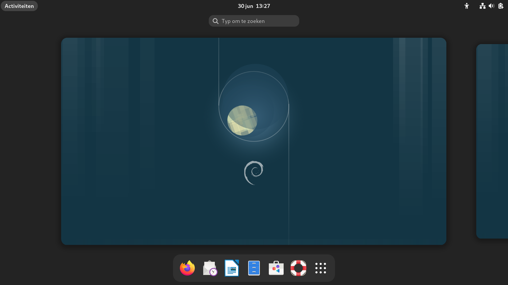

# GNOME
- GNOME is de standaard **desktop-manager**
    - regelt het tekenen van de window decoraties
    - voorziet in icons, toolbars, wallpapers en desktop widgets
    - werkt met twee modi:
        i. Normale modus
        i. Activiteiten modus

---
# Inloggen in GDM
- GDM is de **display manager**, die regelt de graphische logins
- Inloggen met ```(gebruikersnaam='tux', wachtwoord='tux')```
---

# Activiteiten modus

