# Linux beginners cursus
### GNOME op Debian 12

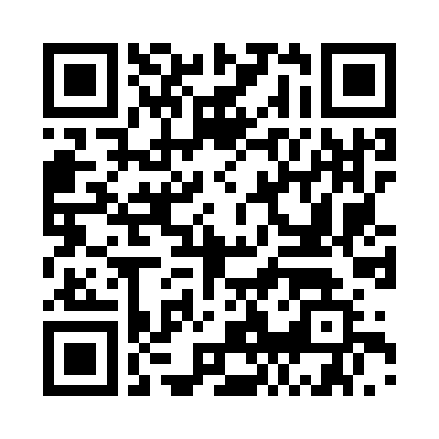

---
## Onderdelen van de cursus
1. Presentatie ([download presentatie voor offline gebruik](https://github.com/slspeek/linux-beginners-cursus/releases/latest/download/presentatie.zip))
1. [Samenvatting](samenvatting.html) [PDF versie](https://github.com/slspeek/linux-beginners-cursus/releases/latest/download/samenvatting.pdf)
1. [Oefeningen](oefeningen.html) [PDF versie](https://github.com/slspeek/linux-beginners-cursus/releases/latest/download/oefeningen.pdf)
1. [Begrippenlijst](begrippen.html) [PDF versie](https://github.com/slspeek/linux-beginners-cursus/releases/latest/download/begrippen.pdf)
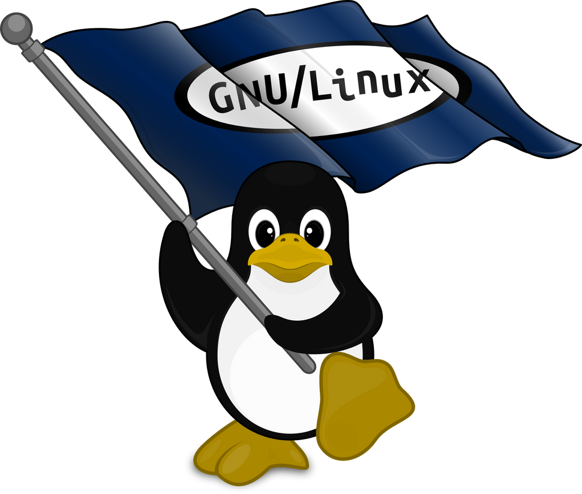
---
## Rondleiding GNOME
1. Inloggen in GDM
1. Schermbeveiliging
1. Wat is GNOME
1. Modi
1. Dash
1. Bovenbalk
1. Systeemmenu
1. Afsluiten


---
### Inloggen in GDM
- GDM is de **display manager**, die regelt de graphische logins
- Inloggen met ```(gebruikersnaam='tux', wachtwoord='tux')```
- GNOME desktopmanager opent in activiteiten modus
---
### Schermbeveiliging

- om te zorgen dat anderen uw gebruikers account niet kunnen misbruiken
- activeren door:
    - de computer een tijd inactief te laten (standaard 5 minuten)
    - op  klikken uit het systeemmenu 
    - ```SUPER+L``` in te drukken

---
#### Voorbeeld
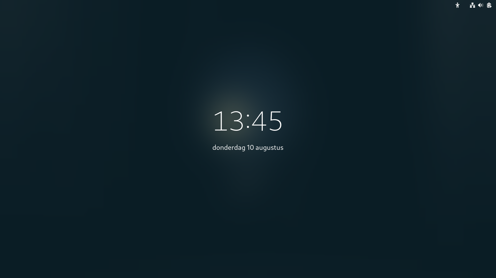

---
Losmaken door je wachtwoord in te voeren
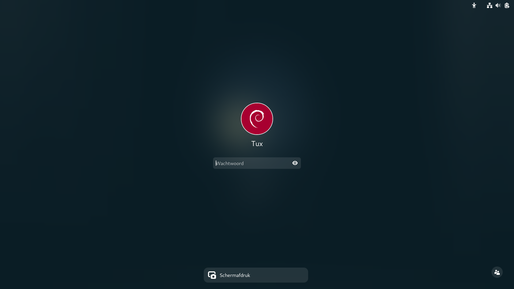

---
### Hulp openen 
- Met ```SUPER+F1```
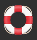
- Zoeken in Hulp met ```CTRL+S```
- Zoeken op één pagina met ```CTRL+F```
---
##### Voorbeeld hulp openen en sneltoetsen opzoeken


---
### GNOME desktop manager 
- GNOME is de standaard **desktop-manager**

    - regelt het tekenen van de window decoraties

    - voorziet in icons, toolbars, wallpapers en desktop widgets

    - werkt met twee modi:

        1. Normale modus

        1. Activiteiten modus

---
### Normale modus
- Toestand die u van de computer bent gewend met programma's in vensters

### Activiteiten modus
- Programma's starten
- Documenten zoeken
- Programma's wisselen
- Overzicht geopende programma's
- Dash tonen


### Activiteiten modus


---
### Activiteiten modus komt u in door
- op de activiteiten knop linksboven op de bovenbalk te klikken


- ```SUPER``` in te drukken


---
### Activiteiten modus verlaat u door
- op de activiteiten knop linksboven op de bovenbalk te klikken


- ```SUPER``` of ```ESC``` in te drukken

 

---

### In activiteiten modus 
- kunt u typen in het zoekvak om een programma te openen


---
- kunt u typen in het zoekvak om een document te zoeken en openen


---
- kunt u van programma of werkblad wisselen


---
- ziet u de dash , daarmee kunt u
    - met de muis één van de programma's hieruit openen
    - met ```CTRL``` ingedrukt klikken om een nieuw venster van een reeds geopend programma te verkrijgen
    - zien welke programma's er zijn geopend
    - op de 3x3 puntjes aan de rechterzijde klikken op applicatie modus in te gaan
    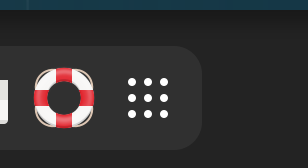
---
### Met de dash kunt u
- een programma openen door met de muis op het icon te klikken


---
- een tweede venster van een programma openen door ```CTRL``` ingedrukt te houden terwijl u klikt


---
- zien welke programma's geopend zijn door de punt onder het icon


---
- applicatie modus binnen gaan door op de 3x3 puntjes aan de rechterzijde te klikken


---
### Applicatie modus
Is een onderdeel van activiteiten modus 


---

### U gaat applicatie modus binnen door
- op de 3x3 puntjes aan de rechterzijde van de dash klikken als u in activiteiten modus bent


- ```SUPER+A``` op het toetsenbord indrukken als u in normale modus bent


---
### Applicatie modus verlaat u door
- op de 3x3 puntjes aan de rechterzijde van de dash te klikken om in activiteiten modus te blijven

- ```ESC``` in te drukken om in activiteiten modus te blijven
    - eventueel nogmaals ```ESC``` of ```SUPER``` te in drukken om in normale modus te komen
- ```SUPER+A``` om in activiteiten te blijven
- ```SUPER``` in te drukken om naar normale modus te komen

---
### In applicatie modus
- kunt u een programma openen door erop te klikken of


---
- een programma slepen naar een werkblad om het te openen


---
- kunt u een programma toevoegen aan de dash


---
- kunt u een programma uit de dash verwijderen door het naar de 3x3 puntjes rechts te slepen


--- 
### Bovenbalk

bestaat uit
- de activiteiten knop om in en uit activiteiten te gaan (```SUPER```)

- de datum- en tijdsaanduiding om het kalender en notificatie venster te openen of sluiten (```SUPER+V```)

- het systeemmenu


---
### Notificatie venster

- toont de kalender 
    - koppelen via instellingen -> online accounts


---
### Openen en sluiten notificatie venster

- op  te klikken
- ```SUPER+V``` in te drukken

---
### Systeemmenu

- met  kunt u schermafdrukken en screencasts maken
    - ```PrintScreen``` voor schermafdrukken
    - ```CTRL+ALT+SHIFT+R``` voor screencasts

---
### Systeemmenu vervolg

-  brengt u naar de instellingen
-  vergrendelt de computer (```SUPER+L```)
-  regelt het volume

---
### Uitschakelen menu

-  opent het submenu om te kunnen
    - gaan naar pauzestand
    - herstarten
    - afsluiten (```ALT+CTRL+DEL```)
    - afmelden

---
### Ethernet internet

-  schakelt het bedrade internet aan of uit
-  de pijl aan de rechterzijde van deze knop opent de bedrade netwerk instellingen
---
#### Voorbeeld netwerk uit en weer aan


---
### Wifi instellingen

-  schakelt de wifi aan of uit
-  de pijl aan de rechterzijde van deze knop opent de draadloze netwerk instellingen
    - u kunt eventueel een ander draadloos netwerk selecteren

---
### Uitschakelen
Om de computer af te sluiten 
- drukt u op ```ALT+CTRL+DELETE``` 
- klikt u in het systeemmenu  op  en dan op "Uitschakelen"


---
#### Voorbeeld


---
## Toepassingen starten en afsluiten
       

---
### Toepassingen starten
- Activiteiten modus
- Applicatie modus
- Sneltoetsen
### Toepassingsmenu
- Snelle toegang tot afsluiten en nieuw venster
---
### Toepassingen afsluiten of vensters sluiten
- Vensters sluiten
Indien u het laatste open venster van een toepassing sluit, sluit u ook de toepassing af.
- Toepassingen afsluiten
---

### Toepassing starten via zoekvak
- Druk ```SUPER``` en type het begin van de naam van de toepassing tot haar icon er staat en druk ```ENTER```


---
### Voorbeelden
- Druk ```SUPER``` in, type ```kaar``` en ```ENTER``` om kaarten   te starten
- ```SUPER```, type ```ter``` en ```ENTER``` om een terminal  te starten. Sluit de terminal door ```CTRL+D``` te geven, of ```ALT+F4```, of op het kruisje rechtersboven in het venster te klikken
- ```SUPER```, type ```wri``` en ```ENTER``` om writer 

---
### Indien de toepassing op de dash staat kun je ook

- Activiteiten modus ingaan en op het icon van de toepassing op de dash klikken

of
- ```SUPER+1``` gebruiken voor de meest linkse toepassing, ```SUPER+2``` voor de tweede toepassing van links, enzovoort.

---
### Voorbeelden
- klik op het bestanden icon  op de dash 
    - Ga activiteiten in door
        - op  te klikken of
        - ```SUPER``` in te drukken
    - Klik op  om de bestanden toepassing te openen
---
- ```SUPER+1``` om firefox  te openen
- ```SUPER+3``` om writer  te openen
- ```SUPER+4``` om bestanden  te openen
- ```SUPER+5``` om software  te openen
---
### Focus teruggeven met ```SUPER+1```, ```SUPER+2``` ...
Naast het starten van het eerste programma van links met ```SUPER+1``` kunt u ook de focus teruggeven aan dat programma (standaard firefox )

#### Handig
- plaats al uw veelgebruikte toepassingen op de dash

---
#### Voorbeeld focus terug naar firefox met ```SUPER+1```


---

### De dash aanpassen


---
- sleep een icon naar de dash


---
- sleep een icon naar de 3x3 puntjes rechts


---
### Toepassing openen via applicatie modus


---
#### Applicatie modus gaat u binnen door
- ```SUPER+A``` in te drukken
- Op  te klikken
    - dan op  te klikken
#### Toepassing starten door op het icon te klikken
- bijvoorbeeld:  voor de kaarten toepassing
---
#### Voorbeeld: tetris openen


---
#### Toepassing naar werkblad slepen
U kunt een icon naar een werkblad slepen om de toepassing op dat werkblad te openen


---
Kaarten op eerste werkblad en firefox op het tweede werkblad


---
### Toepassing openen via sneltoets

- standaard is alleen hulp aan de toets ```SUPER+F1``` gekoppeld
- ```SUPER+1```, ```SUPER+2```, ```SUPER+3``` aan de eerste, tweede en derde toepassing op de dash


---
#### Toepassing aan een sneltoets koppelen
- Druk ```SUPER``` in
- type ```snel```
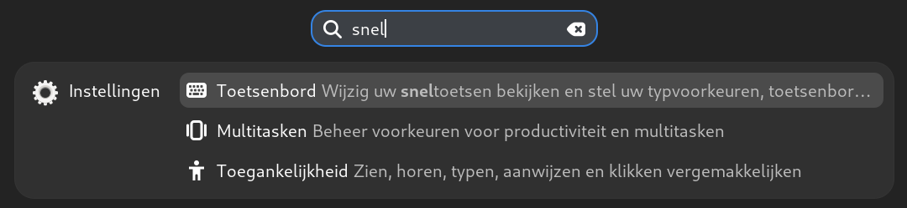
- druk ```ENTER``` in

---


klik hier op "Sneltoetsen bekijken of aanpassen", dan komt u in

---
- open hier "Starters" om aan "Persoonlijke map" de bekende sneltoets ```SUPER+E``` toe te kennen
- scroll hier neer beneden om bij "Aangepaste starters" te komen om een willekeurige toepassing een sneltoets toe te kennen 
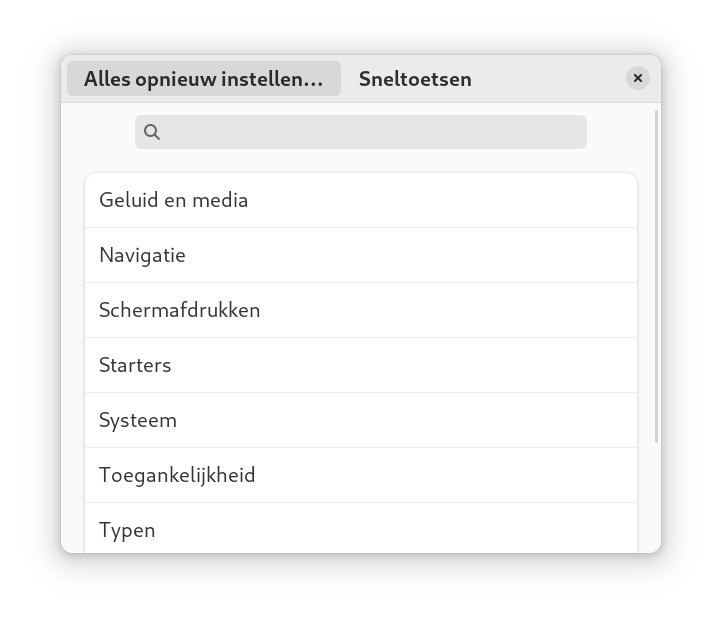

---
Voorbeeld: persoonlijke map aan sneltoets ```SUPER+E``` 


---
Voorbeeld: terminal aan sneltoets ```CTRL+ALT+T```


---
### Toepassingsmenu
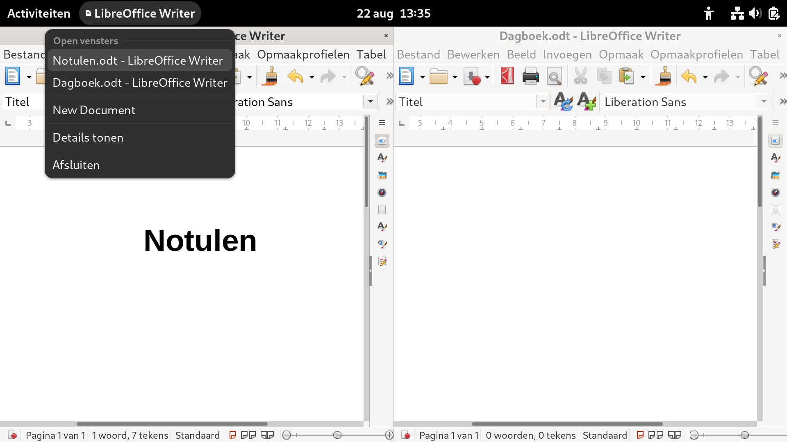

---
- Menu aan de linkerzijde op bovenbalk

- Hoort bij het venster van toepassing dat de focus heeft
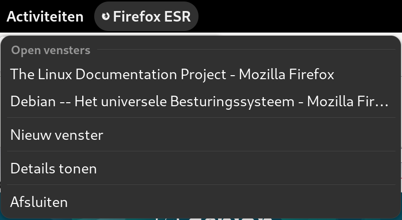

---
#### Wat kunt u met het toepassingsmenu ```SUPER+F10```
- Wisselen tussen vensters
- Extra venster openen
- Details in de Software toepassing zien
- Toepassing afsluiten
 <!-- of venster sluiten -->

---
##### Voorbeeld wisselen tussen twee tekstverwerkers
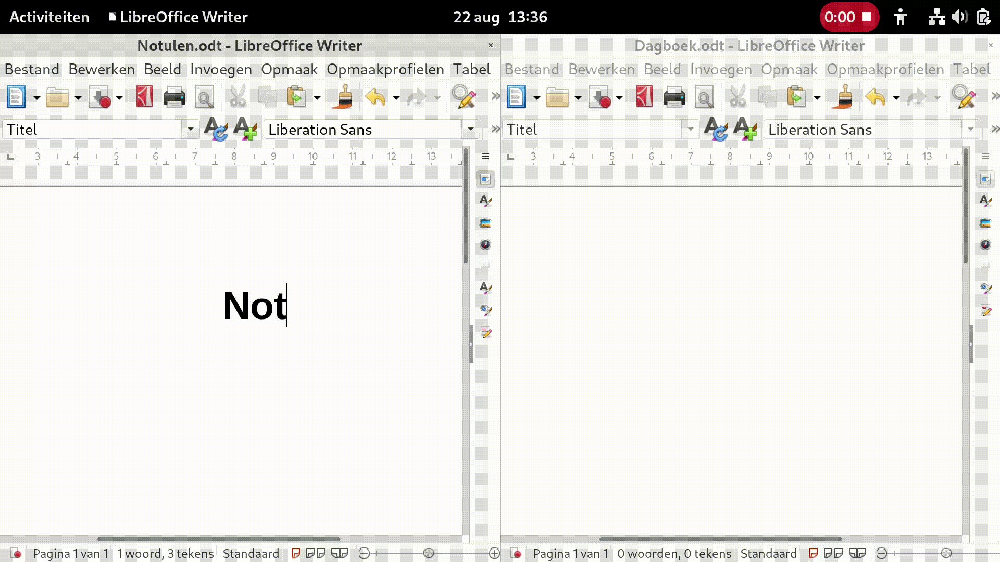

---
##### Voorbeeld extra venster
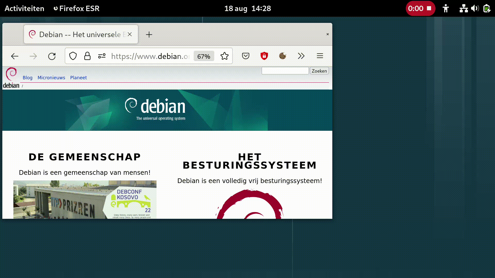

---
##### Voorbeeld details van schaak toepassing tonen


---
##### Voorbeeld Firefox afsluiten
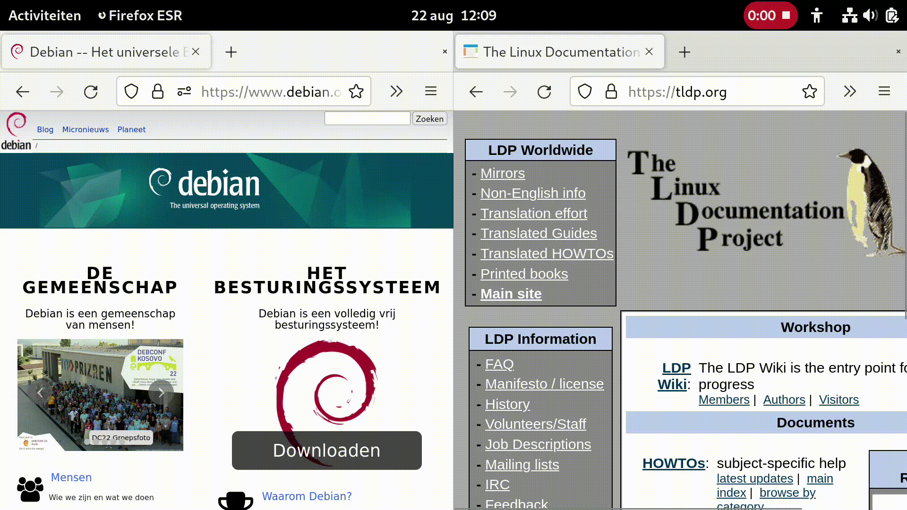

---
### Extra venster openen van een toepassing
__N.B.__ Niet iedere toepassing staat dit toe, bijvoorbeeld Kaarten niet.
- met controltoets ingedrukt op het icon op de dash klikken
- via het toepassingsmenu
- via de toepassing zelf (bestandsmenu)
- in applicatie modus het icon naar een werkblad slepen

---
##### Voorbeeld extra venster met ```CTRL+Click``` op dash


---
##### Voorbeeld extra venster met ```CTRL+Click``` op dash


---
##### Voorbeeld extra venster via toepassingsmenu


---
##### Voorbeeld extra venster via Bestandsmenu van de toepassing


---
##### Voorbeeld extra browser door naar werkblad slepen


---
## Toepassingen afsluiten of vensters sluiten
#### Vensters sluiten
<!-- Indien u het laatste open venster van een toepassing sluit, sluit u ook de toepassing af. -->
- ```ALT+F4```

- Druk op het kruisje rechtsboven in de titelbalk van een venster 

- Via bestandmenu van de toepassing

#### Toepassingen afsluiten

- Via toepassingsmenu

- Via bestandsmenu van de toepassing (vaak ```CTRL+Q```)

---
##### Voorbeeld sluit venster via bestandsmenu
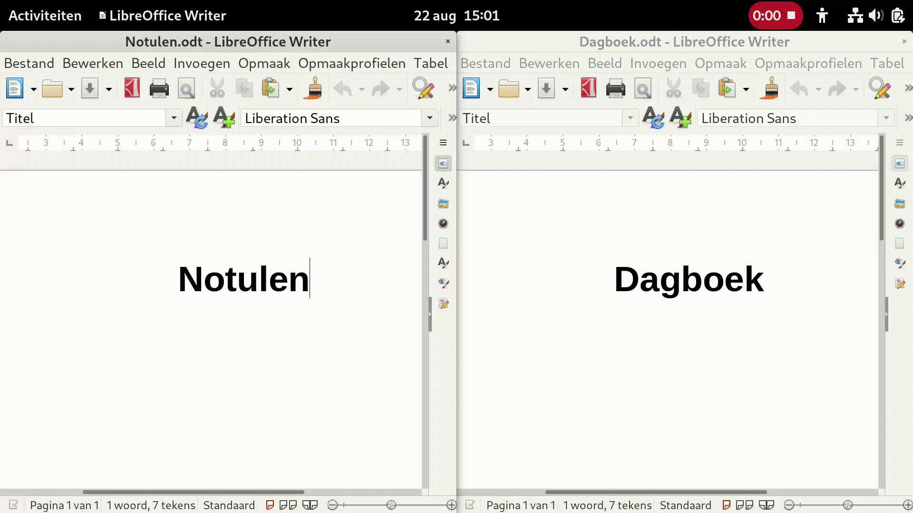

---
##### Voorbeeld Firefox afsluiten via toepassingsmenu


---
##### Voorbeeld sluit toepassing af via bestandsmenu
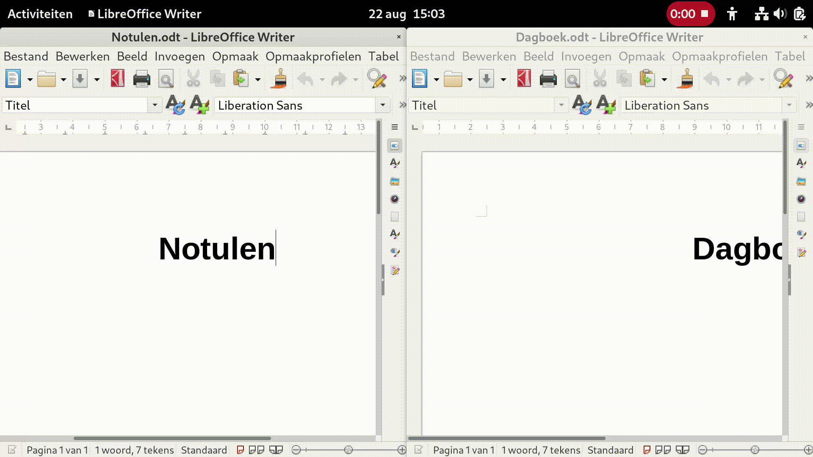

---
## Veelgebruikte toepassingen

- Internet browser: Firefox 

- Bestanden 

- LibreOffice Writer 
---
### Internet browser: Firefox 

- Belangrijke sneltoetsen

- Link openen op nieuw tabblad

- Essentiële extensies

- Hulp over Firefox
---
#### Sneltoetsen voor Firefox

- Nieuw tabblad openen ```CTRL+T``` 

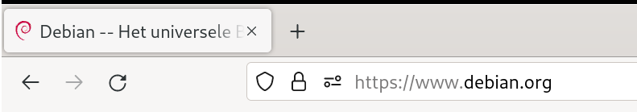

- Tabblad sluiten ```CTRL+W```

- Focus naar adresbalk ```CTRL+L``` (locatie)

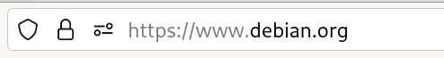

---
#### Sneltoetsen voor Firefox vervolg

- Zoeken met een zoekmachine naar keuze ```CTRL+K```
    
    - ```CTRL+PIJLTJE_OMLAAG```, ```CTRL+PIJLTJE_OMHOOG``` om zoekmachine te selecteren

    - ```ALT+PIJLTJE_OMLAAG```, ```ALT+PIJLTJE_OMHOOG``` om zoekmachine te selecteren als u al iets ingetyped hebt

- Nieuw venster ```CTRL+N```

- Afsluiten ```CTRL+Q```

---
##### Voorbeeld zoeken op Wikipedia


---
#### Link openen op nieuw tabblad

- Op een link klikken met ```CTRL+SHIFT``` ingedrukt opent de link op een nieuw tabblad en navigeert naar dat tabblad toe

- Op een link klikken met ```CTRL``` ingedrukt opent de link op een nieuw tabblad
---
##### Voorbeeld link op een nieuw tabblad openen

---

#### Essentiële extensies installeren

- [Adblocker for Youtube](https://addons.mozilla.org/nl/firefox/addon/adblock-for-youtube/?utm_source=addons.mozilla.org&utm_medium=referral&utm_content=search) houdt alle advertentie filmpjes tegen op Youtube

- [Adblocker Ultimate](https://addons.mozilla.org/nl/firefox/addon/adblocker-ultimate/?utm_source=addons.mozilla.org&utm_medium=referral&utm_content=search) houdt advertenties tegen

- [I don't care about cookies](https://addons.mozilla.org/nl/firefox/addon/i-dont-care-about-cookies/?utm_source=addons.mozilla.org&utm_medium=referral&utm_content=search)
gaat automatisch akkoord met alle cookies

---
##### Voorbeeld extensie installeren door te zoeken


---
##### Hulp openen in Firefox
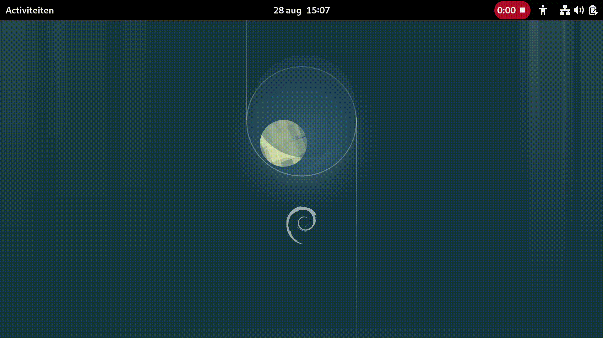