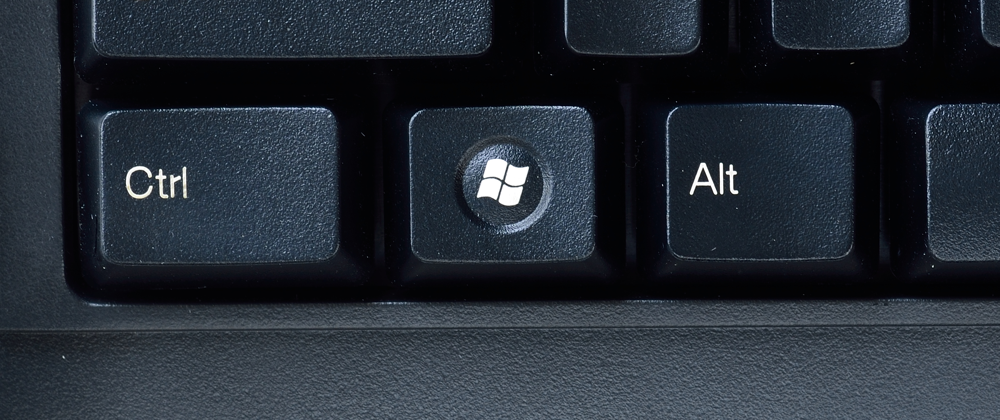
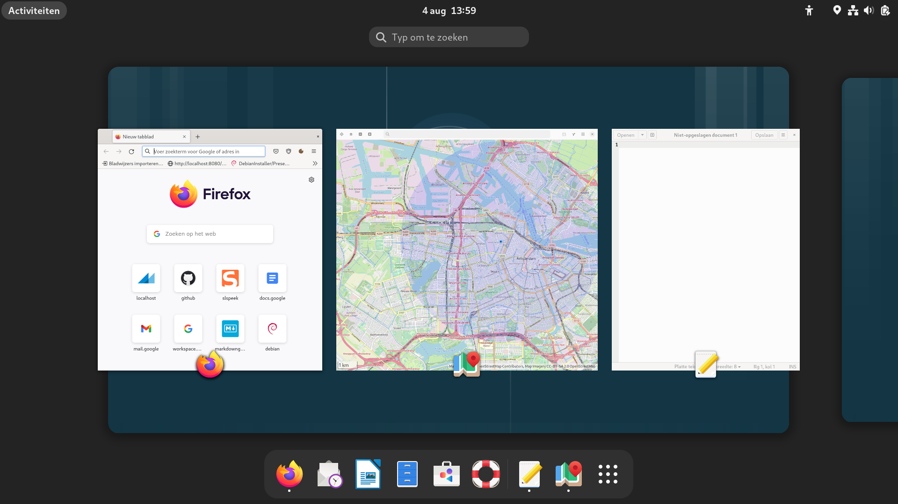
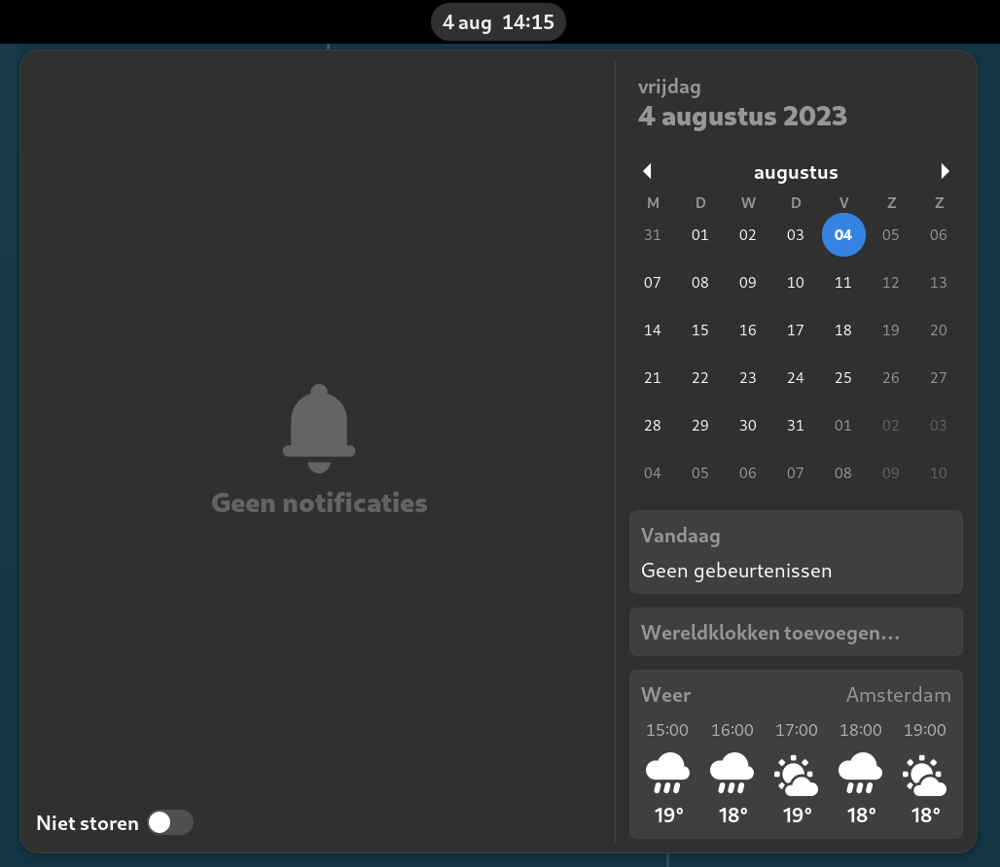

# Debian 12 Bookworm


---
## Rondleiding GNOME
1. Wat is GNOME
1. Modussen
1. Dash
1. Bovenbalk
1. Notificatie venster
1. Systeemmenu


---

### GNOME desktop manager 
- GNOME is de standaard **desktop-manager**
    - regelt het tekenen van de window decoraties
    - voorziet in icons, toolbars, wallpapers en desktop widgets
    - werkt met twee modi:
        i. Normale modus
        i. Activiteiten modus

---
### Normale modus
- Toestand die u van de computer bent gewend met programma's in vensters

### Activiteiten modus
- Programma's starten
- Documenten zoeken
- Programma's wisselen
- Overzicht geopende programma's
- Dash tonen

---
### Inloggen in GDM
- GDM is de **display manager**, die regelt de graphische logins
- Inloggen met ```(gebruikersnaam='tux', wachtwoord='tux')```
- GNOME desktopmanager opent in activiteiten modus
---
### Activiteiten modus


---
### Activiteiten modus komt in door
- op de activiteiten knop linksboven op de bovenbalk te klikken


- ```SUPER``` in te drukken



---
### Activiteiten modus verlaat u door
- op de activiteiten knop linksboven op de bovenbalk te klikken


- ```SUPER``` of ```ESC``` in te drukken

 

---

### In activiteiten modus 
- kunt u typen in het zoekvak om een programma te openen


---
- kunt u typen in het zoekvak om een document te zoeken en openen


---
- kunt u van programma of werkblad wisselen


---
- ziet u de dash , daarmee kunt u
    - met de muis één van de programma's hieruit openen
    - met ```CTRL``` ingedrukt klikken om een nieuw venster van een reeds geopend programma te verkrijgen
    - zien welke programma's er zijn geopend
    - op de 3x3 puntjes aan de rechterzijde klikken op applicatie modus in te gaan
    
---
### Met de dash kunt u
- een programma openen door met de muis op het icon te klikken


---
- een tweede venster van een programma openen door ```CTRL``` ingedrukt te houden terwijl u klikt


---
- zien welke programma's geopend zijn door de punt onder het icon


---
- applicatie modus binnen gaan door op de 3x3 puntjes aan de rechterzijde te klikken


---
### Applicatie modus
Is een onderdeel van activiteiten modus 


---

### U gaat applicatie modus binnen door
- op de 3x3 puntjes aan de rechterzijde van de dash klikken als u in activiteiten modus bent


- ```SUPER+A``` op het toetsenbord indrukken als u in normale modus bent


---
### Applicatie modus verlaat u door
- op de 3x3 puntjes aan de rechterzijde van de dash te klikken om in activiteiten modus te blijven

- ```ESC``` in te drukken om in activiteiten modus te blijven
    - eventueel nogmaals ```ESC``` of ```SUPER``` te in drukken om in normale modus te komen
- ```SUPER+A``` om in activiteiten te blijven
- ```SUPER``` in te drukken om naar normale modus te komen

---
### In applicatie modus
- kunt u een programma openen door erop te klikken of


---
- een programma slepen naar een werkblad om het te openen


---
- kunt u een programma toevoegen aan de dash


---
- kunt u een programma uit de dash verwijderen door het naar de 3x3 puntjes rechts te slepen


---
### Bovenbalk

bestaat uit
- de activiteiten knop om in en uit activiteiten te gaan (```SUPER```)

- de datum- en tijdsaanduiding om het kalender en notificatie venster te openen of sluiten (```SUPER+V```)

- het systeemmenu


---
### Notificatie venster

- toont de kalender 
    - koppelen via instellingen -> online accounts


---
### Openen en sluiten notificatie venster

- op  te klikken
- ```SUPER+V``` in te drukken

---
### Systeemmenu

- met  kunt u schermafdrukken en screencasts maken
    - ```PrintScreen``` voor schermafdrukken
    - ```CTRL+ALT+SHIFT+R``` voor screencasts

---
### Systeemmenu vervolg

-  brengt u naar de instellingen
-  vergrendelt de computer (```SUPER+L```)
-  regelt het volume

---
### Afsluit menu

-  opent het submenu om te kunnen
    - gaan naar pauzestand
    - herstarten
    - afsluiten (```ALT+CTRL+DEL```)
    - afmelden

---
### Ethernet internet

-  schakelt het bedrade internet aan of uit
-  de pijl aan de rechterzijde van deze knop opent de bedrade netwerk instellingen
---
### Wifi instellingen

-  schakelt de wifi aan of uit
-  de pijl aan de rechterzijde van deze knop opent de draadloze netwerk instellingen
    - u kunt eventueel een ander draadloos netwerk selecteren

---
## Toepassingen starten
       
- Activiteiten zoekvak
- Dash  
- Applicatie modus
- Sneltoetsen
---

### Toepassing starten via zoekvak
- Druk ```SUPER``` en type het begin van de naam van de toepassing tot haar icon er staat en druk ```ENTER```


---
### Voorbeelden
- Druk ```SUPER``` in, type ```kaar``` en ```ENTER``` om kaarten   te starten
- ```SUPER```, type ```ter``` en ```ENTER``` om een terminal  te starten. Sluit de terminal door ```CTRL+D``` te geven, of ```ALT+F4```, of op het kruisje rechtersboven in het venster te klikken
- ```SUPER```, type ```wri``` en ```ENTER``` om writer 

---
### Indien de toepassing op de dash staat kun je ook
- Activiteiten modus ingaan en op het icon van de toepassing op de dash klikken

of
- ```SUPER+1``` gebruiken voor de meest linkse toepassing, ```SUPER+2``` voor de tweede toepassing van links, enzovoort.

---
### Voorbeelden
- ```SUPER+1``` om firefox  te openen
- ```SUPER+3``` om writer  te openen
- ```SUPER+4``` om bestanden  te openen
- ```SUPER+5``` om software  te openen

---
- Via klikken op een icon op de dash 
    - Ga activiteiten in via 
        - op  te klikken
        - ```SUPER``` in te drukken
    - Klik op  betanden te openen

---
### De dash aanpassen


---
- sleep een icon naar de dash


---
- sleep een icon naar de 3x3 puntjes rechts


---
