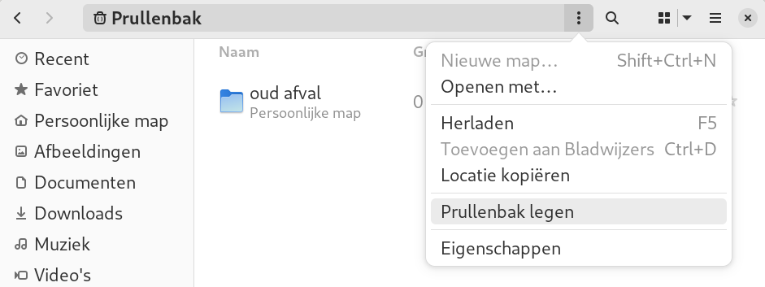

---
title:  Samenvatting voor de Linux beginners cursus
author: |
    | Steven Speek 
    |  \tt{slspeek@gmail.com}
date: \today{}
...

# Notatie
Het lettertype ```Courier``` wordt gebruikt om iets op te schrijven dat u op het toetsenbord kunt typen.
Uitzondering hierop zijn de volgende speciale toetsen:
```SPATIEBALK```, ```CTRL```, ```ALT```, ```SUPER```, ```ESC```, ```DELETE```, ```PageDown```, ```PageUp```, ```F1```, ```F2``` ... en ```ENTER```, hier dient u betreffende toets in te drukken in plaats van het woord in te typen.

# Rondleiding GNOME

1.  Je meldt je aan in GDM3 met account (gebruikersnaam=```tux```, wachtwoord=```tux```)

1.  Schermbeveiliging

    a.  Expres aanzetten (```SUPER+L```)

    a.  Wachtwoord invoeren om verder te kunnen gaan

1.  Hulp openen (```SUPER+F1```)

    a.  Zoeken in Hulp met ```CTRL+S```, zoeken op één pagina met ```CTRL+F```

1.  GNOME is een desktop manager

1.  Modi

    a. Normale modus

    a. Activiteiten modus (```SUPER```)

        - Toepassingen starten

        - Documenten zoeken

        - Toepassing wisselen

        - Applicatie modus 
        
    a. Applicatie modus (```SUPER+A```)

        - Toepassingen openen
           
        - Werkblad wisselen

        - Toepassing slepen naar werkblad

        - Dash aanpassen

1.  Dash

    a.  snelstarters voor veelgebruikte programma's

    a.  overzicht open programma's

    a.  Sneltoetsen ```SUPER+1```, ```SUPER+2```, ...
        Om te openen en later focus terug te geven

1.  Bovenbalk

    a.  Activiteiten knop 

    a.  Toepassingen menu (later)

    a.  Notificatie venster / Kalender (```SUPER+V```)

    a.  Toegankelijkheidsmenu (indien er een toegankelijkheids optie aanstaat)

    a.  Systeemmenu

1.  Notificatie venster (```SUPER+V```)

    - kalender activeren met online-account

1.  Systeemmenu

    a. Volume regeling
    
    a. Instellingen

    a. Netwerk instellingen

    a. Vergrendeling

    a. Uitschakelen en afmelden

1.  Uitschakelen (```ALT+CTRL+DEL```)

# Toepassingen starten en afsluiten 

## Toepassingen starten op zes manieren

1. Via sneltoets

### Activiteiten modus (```SUPER```)

2.  Type de naam van de toepassing in zoekvak

#### Dash

3. Sneltoetsen: ```SUPER+1```, etc.

    a. Openen

    a. Focus terug te krijgen

4. Klik op icon om toepassing te starten

    a. ```CTRL``` klik voor een nieuw venster

### Applicatie modus (```SUPER+A```)

5. Klik icon om toepassing te starten

6. Slepen naar werkblad

##  Toepassingsmenu (```SUPER+F10```)

1. Wisselen tussen vensters

1. Nieuw venster

1. Details in Software

1. Toepassing afsluiten
 <!-- of venster sluiten -->

## Extra venster openen

1. Via ```CTRL``` en muisklik op dash

1. Via toepassingsmenu

1. Via menu binnen applicatie

1. Via slepen naar werkblad in applicatie modus

## Toepassingen afsluiten of vensters sluiten

Indien u het laatste open venster van een toepassing sluit, sluit u ook de toepassing af.

#### Vensters sluiten


- ```ALT+F4```

- Druk op het kruisje rechtsboven in de titelbalk van een venster {width=20px}

- Via bestandmenu van de toepassing

#### Toepassingen afsluiten

- Via toepassingsmenu

- Via bestandsmenu van de toepassing


<!-- tot hier gelijk -->
# Veel gebruikte toepassingen

a.  Internet browser: Firefox

a.  Bestandsbeheer

a.  LibreOffice

## Internet browser: Firefox

a. Belangrijkste sneltoetsen
    
    i. Nieuw tabblad openen ```CTRL+T```

    i. Tabblad sluiten ```CTRL+W```

    i. Focus naar adresbalk ```CTRL+L```

    i. Zoeken met een zoekmachine naar keuze ```CTRL+K```

        - ```CTRL+PIJLTJE_OMLAAG```, ```CTRL+PIJLTJE_OMHOOG``` om zoekmachine te selecteren

        - ```ALT+PIJLTJE_OMLAAG```, ```ALT+PIJLTJE_OMHOOG``` om zoekmachine te selecteren als u al iets ingetyped hebt

    i. Nieuw venster ```CTRL+N```

    i. Afsluiten ```CTRL+Q```

a. Links openen op een nieuw tabblad
    
    i. ```CTRL+SHIFT``` met muisklik opent een link op een nieuw tabblad en schakelt naar het nieuw geopende tabblad

    ii. ```CTRL``` met muisklik opent een link op een nieuw tabblad

    iii. Met ```CTRL+TAB``` wisselt u tussen de tabbladden. Met ```CTRL+SHIFT+TAB``` in tegengestelde richting.

a. Plaatje openen in nieuw tabblad

    - Klik rechts op plaatje, om het context menu te openen en kies "Afbeelding openen in nieuw tabblad"

a. Bladwijzers
    
    - Aanmaken

        - ```CTRL+D```

        - via hamburgermenu {width=30px}, "Bladwijzers >", "Bladwijzer toevoegen"

        - {width=30px} slepen naar Bladwijzerbalk

        - klikken op ster {width=30px} rechts van het adres in de adresbalk
    
    - Verwijderen

        - Klik op blauwe ster {width=30px} als u op die pagina bent, kies op de popup
        "Bladwijzer verwijderen"

        - Via bladwijzers beheren

        - Rechtsklikken op bladwijzer op bladwijzerbalk om het context menu te openen en "Bladwijzer verwijderen" kiezen
    
    - Beheren 

        - via hamburgermenu {width=30px} "Bladwijzers >" "Bladwijzers beheren"
        
        - ```CTRL+SHIFT+O```
    
    - Bladwijzerbalk

        - tonen en verbergen

            - via hamburgermenu {width=30px} "Bladwijzers >" "Bladwijzerbalk tonen/verbergen"

            - ```CTRL+SHIFT+B```

    - Bladwijzers groeperen in mappen

        - Via bladwijzers beheren ```CTRL+SHIFT+O```

        - Via slepen op de bladwijzerbalk

a. Essentiële extensies installeren

    i. [Adblocker for Youtube](https://addons.mozilla.org/nl/firefox/addon/adblock-for-youtube/?utm_source=addons.mozilla.org&utm_medium=referral&utm_content=search)

    i. [Adblocker Ultimate](https://addons.mozilla.org/nl/firefox/addon/adblocker-ultimate/?utm_source=addons.mozilla.org&utm_medium=referral&utm_content=search)

    i. [I don't care about cookies](https://addons.mozilla.org/nl/firefox/addon/i-dont-care-about-cookies/?utm_source=addons.mozilla.org&utm_medium=referral&utm_content=search)

a. Hulp zoeken over Firefox

    - Via hamburgermenu {width=30px} "Help >", "Hulp verkrijgen"

## Bestandsbeheerder

a. Wat kunt u met de bestandsbeheerder?

    - inhoud van map bekijken

    - bestanden of mappen verplaatsen, kopiëren en in de prullenbak gooien

    - zoeken in bestanden

    - archieven aanmaken, inzien en uitpakken

a. Openen met

    - ```SUPER+E```

    - ```SUPER+4```

    - ```SUPER best ENTER```

    - Klikken op {width=30px} op de dash

    - extra venster ```CTRL+N```

a. Verschillende views

    - rasterweergave {width=30px} ```CTRL+2```

    - lijstweergave {width=30px} ```CTRL+1```

    - wel of geen verborgen bestanden tonen ```CTRL+H```

a. Omlaag en omhoog navigeren

    - omlaag navigeren door op een map te dubbelklikken
    
    - omhoog te navigeren door in de adresbalk op bovenliggende map te klikken

        - ```ALT+PIJLTJE_OMHOOG```

a. Mappen maken

    - via de drie puntjes boven elkaar {height=20px} (het actiemenu)

    - ```CTRL+SHIFT+N```

a. Bestanden of mappen verplaatsen

    - sleep ze naar gewenste map

    - via knippen, kopiëren en plakken

        - ```CTRL+X``` voor knippen, ```CTRL+C``` voor kopiëren en ```CTRL+V``` voor plakken

        - via het context menu

a. Bestanden of mappen in de prullenbak gooien

    - geselecteerd bestand of map in de prullenbak gooien met ```DELETE``` toets

    - via het context menu "In Prullenbak gooien"

a. Prullenbak legen

    - Indien u de schijfruimte terug wilt hebben die de bestanden in "Prullenbak" innemen
      kunt u de prullenbak legen

        - __N.B.__ dit kan niet ongedaan worden gemaakt
    
    - Ga naar de "Prullenbak" in de bestandsbeheerder en kies "Prullenbak legen" uit het actiemenu
      
      

a. Eigenschappen van bestanden en mappen 

    - Open het context menu van het item en kies "Eigenschappen"

    - ```ALT+ENTER```

a. Zoeken van mappen of bestanden

    - klik op {width=30px}

    - ```CTRL+F```
    
a. Bladwijzer maken van map of lokatie

    - Navigeer naar map

        - drie puntjes menu: "Toevoegen aan bladwijzers"

        - ```CTRL+D```

    - Sleep map naar linkerpaneel boven "Nieuwe bladwijzer"

    - Verwijderen door rechts te klikken op de bladwijzer in het linkerpaneel
    en "Verwijderen uit bladwijzers" in het popup menu te kiezen

a. Bestanden inpakken en uitpakken

    - Bestanden inpakken

        - meerdere bestanden en of mappen in één archief bestand opslaan

        - klik rechts op map, bestand of bestandsselectie en kies "Inpakken ..."
            
            - geef een archief naam op

            - klik op "Maken"

    - Archief bestand uitpakken

        1. Kies "Uitpakken naar ..." uit het context menu van het archief

            - kies een map waarheen het archief moet worden uitgepakt

            - bevestig dit door op "Uitpakken" te klikken

            - geef aan of u wel of niet de uitgepakte bestanden in de bestandsbeheerder wenst te zien

        1. Kies "Uitpakken" uit het context menu van het archief. Dit pakt het archief uit in de map waar het archief staat.
    
    - Archief bestand inzien

        - dubbelklik zip bestand

a. Hulp opvragen en sneltoetsen tonen

    - Hulp opvragen

        - ```F1```

        - via hamburgermenu {height=20px}, en dan "Hulp"
    
    - Sneltoetsen

        - ```CTRL+?```

        - via hamburgermenu {height=20px}, en dan "Sneltoetsen"

# Toepassingen installeren

1. Installeren 

    a.  Via Software

        i. Bladeren

        i. Zoeken (gewoon beginnen met typen van de zoekterm)

        i. Installeren

             1.  VLC-player

             1.  Chromium

             1.  GIMP

             1.  Inkscape

             1.  Stellarium/KStars

             1.  KDEnlive

    a. Vanuit een .deb bestand

        i. Google chrome

        i. Edge

        i. Visual studio

1.  Standaardtoepassingen

1.  [*Opstarttoepassingen*](https://help.gnome.org/users/gnome-help/stable/shell-apps-auto-start.html.en)


#  Vensters, werkbladen en bureaubladen

1.  Vensterbeheer

    a.  groot maken

    a.  verbergen

    a.  helft scherm gebruiken

1.  Wisselen tussen open programma's

    a.  ```ALT+TAB```, ```SUPER+TAB``` wisselen tussen open programma

    a.  focus bovenbalk ```ALT+CTRL+TAB```

    a.  ```ALT+ESC``` wisselt tussen open vensters van het programma dat nu de
        focus heeft

1.  Werkbladen

    a.  Wat zijn werkbladen

    a.  Schakelen tussen werkbladen

    
1.  Bureaubladen aanpassen

    a.  Achtergrond aanpassen

    a.  Schermbeveiliging uitschakelen

# Online accounts

1.  Online account toevoegen

    a.  Instellingen: voeg bij voorkeur een Google-account toe

        i.  toon kalender

        i.  drive

    b.  helaas werkt Microsoft account **niet**

# Gebruikersbeheer

1.  Wachtwoord wijzigen

    a.  Via instellingen

    b.  Plaatje veranderen

1.  Gebruiker toevoegen

1.  Beheerdersrechten toekennen

1.  Automatisch aanmelden

## Bestanden

1.  Bestanden

    a.  geen drive-letters, maar ```/```, ```/``` heet root (spreek uit als __roet__).

    b.  geen backslashes, maar forward-slashes

    c.  [Filesystem Hierarchy Standard](https://tldp.org/LDP/Linux-Filesystem-Hierarchy/html/index.html)

        i.  ```/home```
        ii. ```/usr/bin```
        iii. ```/media```

    d.  [thuismap](https://nl.wikipedia.org/wiki/Homedirectory) ```/home/tux```

    e.  Starten ```SUPER+4```

2.  Backups maken

    a.  Open bestanden (```SUPER+4```)

    b.  Rechtsklikken op map

        i.  Versturen ...
        ii. Inpakken ...

# Speciale tekens

1.  Euroteken invoeren 

    a. zoekvak 'euro sign'

    a. via speciale tekens toepassing

    a.  ```CTRL-SHIFT-U 20ac SPATIEBALK```

1.  é (e accent) invoeren: ```CTRL-SHIFT-U 00e9 SPATIEBALK```

1.  [GNOME tip speciale tekens](https://help.gnome.org/users/gnome-help/stable/tips-specialchars.html.nl)
