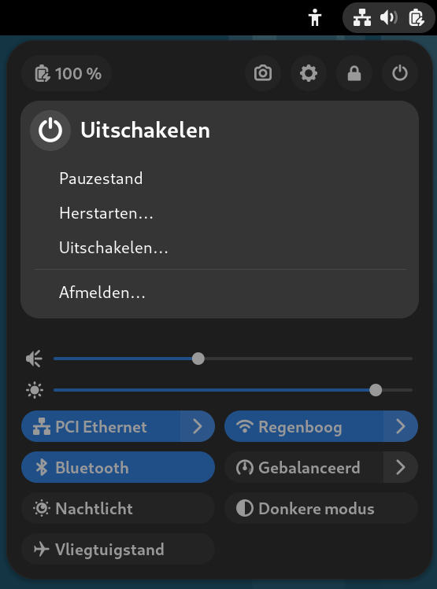
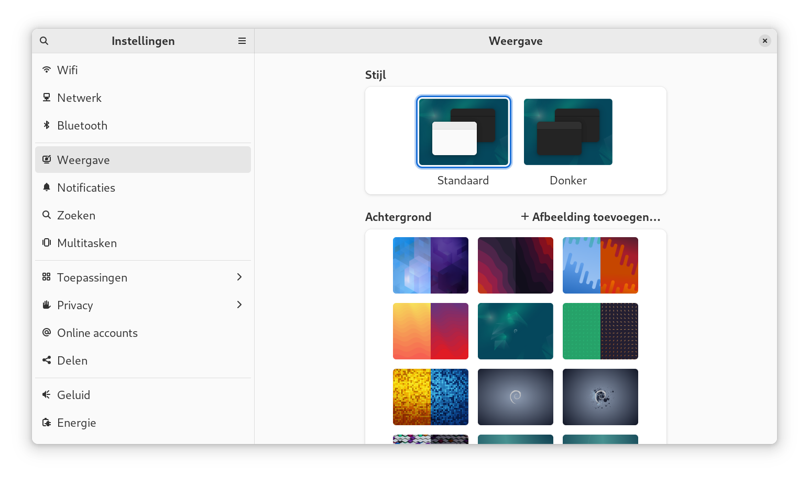
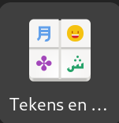
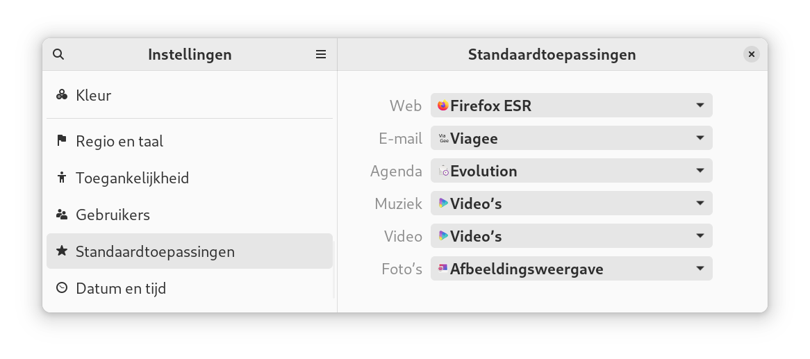

---
title:  Samenvatting voor de Linux beginners cursus
author: |
    | Steven Speek 
    |  \tt{slspeek@gmail.com}
date: \today{}
...

# Notatie
Het lettertype ```Courier``` wordt gebruikt om iets op te schrijven dat u op het toetsenbord kunt typen.
Uitzondering hierop zijn de volgende speciale toetsen:
```SPATIEBALK```, ```CTRL```, ```ALT```, ```SUPER```, ```MENU```, ```TAB```, ```HOME```, ```END```, ```ESC```, ```DELETE```, ```PageDown```, ```PageUp```, ```PrintScreen```, ```F1```, ```F2``` ... en ```ENTER```, hier dient u betreffende toets in te drukken in plaats van het woord in te typen.

# Inleiding

[*Linux*](https://www.computerhope.com/jargon/l/linux.htm) is een [*besturingssysteem*](https://www.computerhope.com/jargon/o/os.htm).
Een besturingssysteem zorgt ervoor dat hardwarecomponenten worden aangestuurd en toepassingen kunnen draaien
Voorbeelden van andere besturingssystemen zijn: Windows, MacOS, en Chromium OS

## Linux is vrij
Linux is gebaseerd op de filosofie dat software en ideeën vrij gedeeld moeten worden.

Linux is vrije software onder de [*GNU Public License*](https://www.computerhope.com/jargon/g/gpl.htm).

## Geschiedenis van Linux

In 1984 begint [*Richard Stallman*](https://nl.wikipedia.org/wiki/Richard_M._Stallman) het [*GNU-project*](https://www.gnu.org/)

- GNU betekent "GNU is Not Unix"

- GNU moet een vrije Unix worden 

### Wat karakteriseert het [*Unix*](https://nl.wikipedia.org/wiki/Unix) besturingssysteem?

- Multi tasking

    - meerdere processen tegelijk draaien

- Multi user

    - meerdere gebruikers kunnen veilig naast elkaar werken

## Hoe vrij?

Richard Stallman schreef de [*GNU Public Licence*](https://www.computerhope.com/jargon/g/gpl.htm) om zijn software vrij te houden:

- Broncode moet meegeleverd worden
- Iedereen mag het draaien en aanpassen
- Je mag een aanpassing alleen onder de GNU Public Licence verspreiden

## Linus Torvalds
Maar hij miste een kernel

Linus Torvalds kwam in 1991 met zijn eerste versie van de Linux kernel
gelicenseerd onder de GPL

Zo ontstond de combinatie GNU/Linux

## Waar wordt Linux gebruikt

- Android apparaten
- Linux draait op de meerderheid van de internet servers
- Linux draait op supercomputers
- Linux draait op [*laptops in het ISS*](https://www.fsf.org/blogs/community/gnu-linux-chosen-as-operating-system-of-the-international-space-station)
- Linux draait op de kassa's van Albert Heijn
- Linux draait op TomToms

## Linux distributie

- Linux kernel

- Toepassingen
    
    - Web browser {width=30px}

    - Office toepassingen {width=30px}

    - Mail {width=30px}

    - Videospeler {width=30px}
    
    - Foto bewerken {width=30px}

<!-- ## Distributies

      -->

## Belang van vrije software

- Met broncode kun je nagaan wat programmatuur doet
- Programmeurs en gebruikers zijn de baas over de programmatuur

## Belang dat u vrije software gebruikt

- Voorleven aan anderen dat het kan
- Rapporteren van fouten

## Voordelen van vrije software

- Kosteloos
- Eenvoudige installatie van toepassingen
- Geen reclame of marketing in het systeem
- Veranderingen aan software die een belangrijk deel van de gebruikers niet aanstaan zal leiden tot een afsplitsing die hen wel behaagd

## [*Redenen om Debian te gebruiken*](https://www.debian.org/intro/why_debian)

- Debian is vrije software
    - Gemaakt van vrije bronnen
    - Zal altijd 100% vrij zijn
    - Vrij voor iedereen om te gebruiken, aangepast en verspreid te worden
    - Kosteloos

- Debian is stabiel en veilig
    - Gefundeerde standaardconfiguratie voor alle pakketten
    - Geregelde veiligheidsupdates

- Uitgebreide ondersteuning voor hardware
    - Alle hardware die ondersteund wordt door de Linux kernel, wordt ook door Debian ondersteund.
    - Indien nodig zijn gepatenteerde stuurprogramma’s beschikbaar

- Flexibel installatiesysteem
    - Live-cd met installatie mogelijkheden
    - Debian installer voor meer opties voor ervaren gebruikers
    - Preseeded installatie (zonder vragen)
    - Geautomatiseerde netwerkinstallatie

- Debian biedt soepele opwaarderingen
    - Eenvoudige pakket opwaardering
    - Distributie opwaardering ongeveer elke twee jaar

- Debian is de basis voor veel andere distributies

- Het Debian-project is een gemeenschap
    - Democratische beleidsstructuur
    - Niet door één bedrijf gecontroleerd
    - Ontwikkelaars uit 60 landen
    - Vertaald naar meer dan 80 talen

- Debian heeft een enorm aantal softwarepakketten
    - 59000 pakketten die de .deb indeling gebruiken

- Debian heeft beleidsrichtlijnen voor ontwikkelaars
    - Bevordert de kwaliteit van de software
    - Goede integratie van pakketten

- Lange termijn ondersteuning

# Rondleiding GNOME

## Aanmelden in de displaymanager
Met account (gebruikersnaam=```tux```, wachtwoord=```tux```)

##  Schermbeveiliging

-  Expres aanzetten (```SUPER+L```)

-  Wachtwoord invoeren om verder te kunnen gaan

## Hulp openen

- ```SUPER+F1```

- Zoeken in Hulp met ```CTRL+S```

- Zoeken op één pagina met ```CTRL+F```

## GNOME is een desktop manager

- GNOME is de standaard **desktop-manager**

- regelt het tekenen van de window decoraties

- voorziet in icons, toolbars, wallpapers en desktop widgets

- werkt met twee modi:

    1. Normale modus

    1. Activiteiten modus

##  Modi

- Normale modus

- Activiteiten modus (```SUPER```)

    - Toepassingen starten

    - Documenten zoeken

    - Toepassing wisselen

    - Dash favoritieten verwijderen

    - Applicatie modus 
    
- Applicatie modus (```SUPER+A```)

    - Toepassingen starten
        
    - Werkblad wisselen

    - Toepassing slepen naar werkblad

    - Dash aanpassen

## Dash

-  snelstarters voor veelgebruikte programma's

-  overzicht open programma's

-  Sneltoetsen ```SUPER+1```, ```SUPER+2```, ...
    Om te openen en later focus terug te geven

## Bovenbalk

-  Activiteiten knop 

-  Toepassingen menu (later)

-  Notificatie venster / Kalender (```SUPER+V```)

-  Toegankelijkheidsmenu (indien er een toegankelijkheids optie aanstaat)

-  Systeemmenu

##  Notificatie venster

- ```SUPER+V```

- kalender activeren met online-account

##  Systeemmenu

- Volume regeling

- Screenshots maken

- Instellingen

- Netwerk instellingen

- Vergrendeling

- Uitschakelen en afmelden

##  Uitschakelen
Om de computer uit te schakelen

- drukt u op ```ALT+CTRL+DELETE``` 

- klikt u in het systeemmenu {height=20px} op {height=20px} en dan op "Uitschakelen"
{height=200px}

- ```SUPER uits ENTER```


# Toepassingen starten en afsluiten 

## Toepassingen starten op zes manieren

1. Via sneltoets

### Activiteiten modus (```SUPER```)

2.  Type de naam van de toepassing in zoekvak

#### Dash

3. Sneltoetsen: ```SUPER+1```, ```SUPER+2```, ```SUPER+3```, etc.

    - Openen

    - Focus terug te krijgen

4. Klik op icon om toepassing te starten

    - ```CTRL``` klik voor een nieuw venster

### Applicatie modus (```SUPER+A```)

5. Klik icon om toepassing te starten

6. Slepen naar werkblad

##  Toepassingsmenu (```SUPER+F10```)

- Wisselen tussen vensters

- Nieuw venster

- Details in Software

- Toepassing afsluiten
 <!-- of venster sluiten -->

## Extra venster openen

- Via ```CTRL``` en muisklik op dash

- Via toepassingsmenu

- Via menu binnen applicatie

- Via slepen naar werkblad in applicatie modus

## Toepassingen afsluiten of vensters sluiten

Indien u het laatste open venster van een toepassing sluit, sluit u ook de toepassing af.

#### Vensters sluiten


- ```ALT+F4```

- Druk op het kruisje rechtsboven in de titelbalk van een venster {width=20px}

- Via bestandmenu van de toepassing

#### Toepassingen afsluiten

- Via toepassingsmenu

- Via bestandsmenu van de toepassing


# Veel gebruikte toepassingen

-  Internet browser: Firefox

-  Bestandsbeheer

<!-- -  LibreOffice -->

## Internet browser: Firefox

- Belangrijkste sneltoetsen
    
    - Nieuw tabblad openen ```CTRL+T```

    - Tabblad sluiten ```CTRL+W```

    - Focus naar adresbalk ```CTRL+L```

    - Zoeken met een zoekmachine naar keuze ```CTRL+K```

        - ```CTRL+↓```, ```CTRL+↑``` om zoekmachine te selecteren

        - ```ALT+↓```, ```ALT+↑``` om zoekmachine te selecteren als u al iets ingetyped hebt

    - Nieuw venster ```CTRL+N```

    - Afsluiten ```CTRL+Q```

- Links openen op een nieuw tabblad
    
    - ```CTRL+SHIFT``` met muisklik opent een link op een nieuw tabblad en schakelt naar het nieuw geopende tabblad

    - ```CTRL``` met muisklik opent een link op een nieuw tabblad

    - Met ```CTRL+TAB``` wisselt u tussen de tabbladden. Met ```CTRL+SHIFT+TAB``` in tegengestelde richting.

- Plaatje openen in nieuw tabblad

    - Klik rechts op plaatje, om het context menu te openen en kies "Afbeelding openen in nieuw tabblad"

- Bladwijzers
    
    - Aanmaken

        - ```CTRL+D```

        - via hamburgermenu {width=30px}, "Bladwijzers >", "Bladwijzer toevoegen"

        - {width=30px} slepen naar Bladwijzerbalk

        - klikken op ster {width=30px} rechts van het adres in de adresbalk
    
    - Verwijderen

        - Klik op blauwe ster {width=30px} als u op die pagina bent, kies op de popup
        "Bladwijzer verwijderen"

        - Via bladwijzers beheren

        - Rechtsklikken op bladwijzer op bladwijzerbalk om het context menu te openen en "Bladwijzer verwijderen" kiezen
    
    - Beheren 

        - via hamburgermenu {width=30px} "Bladwijzers >" "Bladwijzers beheren"
        
        - ```CTRL+SHIFT+O```
    
    - Bladwijzerbalk

        - tonen en verbergen

            - via hamburgermenu {width=30px} "Bladwijzers >" "Bladwijzerbalk tonen/verbergen"

            - ```CTRL+SHIFT+B```

    - Bladwijzers groeperen in mappen

        - Via bladwijzers beheren ```CTRL+SHIFT+O```

        - Via slepen op de bladwijzerbalk

- Aanbevolen extensies installeren

    <!-- - [*Adblocker for Youtube*](https://addons.mozilla.org/nl/firefox/addon/adblock-for-youtube/?utm_source=addons.mozilla.org&utm_medium=referral&utm_content=search) -->

    - [*Adblocker Ultimate*](https://addons.mozilla.org/nl/firefox/addon/adblocker-ultimate/?utm_source=addons.mozilla.org&utm_medium=referral&utm_content=search)

    - [*I don't care about cookies*](https://addons.mozilla.org/nl/firefox/addon/i-dont-care-about-cookies/?utm_source=addons.mozilla.org&utm_medium=referral&utm_content=search)

- Hulp zoeken over Firefox

    - Via hamburgermenu {width=30px} "Help >", "Hulp verkrijgen"

# Bestanden

## Bestanden op Linux

- fysieke volumes (indien er meerdere disks zijn)

    - geen drive-letters ```C:```, ```D:``` etc.

    - aankoppelpunten zijn (lege) mappen (bijvoorbeeld ```/mnt```, ```/media/<XXXX>```)

-  geen backslashes (```\```), maar forward-slashes (```/```) als map scheidingsteken

- [*Filesystem Hierarchy Standard*](https://tldp.org/LDP/Linux-Filesystem-Hierarchy/html/index.html)

    -  ```/home``` hieronder staan alle thuismappen

    - ```/usr/bin``` hieronder staan de toepassingen

    - ```/media``` hieronder leven alle aankoppelbare media zoals USB-sticks

-  [*thuismap*](https://nl.wikipedia.org/wiki/Homedirectory) van gebruiker ```tux``` is ```/home/tux```. Deze map heet "Persoonlijke map" in de bestandsbeheerder.

## Bestandsbeheerder

- Wat kunt u met de bestandsbeheerder?

    - inhoud van een map bekijken

    - bestanden of mappen verplaatsen, kopiëren en in de prullenbak gooien

    - zoeken in bestanden

    - archieven aanmaken, inzien en uitpakken

- Openen met

    - ```SUPER+E```

    - ```SUPER+4```

    - ```SUPER best ENTER```

    - Klikken op {width=30px} op de dash

    - extra venster ```CTRL+N```

- Verschillende views

    - rasterweergave {width=30px} ```CTRL+2```

    - lijstweergave {width=30px} ```CTRL+1```

    - wel of geen verborgen bestanden tonen ```CTRL+H```

- Omlaag en omhoog navigeren

    - omlaag navigeren door op een map te dubbelklikken
    
    - omhoog te navigeren door in de adresbalk op bovenliggende map te klikken

        - ```ALT+↑```

- Mappen maken

    - via de drie puntjes boven elkaar {height=20px} (het actiemenu)

    - ```CTRL+SHIFT+N```

- Bestanden of mappen verplaatsen

    - sleep ze naar gewenste map

    - via knippen, kopiëren en plakken

        - ```CTRL+X``` voor knippen, ```CTRL+C``` voor kopiëren en ```CTRL+V``` voor plakken

        - via het context menu

- Bestanden of mappen in de prullenbak gooien

    - geselecteerd bestand of map in de prullenbak gooien met ```DELETE``` toets

    - via het context menu "In Prullenbak gooien"

- Prullenbak legen

    - Indien u de schijfruimte terug wilt hebben die de bestanden in "Prullenbak" innemen
      kunt u de prullenbak legen

        - __N.B.__ dit kan niet ongedaan worden gemaakt
    
    - Ga naar de "Prullenbak" in de bestandsbeheerder en kies "Prullenbak legen" uit het actiemenu
      
      

- Eigenschappen van bestanden en mappen 

    - Open het context menu van het item en kies "Eigenschappen"

    - ```ALT+ENTER```

- Zoeken van mappen of bestanden

    - klik op {width=30px}

    - ```CTRL+F```
    
- Bladwijzer maken van map of lokatie

    - Navigeer naar map

        - Actiemenu: "Toevoegen aan bladwijzers"

        - ```CTRL+D```

    - Sleep map naar linkerpaneel boven "Nieuwe bladwijzer"

    - Verwijderen door rechts te klikken op de bladwijzer in het linkerpaneel
    en "Verwijderen uit bladwijzers" in het popup menu te kiezen

- Bestanden inpakken en uitpakken

    - Bestanden inpakken

        - meerdere bestanden en of mappen in één archief bestand opslaan

        - klik rechts op map, bestand of bestandsselectie en kies "Inpakken ..."
            
            - geef een archief naam op

            - klik op "Maken"

    - Archief bestand uitpakken

        - Kies "Uitpakken naar ..." uit het context menu van het archief

            - kies een map waarheen het archief moet worden uitgepakt

            - bevestig dit door op "Uitpakken" te klikken

            - geef aan of u wel of niet de uitgepakte bestanden in de bestandsbeheerder wenst te zien

        - Kies "Uitpakken" uit het context menu van het archief. Dit pakt het archief uit in de map waar het archief staat.
    
    - Archief bestand inzien

        - dubbelklik zip bestand

- Hulp opvragen en sneltoetsen tonen

    - Hulp opvragen

        - ```F1```

        - via hamburgermenu {height=20px}, en dan "Hulp"
    
    - Sneltoetsen

        - ```CTRL+?```

        - via hamburgermenu {height=20px}, en dan "Sneltoetsen"

#  Vensters en werkbladen

##  Wisselen tussen geopende toepassingen

- Indien op hetzelfde werkblad (en zichtbaar) door in het venster te klikken 

- Activiteiten modus

-  ```ALT+TAB```, ```SUPER+TAB``` wisselen tussen geopende toepassingen

-  ```ALT+` ``` (alt backtick) wisselt tussen open vensters van de toepassing die nu de
    focus heeft

- Wisselen tussen vensters op actieve werkblad ```ALT+ESC```

- Focus bovenbalk ```ALT+CTRL+TAB```

##  Werkbladen

-  Wat zijn werkbladen

    - Groeperen van dingen die u doet

-  Wisselen tussen werkbladen

    - ```SUPER+PageDown```, ```SUPER+PageUp```

    - Activiteiten modus

        - ```PageDown```, ```PageUp```

    - Applicatie modus

- Venster verplaatsen naar werkblad

    - slepen in activiteiten modus

    - venstermenu

- Venster meenemen naar werkblad

    - ```SUPER+SHIFT+PageDown```, ```SUPER+SHIFT+PageUp```


## Vensterbeheer

- Venstermenu {height=200px}

    - Context menu van titelbalk

    - ```ALT+SPATIEBALK```

-  Maximaliseren ```SUPER+↑```/herstellen ```SUPER+↓```

    - Dubbelklikken op de titelbalk

    - Venstermenu

    - Slepen aan titelbalk tot boven de bovenbalk

- Verplaatsen

    - Aan de titelbalk slepen

    - ```ALT+F7``` of venstermenu

        - muis bewegen, klik is plaatsen

        - ```SHIFT``` met pijltjes direct naar de rand

        - pijltjes gewone stappen

        - ```CTRL``` met pijltjes kleine stapjes

-  Vergroten/verkleinen

    - Aan de randen slepen

    - ```ALT+F8``` of venstermenu
    
        - muis bewegen, klik is nieuwe grootte accepteren

        - ```SHIFT``` met pijltjes direct tot de rand

        - pijltjes gewone stappen

        - ```CTRL``` met pijltjes kleine stapjes

-  Verbergen

    - ```SUPER+H``` of venstermenu

    - Terughalen 
            
        - Erop klikken in activiteiten modus

        - ```ALT+TAB```, ```SUPER+TAB```

-  Helft scherm gebruiken

    - Links ```SUPER+←```

    - Rechts ```SUPER+→```

##  Achtergrond aanpassen

- Context menu bureaublad {width=200px}

# Instellingen

## Instellingen toepassing openen

- ```SUPER+I``` 

- Systeemmenu {height=25px} -> {height=25px}

- ```SUPER inst ENTER``` 

## Donker thema inschakelen

- Instellingen -> Weergave -> Stijl -> Donker

{width=400px}

## Schermvergrendeling uitschakelen

- Instellingen -> Privacy -> Scherm -> Automatische schermvergrendeling

{width=400px}

## Nachtlicht

- Via systeemmenu {height=25px}

- Instellingen -> Schermen -> Nachtlicht

## Toegankelijkheid

- Instellingen -> Toegankelijkheid

- Grote letters

- Menu in bovenbalk {width=30px}

## Speciale tekens invoeren

- Samensteltoets

- Zoekvak

- Tekens en symbolen

- Unicode code ```CTRL+SHIFT+U XXXX SPATIEBALK```

Zie vooral ook deze webpagina [*GNOME tip speciale tekens*](https://help.gnome.org/users/gnome-help/stable/tips-specialchars.html.nl)

### Speciale tekens via samensteltoets

- Instellingen -> Toetsenbord -> Invoer voor speciale tekens
    
- Samensteltoets op rechter alt zetten 

|Teken|Toetsencombinatie|
|:---:|:---| 
| é| ```COMPOSE ' e```|
| è| ```COMPOSE ` e```|
| ë |```COMPOSE " e```|
| ē | ```COMPOSE - e```|
| ê | ```COMPOSE ^ e```|

- [*Voor meer combinaties zie deze webpagina*](https://en.wikipedia.org/wiki/Compose_key#Common_compose_combinations)

### Speciale tekens via het zoekvak

Voor invoeren via het zoekveld kunt de volgende namen gebruiken

|Teken|Naam|
|:---:|:---| 
| é| Acute|
| è| Grave|
| ë | Diaeresis|
| ē | Macron|
| ê | Circumflex|

### Speciale tekens via "Tekens en symbolen" 

{width=60px}

- ```SUPER sym ENTER```

### het euroteken € krijgt u door
    
- ```COMPOSE = c```

- ```SUPER euro sign ↓ ENTER```

- ```CTRL+SHIFT+u 20AC SPATIEBALK```

## Gebruikers instellingen

- Plaatje wijzigen

- Eigennaam wijzigen

## Online account toevoegen

-  Instellingen -> Online accounts -> Google

    -  drive

    -  email

<!-- __N.B.__ Microsoft account werkt **niet**. -->

# Toepassingen installeren

## Updates uitvoeren

- Downloaden in Software {height=25px}

- Herstarten en bijwerken

## Installeren 

###  Via Software {height=25px}

- Bladeren

- Zoeken (gewoon beginnen met typen van de zoekterm)

- Installeren

### Vanuit een .deb bestand

- download het .deb bestand

- open het in bestandsbeheerder

- via context menu openen met Software

- klik installeren

<!-- - Google chrome

- Visual studio -->

## Standaardtoepassingen



### Standaardtoepassing per bestandstype

- Context menu -> "Openen met"

- Kies toepassing en zet schakelaar "Altijd gebruiken voor dit bestandstype"

{width=200px}

{width=200px}

##  [*Opstarttoepassingen*](https://help.gnome.org/users/gnome-help/stable/shell-apps-auto-start.html.en)


- Open Afstellingen (```SUPER+SHIFT+I``` )

- "Opstarttoepassingen"
